## 전체 흐름

```mermaid
flowchart LR
    Input["Enhanced Input / Blueprint"] --> InputManager["UMVInputManagerComponent"]
    StateTree["StateTree asset"] --> AITasks["AI Task / Condition / Evaluator"]
    InputManager --> Handlers["도메인 입력 handler"]
    AITasks -->|SelectAndExecute| Action["UMVActionComponent"]
    AITasks -->|EnemyCombatAction| Combat["UMVCombatComponent"]
    Handlers --> Combat
    Handlers --> PlayerDomains["Dodge / Consumable / Finisher"]
    Combat --> Action
    PlayerDomains --> Action
    Action --> Montage["Montage + AnimNotify"]
    Montage --> Ability["UMVAbilityBase / 도메인 상태"]
    Ability -. "공격 활성 구간" .-> HitSource["Collision / Blueprint (asset boundary)"]
    HitSource -. "FMVHitResolveRequest" .-> HitResolver["UMVHitResolverSubsystem"]
    HitResolver --> CharacterBridge["AMVCharacterBase::OnHitResolved"]
    CharacterBridge --> OnDamaged["OnDamaged delegate"]
    OnDamaged --> Stat["UMVStatComponent"]
    OnDamaged -. "Player direct / Enemy asset route" .-> HitReaction["UMVHitReactionComponent"]
    Stat --> Death["UMVDeathComponent"]
    Death --> Respawn["UMVDeathRespawnFlow"]
    Respawn --> Transition["UMVFieldTransitionSubsystem"]
    Transition --> WorldState["UMVWorldStateSubsystem"]
    Transition --> UI["UMVUISubsystem"]
    Tables["CSV / direct-managed DataTable"] --> TableManager["UMVTableManager"]
    TableManager --> RuntimeConsumers["Action / Stat / Death / HitReaction"]
```

## 디렉터리 책임

| 경로                                                 | 책임과 주요 진입점                                                                             |
| -------------------------------------------------- | -------------------------------------------------------------------------------------- |
| `Character/`                                       | Actor 조립과 플레이어/NPC 특화 브리지. `AMVCharacterBase`, `AMVPlayerCharacter`, `AMVEnemy`.       |
| `Components/`                                      | 상태를 소유하는 런타임 도메인. Input, Action, Combat, Stat, HitReaction, Death, Weapon, Finisher 등. |
| `Combat/`                                          | 공격 실행 객체와 월드 단위 hit 계산. `UMVAbilityBase`, `UMVHitResolverSubsystem`.                   |
| `AI/`                                              | StateTree용 공유 문맥, evaluator, condition, task와 perception controller.                   |
| `Animation/`                                       | AnimInstance와 Montage 구간을 도메인 API로 연결하는 Notify/NotifyState.                            |
| `System/`                                          | 필드 전환, 사망 부활, 월드 상태, 저장, 퀘스트의 장수명 오케스트레이션.                                             |
| `UI/`                                              | CommonUI 기반 window stack, HUD/popup overlay, loading/death/interaction UI.             |
| `Public/Tables`, `Private/Tables`                  | typed row 계약, editor 생성기, runtime manifest 조회.                                         |
| `Public/Interface`, `Public/Struct`, `Public/Tags` | 도메인 간 계약과 공유 데이터.                                                                      |
| `Plugins/LockOnTarget/`                            | 타깃 선택·보관·확장과 대상 컴포넌트. Maverick은 공개 API로만 조정한다.                                         |

## 캐릭터 조립과 소유권

`AMVCharacterBase`는 공통 런타임 본체이며 다음 기본 서브오브젝트를 생성한다.

- `UMVStatComponent`: HP, stamina, MP, groggy와 피해·사망 판정의 권위 계층.
- `UMVActionComponent`: 이미 선택된 Action Row와 Montage를 실행하는 범용 executor.
- `UMVCombatComponent`: 공격/스킬 후보, Chooser/fallback, chain과 Ability 인스턴스를 관리하는 선택 계층.
- `UMVDeathComponent`: actor-local 사망 표현 계층.
- `UMVHitReactionComponent`: 피격 row, interrupt, groggy, recovery 표현 계층.
- `UMVInputManagerComponent`: 입력 snapshot, 짧은 buffer, 우선순위 handler 라우팅.
- `UMVWeaponComponent`: 현재 장착 무기와 hit snapshot의 원천.
- `UMotionWarpingComponent`: action/montage의 공간 보정 연결.

`AMVPlayerCharacter`는 Dodge, Consumable, InteractionDetector와 플레이어 전용 stamina/lock-on 정책을 추가한다. 플레이어 피격은 `OnDamaged`에서 HitReaction으로 직접 연결된다.

`AMVEnemy`는 EnemyDodgeToken, Boss HUD와 필드 reset 계약을 추가한다. reset 때 Controller의 BrainComponent, 기타 Controller component, Pawn component에서 발견한 StateTree component를 재시작하며, 실제 컴포넌트 배치 위치는 `에셋 확인 필요`다. C++에서는 HitReaction 직접 바인딩을 제거하고 `OnEnemyDamaged`를 broadcast하며, `MVHitReactionTask`가 실행될 때 `HandleDamaged`를 호출한다. StateTree가 이 이벤트를 소비해 task를 선택하는 연결도 `에셋 확인 필요`다.

## 핵심 런타임 흐름

- [[Features/Input-to-Action/document|입력에서 Action 실행까지]]
- [[Features/Hit-Stat-HitReaction/document|Hit, Stat, HitReaction]]
- [[Features/Death-and-Field-Transition/document|사망과 필드 전환]]
- [[Features/AI-StateTree/document|AI StateTree]]
- [[Features/UI-and-CommonUI/document|UI와 CommonUI]]
- [[Features/Table-Data/document|테이블 데이터]]
- [[Features/LockOnTarget-Boundary/document|LockOnTarget 경계]]

## 책임 규칙 요약

- `CharacterBase`는 공통 상태 연결과 엔진 lifecycle bridge에 머문다.
- 입력 정규화와 buffer는 InputManager, 액션 선택은 도메인 컴포넌트, Montage 실행은 ActionComponent가 소유한다.
- HitResolver는 최종 hit 데이터를 계산하고, Stat은 피해·사망을 판정하며, HitReaction/Death는 표현을 소유한다.
- GameInstance/Engine 수명 상태를 Actor나 Widget에 저장하지 않는다.
- Blueprint/asset 경계를 C++에서 확인한 사실처럼 문서화하지 않는다.
- 여러 타입의 관계와 이유는 이 위키에, 단일 타입의 로컬 계약은 헤더 문서 블록에 둔다.

## 갱신 조건

다음 변경은 이 문서를 함께 검토한다.

- 새 runtime/editor 모듈 또는 플러그인 의존성 추가.
- CharacterBase 구성 컴포넌트나 도메인 소유권 이동.
- 입력, hit, death, field transition, AI, UI, table의 순서나 권위 계층 변경.
- Blueprint 경계를 C++로 이동하거나 반대로 이동.
- Graphify 질의가 반복해서 이 문서와 다른 현재 구조를 보여 소스 확인 결과 drift가 확정된 경우.
