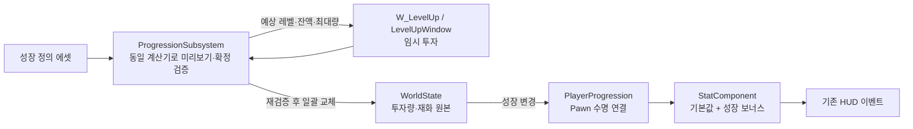

# 레벨업 시스템 설계·구현 계획

- 목표: 기존 `W_LevelUp`을 통한 HP·Stamina·MP 성장 배분, 비교 표시, 테스트 재화 차감
- 상태: 2026-09-22 코드·위키·제공 이미지 조사 완료, 설계안 작성; 구현 미착수
- 사용자 확정: 초기 성장 대상 3종, C++ 부모 연동, 다른 스탯 확장, 테스트 재화 비용 차감
- 제안 기본값: 아래 수치·자원 보정·진입 규칙은 테스트용 설계안, 최종 게임 밸런스와 별개
- 위키 검토: 현재 변경 불필요 — 구현 전 계획 단계; 구현·검증 후 `Features/Progression/Level-Up/document.md` 생성과 기존 UI 참고 문서 갱신
- 조사 검증: Windows에서 Hive 0.9.5·Graphify 0.9.38 의존성 검사 통과; Graphify 조회 실행 후 원본 C++ 대조
- 조사 한계: Graphify 스킬 표시 0.9.36, 167개 부분 추출·9개 미추출 경고와 출력 제한; 관계 탐색 보조로만 사용
- 실행 범위: 이번 작업은 Markdown 계획 작성; C++·에셋 변경, 새 빌드·PIE·에디터 바인딩 검사 미실행

## 현재 코드 근거

| 근거 | 현재 동작 | 설계 영향 |
|---|---|---|
| `Components/MVStatComponent.cpp::LoadStatsFromTable` | `CharacterStat` 기본값을 각 setter로 직접 적용 | 기본값과 성장 보너스 분리, 재로드 후 중복 없는 재계산 필요 |
| `SetMaxHP/SetMaxStamina/SetMaxMP` | 현재량 유지·상한 제한과 변경 이벤트 | 최대량 증가 후 기존 HUD 갱신 경로 재사용 |
| `UI/HUD/MVPlayerStatusWidget.cpp` | 자원 이벤트 구독·최대량에 따른 막대 크기 조정 | UI 숫자 변경과 실제 자원 최대량 반영의 동시 확인 필요 |
| `UI/Base/MVWindowBase` | CommonUI 메뉴 입력·이동/시점 차단 | 레벨업 창 C++ 부모의 기반 클래스 |
| `UI/Base/MVActivatableWidgetBase` | 활성화·뒤로 가기·포커스·페이드 처리 | 창 수명과 임시 배분 정리를 활성화/비활성화에 연결 |
| `System/MVWorldStateSubsystem`, `MVWorldStateTypes` | 월드·퀘스트 저장 데이터 소유, 성장 데이터 부재 | 기존 저장 포맷에 플레이어 성장 레코드 추가 |
| `UI/HUD/MVCurrencyStatusWidget.cpp` | 숫자 표시용 `SetCurrency(int32)`만 존재 | 테스트 지갑 추가와 실제 재화 변경 구독 필요 |
| `System/MVFieldTransitionSubsystem::ResetPlayerStatsForTransition` | 현재 최대량까지 회복 | 성장 반영 후 최대량 기준 부활·회복 유지 |
| `Character/PC/MVPlayerCharacter` | 플레이어 도메인 객체 초기화·해제 | 성장 연결도 전용 객체로 분리하고 캐릭터에는 수명 연결만 추가 |

## 1. 테스트 규칙

| 항목 | 초기 제안 |
|---|---|
| 시작 레벨·투자량 | 레벨 1, 각 성장 항목 투자 0 |
| 레벨 관계 | `Level = BaseLevel + Σ 확정 투자 포인트`, 임시 배분 1점당 예상 레벨 +1 |
| HP | 1점당 `MaxHP +20` |
| Stamina | 1점당 `MaxStamina +10` |
| MP | 1점당 `MaxMP +10` |
| 한 단계 비용 | 현재 레벨 L 기준 `100 + 50 × (L - 1)` |
| 여러 단계 비용 | L부터 L+N-1까지 단계별 비용 합산; 항목 선택 순서와 무관 |
| 테스트 재화 | 전용 디버그 명령으로 10,000 지급, 화면 재진입에 따른 자동 지급 금지 |
| 상한 | 설정 가능한 전체 레벨 100·항목별 투자 99; 더 작은 제한 우선 |
| 감소·취소 | 이번 창에서 추가한 포인트만 회수 가능; 기존 확정 투자 환불 제외 |
| 최대량 증가 시 현재량 | 기존 절대량 유지·새 상한으로 제한, 레벨업 자체의 자동 회복 없음 |
| 진입 | 첫 단계는 안전한 테스트 장소의 디버그 명령; 사망·전투·필드 전환 중 진입/확정 차단 |

- 기본값 예시: 현재 CSV의 최대 HP·Stamina·MP 각 100에서 모두 1점 투자 → 최대량 120·110·110, 레벨 1→4, 비용 450
- 위 예시는 CSV 기준 계산 예제; 실제 시작값은 로드된 캐릭터 기본 스탯 기준
- 메뉴는 배경 흐림과 입력 차단 적용, 전역 일시정지 없음; 사망·전환 시 즉시 닫고 임시 배분 폐기

## 2. 소유권과 C++ 구성

| 구성 | 책임 |
|---|---|
| `FMVPlayerProgressionSaveData` | `BaseLevel`, `TMap<FGameplayTag,int32> InvestedRanks`, `int64 Currency`, 데이터 버전 |
| `UMVWorldStateSubsystem` | 성장 레코드의 유일한 영구 상태 원본, 비교 후 일괄 교체·저장·로드 |
| `UMVProgressionSubsystem` | 정의 조회, 비용·투자 유효성 검사, 공용 미리보기 계산, 확정 조정; 별도 가변 성장 원본과 Actor/Widget 보관 없음 |
| `UMVPlayerProgression` | `AMVPlayerCharacter` 소유 도메인 객체; 성장 변경·기본 스탯 준비 구독, 현재 Pawn에 성장 보너스 적용, EndPlay 해제 |
| `UMVStatComponent` | 기본 수치·성장 보너스·실효 수치 분리, 자원 상한·특수 스탯 제약·기존 이벤트 유지 |
| `UMVLevelUpWindow : UMVWindowBase` | `W_LevelUp`의 새 부모, 임시 배분·초점·확인·취소·표시 데이터 관리 |
| 행·요약용 C++ 위젯 | 스탯별 분기 없는 표시와 증감 요청 전달; 재화·스탯 직접 변경 금지 |

- Pawn 재생성: 기본 스탯 로드 완료 → 저장된 성장 적용 → 자원 초기화/부활 회복 → HUD 갱신
- 별도 `OnBaseStatsReady` 또는 동등한 명시적 완료 계약 추가; 컴포넌트 BeginPlay 순서에 의존한 한 번짜리 적용 금지
- 저장 로드·초기화·기본 스탯 재로드에도 성장 전체 재계산; 이전 보너스에 다시 더하는 방식 금지
- 초기 단일 플레이어·단일 저장 슬롯 기준; 네트워크 복제·다중 프로필은 이번 구현 범위 밖

## 3. 스탯 확장 방식

- 투자 항목 ID와 실제 스탯 ID 분리: 예시 `Progression.HP` → `Stat.MaxHP`
- `UMVProgressionDefinition` 데이터 에셋에 시작값·상한·비용 설정과 성장 항목 배열 보관
- 항목별 데이터: ID, 표시명, 정렬, 설명, 투자 상한, 적용 효과 배열
- 효과별 데이터: 대상 `StatId`, 투자량별 누적 보너스 곡선; 한 항목에서 여러 스탯 변경 가능
- 계산: `성장 보너스(S) = Σ [Curve(확정 투자량) - Curve(0)]`, 미리보기는 임시 투자량을 합산한 동일 식
- 첫 데이터는 선형 곡선 3개; 성장 둔화 구간도 같은 누적 곡선 교체로 대응
- UI 행은 정의 배열로 생성; HP·Stamina·MP 개수나 이름을 코드에 고정하지 않는 구조
- 스탯 바인딩 등록부: ID별 기본값 읽기·적용·단위·범위·개선 방향 명시, 임의 문자열을 이용한 속성 직접 쓰기 금지
- 최초 등록 범위: `MaxHP`, `MaxStamina`, `MaxMP`, `AttackPower`, `AttackSpeed`, `Defence`, 이동속도 3종, 자원 회복·지연, `MaxGroggy`, 그로기 회복·지연, 기본 강인도 등 기존 영구 수치
- `MinPoiseRecoveryRatio`·`PoiseRecoveryTime` 등 테이블 밖 조정값은 컴포넌트 초기값을 기본값으로 취급하고 전용 검증·적용 경로 등록
- 현재 HP·현재 강인도·고갈 타이머·사망 상태는 진행 중 상태; 성장 대상과 분리, 필요한 현재량은 읽기 전용 표시
- 그로기·강인도 같은 특수 스탯은 진행 중 상태를 초기화하지 않는 적용 정책 필요; 변경되지 않은 스탯의 setter 반복 호출 금지
- 기존 등록 스탯의 성장 항목 추가는 데이터 편집으로 처리; 완전히 새로운 스탯은 해당 게임플레이 소비처와 등록부 연결 추가 필요
- 효과 소스별 저장 공간에서 성장 항목을 교체하는 구조로 장비·버프 덮어쓰기 방지; 이번 단계 실제 효과 소스는 성장만 구현
- 기존 공개 getter/필드의 실효값 읽기와 Blueprint setter 사용처 조사 후 호환 경로 유지; 전체 전투 스탯 체계 교체 제외
- 범위를 벗어난 수치·알 수 없는 ID·중복 항목·NaN·비용 오버플로는 데이터 오류로 거부; 낮을수록 유리한 지연값은 해당 표시 방향 적용

## 4. 미리보기·확정·저장 계약

1. 열기: 확정 성장 스냅샷·성장 리비전·스탯 계산 리비전 확보, 임시 배분 0
2. 조정: `EvaluateAllocation`으로 예상 레벨·총비용·잔액·모든 영향 스탯 산출; 실제 캐릭터 변경 없음
3. 확정: 최신 데이터로 비용·상한·재화·생존·진입 조건 재검사; 이전 리비전이면 재표시 후 다시 확인
4. 적용: 검증된 투자량·잔액을 원본 레코드에 한 번 교체, 성장 전체를 실효 스탯에 한 번 반영한 뒤 완료 통지
5. 완료: 임시 배분 초기화, 새 확정값 표시; 실패 시 투자량·재화·실효 스탯 모두 유지
6. 닫기: 임시 배분 폐기, 이벤트 해제, CommonUI 입력·초점 복구

- 원본 갱신·실효 수치 적용의 중간 상태에서 완료 이벤트 금지; 재진입 방어와 한 번의 합산 알림 필요
- 확인 연타: 처리 중 잠금 + 리비전 비교 + 성공 후 임시 배분 초기화로 중복 차감 방지
- 성장 리비전은 투자·재화·저장 로드/초기화에만 변경; 자연 회복 틱 때문에 매번 확정이 무효화되는 구조 금지
- 계산 리비전은 기본 스탯·영구 보너스·정의 변경에만 사용; 현재 자원량은 기존 이벤트로 따로 표시
- 기존 최대량 setter의 현재량 유지 정책 재사용; 초기 스폰·부활의 충전 정책과 구분
- 저장 대상은 투자량·재화·초기 레벨; 계산된 최대 HP와 UI 객체 직렬화 제외
- `FMVWorldSaveData` 버전 갱신과 기존 버전의 레벨 1·투자 0·재화 0 초기화 경로 추가
- 저장에 남은 미등록 투자 ID는 임의 삭제·환불 금지, 이관 대상 오류로 표시하고 레벨업 차단
- 확정은 메모리 상태 갱신과 dirty 표시까지; 디스크 저장은 기존 저장 경로 이용, 저장 실패를 레벨업 실패로 오인해 재차 결제하지 않는 분리 결과
- 저장/로드 테스트는 `Maverick_LevelUpTest` 전용 슬롯 사용; 기존 `MaverickDefault` 자동 덮어쓰기 금지

## 5. 위젯 연동

| 기존 에셋 | 연결 계획 |
|---|---|
| `W_LevelUp` | `UMVLevelUpWindow`로 부모 변경, `UMVUISubsystem` 창 스택으로 열기 |
| `W_StatEntry_LevelUp` | 공용 증감 행 C++ 부모; 표시명·현재 투자·예상 투자·좌우 버튼·선택 강조 |
| `W_StatEntry` | 공용 비교 행 C++ 부모; 현재 실효값·예상값·변경 방향 표시 |
| `W_StatBlock_LevelUp` | 항목 컨테이너로 재사용, 데이터 목록에 따라 행 생성 |
| `W_LevelCurrencyBlock_LevelUp` | 요약 C++ 부모; 레벨·잔액·총비용을 한 표시 모델에서 갱신 |
| 숫자·문구 하위 위젯 | 공용 값 표시 API 또는 작은 C++ 부모로 연결, 상위 창의 문자열 경로 탐색 제외 |

- 상위 `BindWidget`은 같은 WidgetTree의 직접 바인딩만 사용; 중첩 UserWidget 내부 TextBlock은 해당 위젯의 공개 표시 API로 전달
- 실제 바인딩명은 에디터 계층 검사 후 의미 있는 이름으로 정리; 현재 자동 생성 이름을 확정 계약으로 가정하지 않는 계획
- 왼쪽: 레벨·재화·총비용 + HP·Stamina·MP 투자 행; 오른쪽: 실제 최대 HP·Stamina·MP의 변경 전/후
- 미연결 공격·방어·저항 영역은 숨김, 기존 화면 스타일·프레임·폰트 재사용; 추후 표시 정의 추가 시 그룹 노출
- 3번의 전체 구성을 참고하되 초기 화면 내용은 실제 구현한 3종에 한정
- 확인 활성 조건: 양수 배분·비용 충족·상한 이내·유효한 대상; 감소 버튼은 확정 투자 이하에서 비활성
- 마우스 증감·확인, 키보드/게임패드 상하 선택·좌우 증감·확인·뒤로 가기 연결; 입력 표시는 CommonUI 액션과 일치
- `NativePreConstruct`는 Designer 예시 데이터만 사용, 저장/월드 접근과 테스트 재화 지급 금지
- `UMVUISettings.LevelUpWindowClass`와 `UMVUISubsystem.ShowLevelUpWindow` 추가; 테스트 진입 명령은 별도 디버그 파일에 배치
- 기존 `W_RestMenu`·`W_Navigable*` 복구와 화톳불 상호작용은 이번 범위 밖; 이후 같은 창 열기 API로 연결

## 6. 구현 순서와 완료 기준

| 순서 | 작업·예상 위치 | 완료 기준 |
|---|---|---|
| 1 | `Public/Struct/MVProgressionTypes.h`, `System/Progression/`의 정의·계산기·저장 계약 | 3개 성장 데이터, 비용 합산·상한·오류 처리 자동 검증 |
| 2 | `Components/MVStatComponent.*`, 스탯 바인딩 파일 | 기존 이벤트 유지, 순수 미리보기와 실제 반영 수치 일치, 전체 보너스 교체의 반복 적용 안전성 |
| 3 | `MVWorldStateTypes/Subsystem`, `MVProgressionSubsystem`, `Character/PC/Progression/MVPlayerProgression.*` | 재화·투자 원자적 확정, 기본값 재로드·Pawn 재생성·저장 이관 연결 |
| 4 | `UI/Window/MVLevelUpWindow.*`, `UI/LevelUp/` 행·요약 클래스 | C++ 부모 빌드 후 기존 Widget Blueprint 부모 변경·바인딩·컴파일 |
| 5 | `MVUISettings/Subsystem`, `UI/Debug/`, 기존 재화 HUD | 테스트 창 열기·재화 지급, 입력 복구, 실제 HUD 반영 |
| 6 | 자동 검사·Windows PIE, 후속 위키 | 아래 검증표 충족과 디자이너/인게임 화면 확인 |

- 새 반영 타입이 포함된 C++ 빌드 후 에디터 재시작·부모 변경·에셋 컴파일 순서 적용
- 신규 데이터 위치 제안: `/Game/Data/Progression/DA_PlayerProgression`; 기존 CSV 기본 스탯과 독립 관리
- 이번 설계 단계에서 원본 에셋 덮어쓰기나 실제 클래스 생성 없음

## 7. 구현 후 검증표

- 계산 자동 검사: 1→4 비용 450, 세 성장 최대량, 투자 순서 독립성, 여러 항목의 동일 스탯 기여 합산
- 상태 자동 검사: 취소 무변경, 재화 부족·상한·미등록 스탯 거부, 확인 연타 1회 차감, 오래된 리비전 거부
- 스탯 검사: 성장 반복 적용·테이블 재로드의 보너스 중복 없음, 최대량 증가 시 현재량 유지, 무관한 강인도·그로기 상태 보존
- 수명 검사: 닫기·재열기·사망·부활·Pawn 교체·맵 전환 이후 확정 성장 유지, 임시 배분 폐기와 이벤트 중복 구독 방지
- 저장 검사: 전용 슬롯 저장·재시작·로드, 구버전 기본값 이관, 저장 실패와 성장 확정 결과 구분
- 확장 검사: 기존 `AttackPower` 대상 성장 항목을 데이터로 임시 추가해 UI 자동 생성과 실제 공격 계산 반영 확인 후 테스트 정의 제거
- Windows UE 5.8.1 실제 PIE: C++ 빌드·관련 위젯 컴파일, 키보드·마우스·게임패드, HUD 수치·막대 폭·입력 복구·창 중복 열기 검사
- 실제 게임패드 장치 부재 시 해당 조작 검증은 별도 미검증 표기; 키보드 테스트로 대체 통과 판정 금지
- 제외: 새 게임 밸런스 확정, 재화 드롭·사망 유실·회수, 재분배, 멀티플레이, 정식 화톳불/휴식 메뉴
