# Maverick Architecture

이 문서의 역할: Maverick의 현재 C++ 책임 경계와 주요 런타임 흐름을 파악하는 첫 진입점. 세부 심볼 관계는 `graphify query`와 `path`, 타입 단위 탐색은 `graphify explain`, 커뮤니티 탐색은 `graphify-out/wiki/index.md` 사용

## 읽는 순서

1. 전체 구조와 소유권은 이 문서에서 확인한다.
2. 작업과 관련된 세부 경로는 `graphify query`, `graphify path`, `graphify explain`으로 좁힌다.
3. 변경할 선언과 호출부만 원본 코드에서 확인한다.
4. Blueprint, StateTree, Chooser, Montage, DataTable, WBP처럼 `.uasset` 내부가 필요한 판단은 에디터에서 별도로 검증한다.

Graphify는 관련 파일과 심볼을 찾는 지도이며 호출 순서의 최종 증거가 아니다. 이 문서는 Graphify를 대체하지 않고, 그래프가 직접 표현하지 못하는 책임·수명·바이너리 에셋 경계를 보완한다.

## 증거 범위

- `현재 구현`: C++, `.Build.cs`, `.uproject`, `.ini`에서 확인한 사실이다.
- `설계 목표`: `docs/wiki/`에 기록했지만 현재 텍스트 코드만으로 완전한 적용을 확인할 수 없는 내용이다.
- `에셋 확인 필요`: Blueprint/WBP/StateTree/Chooser/Montage/DataTable 내부 연결이 필요한 내용이다.

Graphify 코퍼스는 `Content/`와 Unreal 생성 디렉터리, 작업용 `docs/todo/`를 제외한다. 따라서 그래프에 노드가 없다는 사실만으로 에셋이나 연결이 없다고 결론 내리지 않는다.

## 빌드와 모듈 경계

Maverick: Unreal Engine 5.8 기반, 게임과 에디터 Target이 같은 `Maverick` 런타임 모듈을 로드하는 단일 프로젝트 모듈 구조

`FMaverickModule`의 startup은 런타임 서비스나 캐릭터 시스템을 조립하지 않는다. 현재 명시적인 startup 작업은 `WITH_EDITOR`의 메뉴 등록이며, 게임플레이 조립은 Actor와 Component가 담당한다.

| 경계 | 현재 책임 |
| --- | --- |
| `Maverick` runtime module | Character, Components, Combat, AI, Animation, System, UI, table runtime을 포함한다. |
| Editor 전용 의존성 | `UnrealEd`, `AssetRegistry`, `KismetCompiler`, `BlueprintGraph`, `ToolMenus` 등을 에디터 Target에서만 추가한다. |
| 엔진/플러그인 의존성 | EnhancedInput, StateTree, GameplayTags, Chooser, CommonUI/CommonInput, MotionWarping, LockOnTarget을 직접 사용한다. |
| `LockOnTarget` plugin | runtime, developer tool, editor 모듈을 별도로 제공한다. Maverick 빌드에는 runtime 모듈이 필수 의존성이다. |

근거 진입점: `Source/Maverick/Maverick.Build.cs`, `Source/Maverick.Target.cs`, `Source/MaverickEditor.Target.cs`, `Maverick.uproject`, `Plugins/LockOnTarget/LockOnTarget.uplugin`.

## 상위 구조

```mermaid
flowchart LR
    Input["Enhanced Input / Blueprint"] --> InputManager["UMVInputManagerComponent"]
    StateTree["StateTree asset"] --> AITasks["AI Task / Condition / Evaluator"]
    InputManager --> Handlers["도메인 입력 handler"]
    AITasks -->|SelectAndExecute| Action["UMVActionComponent"]
    AITasks -->|EnemyCombatAction| Combat["UMVCombatComponent"]
    Handlers --> Combat
    Handlers --> PlayerDomains["Dodge / Consumable / Finisher"]
    Combat --> Action
    PlayerDomains --> Action
    Action --> Montage["Montage + AnimNotify"]
    Montage --> Ability["UMVAbilityBase / 도메인 상태"]
    Ability -. "공격 활성 구간" .-> HitSource["Collision / Blueprint (asset boundary)"]
    HitSource -. "FMVHitResolveRequest" .-> HitResolver["UMVHitResolverSubsystem"]
    HitResolver --> CharacterBridge["AMVCharacterBase::OnHitResolved"]
    CharacterBridge --> OnDamaged["OnDamaged delegate"]
    OnDamaged --> Stat["UMVStatComponent"]
    OnDamaged -. "Player direct / Enemy asset route" .-> HitReaction["UMVHitReactionComponent"]
    Stat --> Death["UMVDeathComponent"]
    Death --> Respawn["UMVDeathRespawnFlow"]
    Respawn --> Transition["UMVFieldTransitionSubsystem"]
    Transition --> WorldState["UMVWorldStateSubsystem"]
    Transition --> UI["UMVUISubsystem"]
    Tables["CSV / direct-managed DataTable"] --> TableManager["UMVTableManager"]
    TableManager --> RuntimeConsumers["Action / Stat / Death / HitReaction"]
```



`Enhanced Input / Blueprint -> SubmitActionInput`과 production collision의 `ResolveAttackHit` 호출은 텍스트 코드만으로 완전한 연결을 확인할 수 없는 에셋 경계다.

## 디렉터리 책임

| 경로 | 책임과 주요 진입점 |
| --- | --- |
| `Character/` | Actor 조립과 플레이어/NPC 특화 브리지. `AMVCharacterBase`, `AMVPlayerCharacter`, `AMVEnemy`. |
| `Components/` | 상태를 소유하는 런타임 도메인. Input, Action, Combat, Stat, HitReaction, Death, Weapon, Finisher 등. |
| `Combat/` | 공격 실행 객체와 월드 단위 hit 계산. `UMVAbilityBase`, `UMVHitResolverSubsystem`. |
| `AI/` | StateTree용 공유 문맥, evaluator, condition, task와 perception controller. |
| `Animation/` | AnimInstance와 Montage 구간을 도메인 API로 연결하는 Notify/NotifyState. |
| `System/` | 필드 전환, 사망 부활, 월드 상태, 저장, 퀘스트의 장수명 오케스트레이션. |
| `UI/` | CommonUI 기반 window stack, HUD/popup overlay, loading/death/interaction UI. |
| `Public/Tables`, `Private/Tables` | typed row 계약, editor 생성기, runtime manifest 조회. |
| `Public/Interface`, `Public/Struct`, `Public/Tags` | 도메인 간 계약과 공유 데이터. |
| `Plugins/LockOnTarget/` | 타깃 선택·보관·확장과 대상 컴포넌트. Maverick은 공개 API로만 조정한다. |

## 캐릭터 조립과 소유권

`AMVCharacterBase`는 공통 런타임 본체이며 다음 기본 서브오브젝트를 생성한다.

- `UMVStatComponent`: HP, stamina, MP, groggy와 피해·사망 판정의 권위 계층.
- `UMVActionComponent`: 이미 선택된 Action Row와 Montage를 실행하는 범용 executor.
- `UMVCombatComponent`: 공격/스킬 후보, Chooser/fallback, chain과 Ability 인스턴스를 관리하는 선택 계층.
- `UMVDeathComponent`: actor-local 사망 표현 계층.
- `UMVHitReactionComponent`: 피격 row, interrupt, groggy, recovery 표현 계층.
- `UMVInputManagerComponent`: 입력 snapshot, 짧은 buffer, 우선순위 handler 라우팅.
- `UMVWeaponComponent`: 현재 장착 무기와 hit snapshot의 원천.
- `UMotionWarpingComponent`: action/montage의 공간 보정 연결.

`AMVPlayerCharacter`는 Dodge, Consumable, InteractionDetector와 플레이어 전용 stamina/lock-on 정책을 추가한다. 플레이어 피격은 `OnDamaged`에서 HitReaction으로 직접 연결된다.

`AMVEnemy`는 EnemyDodgeToken, Boss HUD와 필드 reset 계약을 추가한다. reset 때 Controller의 BrainComponent, 기타 Controller component, Pawn component에서 발견한 StateTree component를 재시작하며, 실제 컴포넌트 배치 위치는 `에셋 확인 필요`다. C++에서는 HitReaction 직접 바인딩을 제거하고 `OnEnemyDamaged`를 broadcast하며, `MVHitReactionTask`가 실행될 때 `HandleDamaged`를 호출한다. StateTree가 이 이벤트를 소비해 task를 선택하는 연결도 `에셋 확인 필요`다.

## 핵심 런타임 흐름

### 입력에서 Action 실행까지

1. Blueprint/Enhanced Input이 `UMVInputManagerComponent::SubmitActionInput` 또는 `SubmitHoldActionInput`을 호출한다. `에셋 확인 필요`.
2. InputManager가 controller-space 이동 입력을 snapshot하고 `IMVActionInputHandlerInterface` 구현자를 우선순위 순으로 호출한다.
3. 첫 번째 성공한 handler가 입력을 소비한다. Combat, Dodge, Consumable, HitReaction recovery 등이 같은 문맥을 공유한다.
4. CombatComponent는 공격 태그와 Chooser/fallback 데이터로 Action Row를 고르고 chain/Ability 상태를 준비한다.
5. ActionComponent는 선택된 Row의 Montage, active action, interruptibility와 종료 이벤트를 소유한다.
6. Ability NotifyState가 Montage의 실제 공격 활성 구간에서 Ability를 열고 닫는다.

경계 원칙: CombatComponent는 선택기이고 ActionComponent는 실행기다. 입력 버퍼에 개별 도메인 규칙을 추가하지 않는다.

### Hit, Stat, HitReaction

1. Collision/Ability/Blueprint 계층이 필터링된 `FMVHitResolveRequest`를 `UMVHitResolverSubsystem`에 전달한다. production 호출부는 `에셋 확인 필요`.
2. Resolver가 공격자·피격자 스탯, 공격 배율, 무기 snapshot으로 `FMVResolvedHitData`를 만든다.
3. Resolver가 피해자 `AMVCharacterBase::OnHitResolved`를 호출한다.
4. CharacterBase가 CharacterIndex를 확인하고 `OnDamaged`를 broadcast한다.
5. StatComponent는 수치 피해, groggy, lethal latch와 `OnDeathStarted`를 소유한다.
6. HitReactionComponent는 row/section, interrupt, 무적, KD/AB recovery 표현만 소유한다.

현재 native 코드 기준 무적 검사는 HitReaction 경로에 있고 Resolver/Stat의 피해 적용 경로에는 없다. 따라서 무적이 피해 자체를 막는다는 전제는 별도 검증 없이 사용하지 않는다.

### 사망과 필드 전환

1. StatComponent가 lethal을 한 번만 확정하고 `FMVDeathContext`를 발행한다.
2. 실행 중인 Action이 `HR_*`이면 DeathComponent는 사망 표현을 보류한다. `MVAnimNotify_HitReactionDeathHandoff` 또는 해당 Action 종료가 handoff를 완료한다.
3. DeathComponent가 Death Action, ragdoll, immediate 중 하나를 선택한다. Death Action의 실행은 ActionComponent에 위임하고, dissolve/overlay/presentation 이벤트는 DeathComponent가 관리한다.
4. `UMVDeathRespawnFlow`는 `UMVFieldTransitionSubsystem`이 소유하는 transient coordinator이며 world마다 플레이어 DeathComponent에 재바인딩한다.
5. Death overlay 최소 표시가 끝나면 FieldTransitionSubsystem이 loading UI, resettable actor, checkpoint 이동, stat/input/UI 복구를 순서대로 실행한다.
6. WorldStateSubsystem은 checkpoint, consumed spawn, flag, quest와 SaveGame 상태를 보존한다. GameInstance 수명의 QuestSubsystem은 WorldState 의존성을 초기화하고 quest 읽기·쓰기와 선택적 저장을 위임하는 facade다.

현재 전환 gate는 DeathOverlay 최소 표시 완료다. presentation finished는 overlay 요청이 누락된 경우 전환을 보장하는 fallback이며, 사망 몽타주 종료를 별도 필수 gate로 기다리지 않는다. 사망 상태에서는 이동·액션·상호작용 입력을 막지만 DeathOverlay는 시점 입력을 허용한다. LoadingWindow가 받는 입력은 도움말 카드 전환에만 쓰고 창 종료와 UI·입력 복원은 FieldTransition이 맡는다.

필드 상태 전용 서브시스템은 두지 않는다. 저장할 사실은 WorldState가 보관하고, 실제 숨김·복원·제거는 `IMVFieldTransitionResettableInterface`를 구현한 actor가 맡는다. 현재 C++에서 확인된 reset policy 적용은 `AMVEnemy`의 `ResetEveryTransition`이며, `PersistIfConsumed`, `PersistState`, `TransientOnly`는 각 도메인 구현을 추가할 때 검증해야 하는 설계 계약이다.

`DT_Death_P1`, `AM_Death_*`, `WBP_DeathOverlayWindow`, `WBP_LoadingWindow`의 row 참조, notify, widget binding은 `에셋 확인 필요`다. 사망 직후 전투·입력을 한곳에서 중단하는 기능과 로딩 화면의 현재 필드 이름 표시는 아직 C++에서 확인되지 않은 `설계 목표`다.

### AI StateTree

```text
StateTree asset
  -> FMVGlobalSensingTask
  -> FMVAICombatContext
  -> FMVCombatDecisionCondition
  -> attack / movement / strafe / hit reaction / death task
  -> ActionComponent + cooldown
```

- `FMVGlobalSensingTask`가 거리, 각도, LOS, 전투 영역, 이동 경로, 실행 상태와 cooldown을 공유 문맥에 갱신한다.
- Condition은 문맥을 판정하지만 실제 상태 우선순위와 property binding은 StateTree 에셋 순서에 의존한다.
- 공격 task는 `EnemyCombatAction -> Enemy -> CombatComponent -> ActionComponent` 경로와 `SelectAndExecuteAttack -> ActionComponent` 직접 경로가 공존한다.
- `AMVAIController`의 AIPerception `TargetActor`와 GlobalSensing의 현재 플레이어 탐색은 텍스트 코드에서 연결되지 않은 별도 경로다.
- C++은 StateTree 컴포넌트를 직접 생성하지 않는다. 실제로 Controller의 BrainComponent, 기타 Controller component, Pawn component 중 어디에 배치되는지는 Blueprint 구성에 따라 달라질 수 있다.

StateTree 에셋을 수정할 때는 다음 계약을 함께 확인한다.

- 위에서 먼저 성립한 상태가 아래의 MoveToTarget이나 Strafe를 가릴 수 있으므로 상태 순서와 후보 범위를 함께 설계한다.
- `GlobalSensing.CombatContext`는 Condition과 Task로, 공격 Task의 `LastAttackTag`는 GlobalSensing으로 되돌아가도록 binding한다.
- 후보별 거리와 각도가 공격 가능 범위를 결정한다. `CombatMaxDistance`는 이동 상태를 나누는 기준이지 공격 사거리가 아니다.
- Focusing은 지속 부모나 이동 상태에 둔다. 공격 중 강제 회전을 원하지 않으면 공격 상태에는 두지 않는다.
- GlobalSensing과 Global Action Cooldown Task가 같은 cooldown component를 동시에 tick하지 않게 소유자를 하나만 둔다.

실제 자식 상태 순서, property binding, Task 배치, 공격 후보, Chooser, cooldown ID와 타깃 경로는 `에셋 확인 필요`다.

### UI와 CommonUI

`UMVUISubsystem`은 GameInstance 수명의 UI 진입점이다.

```text
Viewport
  -> UMVUILayerBase
       -> WindowStack : CommonActivatableWidgetStack
       -> HUDLayer    : Overlay
       -> PopupLayer  : Overlay
       -> WidgetLayer : Overlay
```

- Window만 CommonUI activatable stack과 modal/back/focus/input lifecycle에 참여한다.
- Popup과 HUD는 단일 overlay이며 stack activation을 소유하지 않는다.
- DeathRespawnFlow가 death overlay를 표시한다. FieldTransition은 loading window와 전환 전후 `ClearAllUI`, `ResetToDefaultUI`를 사용해 화면 전환을 오케스트레이션한다.
- WBP 내부 widget tree, animation, Blueprint binding은 `에셋 확인 필요`다.

### 테이블 데이터

```text
MaverickDesign/Csv
  -> CsvToJsonConverter.py
  -> MaverickDesign/Json + SheetRecipe
  -> editor-only UMVTableAssetGenerator
  -> generated /Game/Table/DT_*
                                  -> DT_MVTableManifest
direct-managed /Game/Table/DT_*  -> DT_MVTableManifest
  -> UMVTableManager
  -> typed FindRow / TMVPropTable / Blueprint lookup
```

JSON은 에디터 중간 산출물이고 런타임 기준 데이터는 CSV에서 생성한 테이블, 직접 관리하는 `UDataTable`, manifest다. `UMVTableManager`는 `UEngineSubsystem`으로 typed row와 Blueprint reflection 조회를 제공한다. 현재 직접 관리 root는 `Attack`, `Death`, `Dodge`, `Groggy`, `HitReaction`, `Props`, `Sprint`, `Weapons`이며 `MaverickDesign/README.md`의 목록과 drift가 있다. 실제 행, row struct, source hash와 manifest 완전성은 에디터 검증이 필요하다.

`GameGuide`는 도움말과 팁의 노출 문구만 소유한다. 아이템 설명이나 로어를 복제하지 않으며, 추후 아이템 정보를 도움말로 보여줄 때는 별도 큐레이션 데이터가 `Item` row를 참조한다.

### LockOnTarget 경계

플러그인은 targeting 정책과 상태를 소유한다.

- `ULockOnTargetComponent`: 로컬 Pawn의 target 선택·보관·복제 경계. target info는 복제되지만 `UTargetComponent` 자체 상태는 비복제이므로 capture 설정 변경은 별도 네트워크 동기화를 고려한다.
- `UTargetHandlerBase`: 후보 탐색 전략.
- `ULockOnTargetExtensionBase`: 카메라, 회전, widget 같은 부가기능.
- `UTargetComponent`: 대상 Actor의 socket/focus/priority/capture 상태.

Maverick은 플레이어 dodge suppression, sprint, Action 실행 중 rotation extension 억제, 적 사망 시 target release/capture disable, 필드 reset 시 capture restore처럼 공개 API만 호출한다. Blueprint에 실제 배치된 handler/extension은 에디터 확인이 필요하다.

## 책임 규칙 요약

- `CharacterBase`는 공통 상태 연결과 엔진 lifecycle bridge에 머문다.
- 입력 정규화와 buffer는 InputManager, 액션 선택은 도메인 컴포넌트, Montage 실행은 ActionComponent가 소유한다.
- HitResolver는 최종 hit 데이터를 계산하고, Stat은 피해·사망을 판정하며, HitReaction/Death는 표현을 소유한다.
- GameInstance/Engine 수명 상태를 Actor나 Widget에 저장하지 않는다.
- Blueprint/asset 경계를 C++에서 확인한 사실처럼 문서화하지 않는다.
- 여러 타입의 관계와 이유는 이 위키에, 단일 타입의 로컬 계약은 헤더 문서 블록에 둔다.

## 관련 문서

- `docs/wiki/Documentation-Workflow.md`: 문서와 Graphify 갱신 절차.
- `docs/wiki/Obsidian-Usage.md`: 사람용 `docs/wiki/`를 Obsidian에서 연결하고 검토하는 방법.
- `docs/wiki/Header-Documentation.md`: C++ 헤더 책임 문서화 기준.
- `docs/wiki/Combat-Design-MDA.md`: 현재 전투와 목표 전투 계약, 구현 우선순위.
- `docs/wiki/S1-Tempo-Charge.md`: S1 Charge와 연속기 런타임·HUD 계약.
- `docs/wiki/Soulslike-Market-Research-2026.md`, `docs/wiki/Boss-Rush-Market-Analysis.md`: 제품 방향 판단을 위한 시장 조사.
- `MaverickDesign/README.md`, `MaverickDesign/Schema/README.md`: 테이블 생성 및 schema 계약.

## 갱신 조건

다음 변경은 이 문서를 함께 검토한다.

- 새 runtime/editor 모듈 또는 플러그인 의존성 추가.
- CharacterBase 구성 컴포넌트나 도메인 소유권 이동.
- 입력, hit, death, field transition, AI, UI, table의 순서나 권위 계층 변경.
- Blueprint 경계를 C++로 이동하거나 반대로 이동.
- Graphify 질의가 반복해서 이 문서와 다른 현재 구조를 보여 소스 확인 결과 drift가 확정된 경우.
