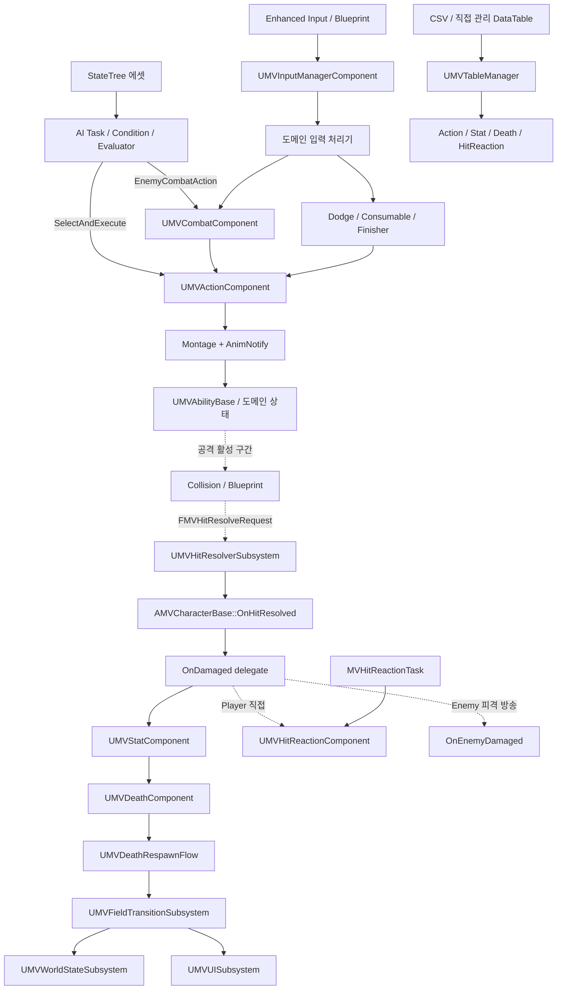

# Maverick 아키텍처

## 전체 흐름

## 디렉터리 책임

| 경로 | 책임과 주요 진입점 |
|---|---|
| `Character/` | Actor 조립과 플레이어·NPC 특화 브리지 `AMVCharacterBase`, `AMVPlayerCharacter`, `AMVEnemy` |
| `Components/` | Input, Action, Combat, Stat, HitReaction, Death, Weapon, Finisher 상태 소유 |
| `Combat/` | 공격 실행 객체와 월드 단위 적중 계산 `UMVAbilityBase`, `UMVHitResolverSubsystem` |
| `AI/` | StateTree 공유 문맥, Evaluator, Condition, Task, Perception Controller |
| `Animation/` | AnimInstance와 Montage 구간을 도메인 API로 연결하는 Notify·NotifyState |
| `System/` | 필드 전환, 사망 부활, 월드 상태, 저장, 퀘스트 오케스트레이션 |
| `UI/` | CommonUI Window Stack, HUD·Popup Overlay, Loading·Death·Interaction UI |
| `Public/Tables`, `Private/Tables` | Typed Row 계약, Editor 생성기, Runtime Manifest 조회 |
| `Public/Interface`, `Public/Struct`, `Public/Tags` | 도메인 간 계약과 공유 데이터 |
| `Plugins/LockOnTarget/` | 타깃 선택·보관·확장과 대상 컴포넌트 Maverick 공개 API 경계 |

## 캐릭터 조립과 소유권

`AMVCharacterBase`: 공통 런타임 본체

| 기본 서브오브젝트 | 책임 |
|---|---|
| `UMVStatComponent` | HP, Stamina, MP, Groggy와 피해·사망 판정의 권위 계층 |
| `UMVActionComponent` | 선택된 Action Row와 Montage 실행 |
| `UMVCombatComponent` | 공격·스킬 후보, Chooser·Fallback, Chain, Ability 인스턴스 선택 |
| `UMVDeathComponent` | Actor 단위 사망 표현 |
| `UMVHitReactionComponent` | 피격 Row, Interrupt, Groggy, Recovery 표현 |
| `UMVInputManagerComponent` | 입력 Snapshot, 짧은 Buffer, 우선순위 처리기 배분 |
| `UMVWeaponComponent` | 현재 장착 무기와 적중 Snapshot 원천 |
| `UMotionWarpingComponent` | Action·Montage 공간 보정 |

### 플레이어

- `AMVPlayerCharacter`: Dodge, Consumable, InteractionDetector 소유
- 플레이어 전용 Stamina·Lock-on 정책 추가

### 적

- `AMVEnemy`: EnemyDodgeToken, Boss HUD, 필드 Reset 계약 소유
- 필드 Reset: Controller BrainComponent, 기타 Controller Component, Pawn Component의 StateTree Component 탐색·재시작
- 피격 경로: 직접 HitReaction 바인딩 대신 `OnEnemyDamaged` 방송
- `MVHitReactionTask` 실행 시 `HandleDamaged` 호출

## 핵심 런타임 흐름

- [[Features/Input-to-Action/document|입력에서 Action 실행까지]]
- [[Features/Hit-Stat-HitReaction/document|Hit, Stat, HitReaction]]
- [[Features/Death-and-Field-Transition/document|사망과 필드 전환]]
- [[Features/AI-StateTree/document|AI StateTree]]
- [[Features/UI-and-CommonUI/document|UI와 CommonUI]]
- [[Features/Interaction-Flow/document|상호작용 흐름]]
- [[Features/Table-Data/document|테이블 데이터]]
- [[Features/LockOnTarget-Boundary/document|LockOnTarget 경계]]

## 책임 규칙

- `CharacterBase`: 공통 상태 연결과 엔진 수명주기 브리지
- 입력 정규화·Buffer: InputManager
- Action 선택: 도메인 컴포넌트
- Montage 실행: ActionComponent
- 최종 적중 계산: HitResolver
- 피해·사망 판정: Stat
- 피격·사망 표현: HitReaction·Death
- GameInstance·Engine 수명 상태의 Actor·Widget 저장 금지
- Blueprint: 입력, 조립, 이벤트 연결 경계
- 여러 타입의 관계와 이유: 위키
- 단일 타입의 로컬 계약: 헤더 문서 블록

## 갱신 조건

- Runtime·Editor 모듈 또는 플러그인 의존성 추가
- CharacterBase 구성 컴포넌트 또는 도메인 소유권 이동
- 입력, 적중, 사망, 필드 전환, AI, UI, 테이블 순서·권위 계층 변경
- Blueprint와 C++ 사이의 책임 경계 이동
- Graphify와 현재 문서의 구조 차이 확정
