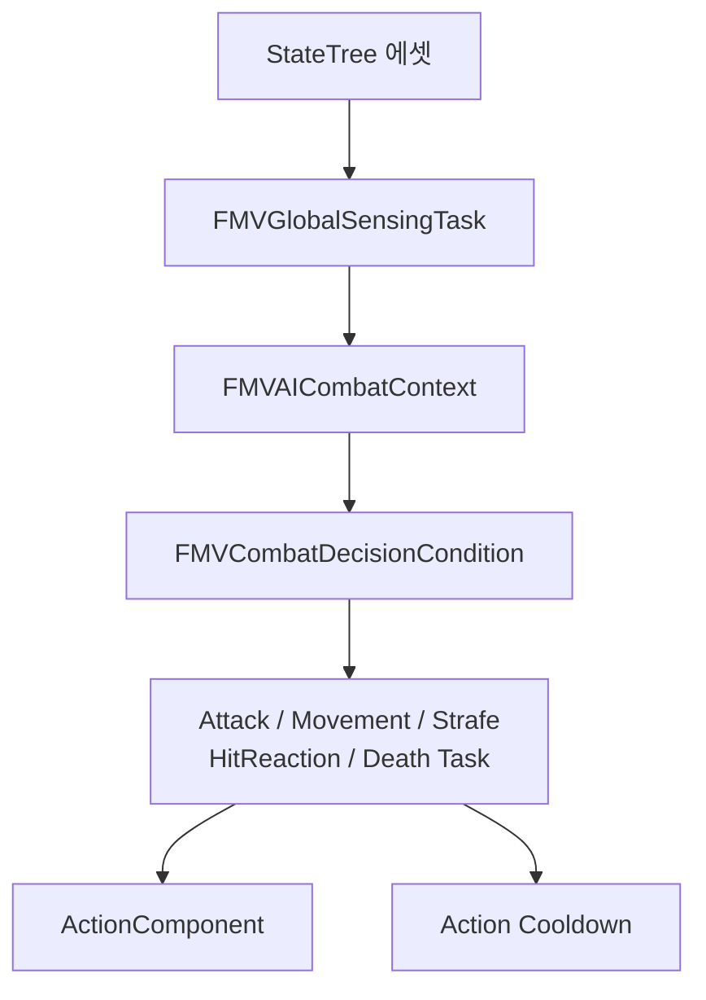

# AI StateTree

## 실행 흐름

## 문맥과 실행 경계

- `FMVGlobalSensingTask`: 거리, 각도, LOS, 전투 영역, 이동 경로, 실행 상태, Cooldown 갱신
- Condition: 공유 문맥 판정
- 상태 우선순위·Property Binding: StateTree 에셋 순서 소유
- 공격 경로 A: `EnemyCombatAction -> Enemy -> CombatComponent -> ActionComponent`
- 공격 경로 B: `SelectAndExecuteAttack -> ActionComponent`
- `AMVAIController` AIPerception `TargetActor`: Controller 감지 경로
- GlobalSensing 현재 플레이어 탐색: 별도 타깃 탐색 경로
- StateTree Component 조립·배치: Blueprint 책임
- 탐색 순서: Controller BrainComponent → 기타 Controller Component → Pawn Component

## StateTree 계약

- 상위 상태 우선 성립 시 하위 MoveToTarget·Strafe 차단
- 상태 순서와 후보 범위의 동시 설계
- `GlobalSensing.CombatContext`: Condition·Task 방향 Binding
- 공격 Task `LastAttackTag`: GlobalSensing 방향 Binding
- 공격 가능 범위: 후보별 거리·각도
- `CombatMaxDistance`: 이동 상태 분기 기준, 공격 사거리와 분리
- Focusing: 지속 부모 또는 이동 상태 소유
- 공격 중 강제 회전 제외 시 공격 상태 Focusing 미배치
- GlobalSensing과 Global Action Cooldown Task의 Cooldown Component Tick 단일 소유
