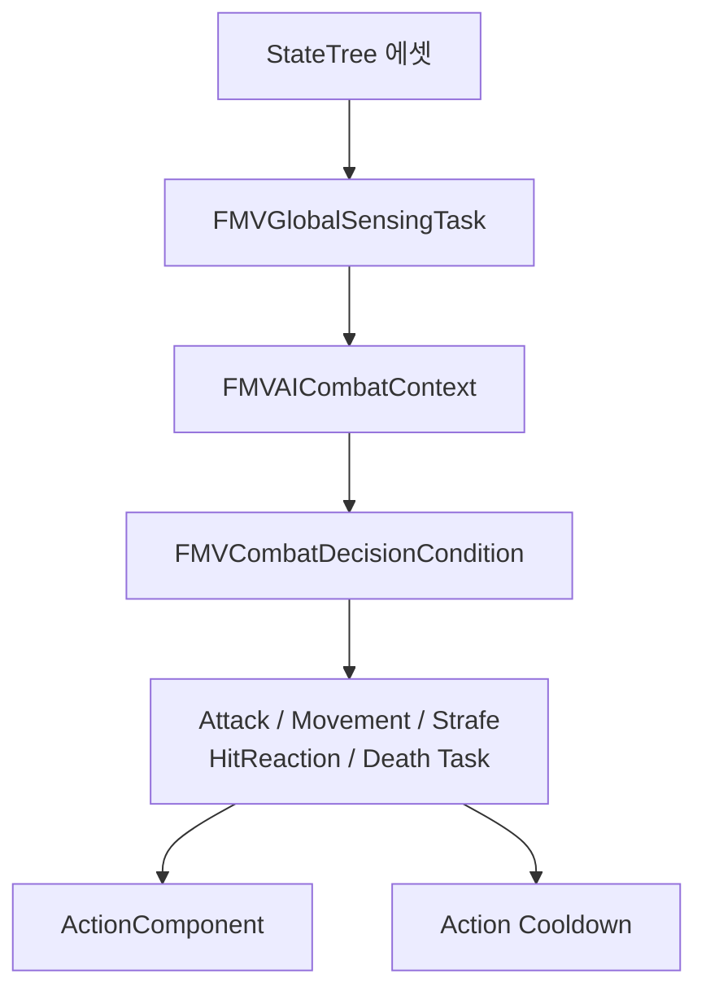

# AI StateTree

## 실행 흐름

```mermaid
flowchart TD
    StateTree["StateTree 에셋"] --> Sensing["FMVGlobalSensingTask"]
    Sensing --> Context["FMVAICombatContext"]
    Context --> Decision["FMVCombatDecisionCondition"]
    Decision --> Tasks["Attack / Movement / Strafe<br/>HitReaction / Death Task"]
    Tasks --> Action["ActionComponent"]
    Tasks --> Cooldown["Action Cooldown"]
```

## 문맥과 실행 경계

- `FMVGlobalSensingTask`: 거리, 각도, LOS, 전투 영역, 이동 경로, 실행 상태, Cooldown 갱신
- Condition: 공유 문맥 판정
- 상태 우선순위·Property Binding: StateTree 에셋 순서 소유
- 공격 경로 A: `EnemyCombatAction -> Enemy -> CombatComponent -> ActionComponent`
- 공격 경로 B: `SelectAndExecuteAttack -> ActionComponent`
- `AMVAIController` AIPerception `TargetActor`: Controller 감지 경로
- GlobalSensing 현재 플레이어 탐색: 별도 타깃 탐색 경로
- StateTree Component 조립·배치: Blueprint 책임
- 탐색 순서: Controller BrainComponent → 기타 Controller Component → Pawn Component

## StateTree 계약

### 공격 예고 이벤트

- `UMVAnimNotify_AttackNotice`: 전방 박스와 겹치는 `AMVEnemy`에 호출당 한 번 예고 전달, 게임 월드에서만 실행
- `AMVEnemy::ReceiveAttackNotice`: Controller Brain → Controller 컴포넌트 → Pawn 컴포넌트 순서의 첫 실행 중 StateTree에 전송
- 이벤트 태그: `AI.Event.AttackNotice`, 데이터: `FMVAIDodgeRequest`
- 전달 값: `ThreatActor`, `ThreatLocation`, `DistanceToThreat`, `AngleToThreat`; 각도는 적 로컬 전방 기준 부호 있는 도 단위
- `Direction`: 기본 `Back`, `ThreatActionType`: 미지정; 실제 회피 판단·방향 선택은 StateTree 책임
- 로그 `EventSent=1`: 이벤트 전달 경로 호출 완료; 전환 선택이나 회피 동작 성공의 증거와 구분
- 예고 박스 검출은 실제 피해 적중과 별도, 적의 충돌 쿼리 활성화 필요

### 상태 선택

- 상위 상태 우선 성립 시 하위 MoveToTarget·Strafe 차단
- 상태 순서와 후보 범위의 동시 설계
- `GlobalSensing.CombatContext`: Condition·Task 방향 Binding
- 공격 Task `LastAttackTag`: GlobalSensing 방향 Binding
- 공격 가능 범위: 후보별 거리·각도
- `CombatMaxDistance`: 이동 상태 분기 기준, 공격 사거리와 분리
- Focusing: 지속 부모 또는 이동 상태 소유
- 공격 중 강제 회전 제외 시 공격 상태 Focusing 미배치
- GlobalSensing과 Global Action Cooldown Task의 Cooldown Component Tick 단일 소유

### 보스 공격 종료

- `FMVBossExecuteAttackTask`: 범위 밖 공격 생략과 시작한 몽타주·액션 종료 모두 명시적 `RequestTransition(Succeeded)` 후 성공 반환
- 완료 판정 제외 Task의 성공 반환만으로 공격 트리 종료 보장 불가, 생략 시 후속 Tick 없는 경로까지 종료 요청 필요
- `ST_DuelistBoss_Attack.BasicAttack1`의 완료 판정 제외 설정에서 범위 생략 후 액션 없는 `Running` 재현, 명시적 성공 전이로 해소
- `ST_DuelistBossAIStateTree.Alive.Attack`: 연결 공격 트리 완료 후 `Chase` 복귀, 복귀 목적지는 에셋 전이 책임

## 보스 공격 정지 수정 검증

2026-10-07 / Codex / Windows / Unreal Engine 5.8.3 실제 실행

- 임시 C++ 추적 로그로 실행 순서 확인 후 제거, 최종 변경은 범위 생략 분기의 성공 전이 1곳
- 배치된 `BP_Duelist`의 PIE 컴포넌트에 공격 트리만 연결한 350cm 시험: 수정 전 3.125초까지 액션 없는 `Running`, 수정 후 첫 관측 0.218초부터 `Succeeded`
- 공격 트리의 실행 결과는 `GetStateTreeRunStatus` 기준, 수정 후에도 참인 BrainComponent `IsRunning` 플래그와 구분
- 메인 AI 20초·61개 표본과 추적 로그: 사슬 공격·기본 공격·페이즈 동작 종료, 추적 복귀·다음 공격 연결 확인; 모든 공격·거리 조합의 무정지 보장 범위 제외
- 최초 관측 보조 스크립트의 보호 속성 `bAbilityActive` 조회 실패, 공개 상태값 관측으로 변경 후 61개 표본 수집 성공; 보조 스크립트 오류와 게임 동작 구분
- 최종 Windows Live Coding 컴파일·패치 통과, 사용자 DataTable 미저장 편집 보존을 위해 일반 Editor 빌드·프로세스 재시작 미실행; 새 프로세스 로딩·네트워크·패키징 보장 범위 제외
- 별도 에셋 결함: `DT_DuelistBossCombatAttack.SkillW`의 `AM_Duelist_SkillW` 누락으로 재생 실패 확인, 대체 공격 미지정으로 자동 교체·DataTable 저장 제외

검증 요약: [boss-attack-stall-validation.json](attachments/boss-attack-stall-validation.json)
원본 재현·관측 기록: `Saved/BossAttackStall`, Git 제외
