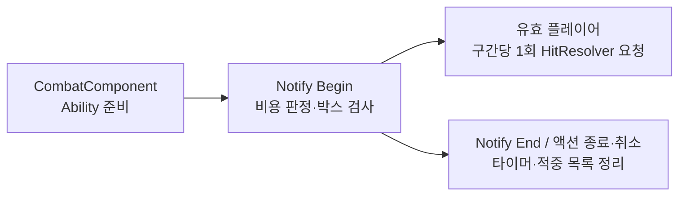

# 박스 범위 피해 Ability

## 사용 위치

- C++: `Source/Maverick/Combat/MVBoxDamageAbility.h`, `MVBoxDamageAbility.cpp`
- Blueprint: `/Game/Characters/Components/Combat/Abilities/BP_BoxDamage`
- 부모 클래스: `UMVBoxDamageAbility`

## 범위 설정

`BP_BoxDamage`의 `Class Defaults`에서 조절

| 항목 | 기본값 | 의미 |
|---|---|---|
| `BoxSize` | `(200, 200, 200)` | 전후·좌우·높이의 전체 길이, cm 단위 |
| `BoxOffset` | `(150, 0, 0)` | 액터 중심에서 전방·우측·위 방향의 박스 중심 이동, cm 단위 |
| `bDrawDebug` | `true` | 실제 판정과 동일한 박스 표시, 해당 검사에서 유효 적중 시 초록색·그 외 노란색 |

- 캐릭터 액터의 위치·회전 추적, 메시 크기와 무관한 범위
- `BoxSize` 각 축의 최솟값: 1cm
- 활성 시작 즉시 검사, 이후 초당 60회 검사
- 벽 가림 판정 제외, 박스와 플레이어 충돌 형상의 겹침 기준
- 디버그 표시: `ENABLE_DRAW_DEBUG` 활성 빌드 대상

## 피해 계약

- 대상: 플레이어가 조종하는 `AMVCharacterBase`, 충돌 오브젝트 유형 `Pawn`
- 자기 자신·무적·사망·파괴 중인 캐릭터 제외
- 같은 활성 구간의 플레이어별 최대 1회 피해, 다음 구간에서 재타격 허용
- 기존 `HitResolver` 계산 사용: `max(0, 장착 무기 공격력 × 행의 DamageMultiplier − 대상 방어력)`
- `HitReactionType=None`, 그로기 배율·자세 피해·밀림 요청 0
- 상속받은 `HitLaunchData` 값과 행의 `GroggyDamageMultiplier` 무시
- 기존 HP 감소·사망·적중 이벤트 처리 유지
- 공격 행의 `OnHitStatusEffects`는 공통 적중 경로 대상, 순수 HP 피해 구성 시 빈 배열 사용

## 공격 연결

1. 공격 데이터 행의 `AbilityReference`에 `BP_BoxDamage` 지정
2. 공격 몽타주의 타격 구간에 기존 `MV Activate Ability` NotifyState 배치
3. Notify의 `AbilityClass` 사용 시 `BP_BoxDamage`로 지정, `AbilityIndex`는 기본값 0 사용
4. 같은 구간의 별도 피해 Notify·트레이스 중복 제외

공격 행의 `AbilityReference` 교체는 기존 특수 Ability 대체, 사슬 공격의 전용 Ability를 `BP_BoxDamage`로 바꾸면 사슬 발사 경로 제외

- 사용자가 선택할 공격 행과 몽타주의 기존 연결 유지, 새 Ability 에셋만 추가
- 소유 캐릭터 사망·파괴 감지 시 검사 종료, Ability 소멸 시 타이머 정리

## 검증 범위

2026-10-07, Codex의 Windows 환경·Unreal Engine 5.8.3에서 실제 실행

| 대상 | 결과 | 증명 범위 |
|---|---|---|
| `MaverickEditor Win64 Development` 빌드 | 통과 | 새 C++ 클래스·자동화 검사 컴파일과 링크 |
| 수정한 검사 코드의 Live Coding 컴파일 | 통과 | 신규 타이머 등록 프레임을 반영한 검사 코드의 Editor 적용 |
| `Maverick.Combat.BoxDamageAbility` | 통과, 오류·경고 0 | 격리 게임 월드의 범위 내외·비플레이어·회전·높이·무적·중복·종료·비용 부족과 HP 피해·그로기 유지·피격 동작 없음·속도 0 |
| `BP_BoxDamage` | 컴파일·저장 통과 | 새 부모 클래스 연결, 기본 범위·디버그 활성값 확인, Blueprint 컴파일 경고·오류 없음 |

- 기존 공격 몽타주에 새 Ability를 연결한 PIE 동작: 미실행, 추가 에셋 제작 요청에 특정 공격 선택 없음
- 패키징·네트워크 플레이·디버그 박스의 화면 표시: 미검증, 이번 실행 범위는 로컬 Editor 빌드와 격리 게임 월드 검사
- 검증 기록: [박스 피해 Ability 검증](attachments/validation.json)
