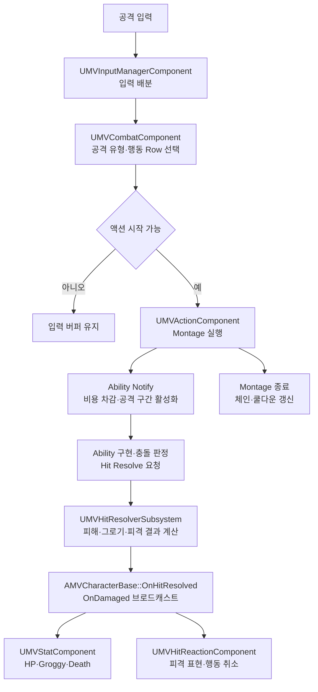

# Maverick 전투 시스템

## 전투 흐름

## 공격 종류

| 분류 | 현재 동작 |
|---|---|
| 약공격 | 연속 Row 기반 기본 연계 |
| 강공격 | 연속 Row 기반 강공격과 누르기 유지 조기 해제 분기 |
| 차지공격 | 누르기 유지 후 확정 시간 도달 시 실행 |
| 전력질주 공격 | 전력질주 문맥에서 약·강 입력을 전용 Row로 치환 |
| 회피 공격 | 회피 문맥에서 약·강 입력을 전용 Row로 치환 |

## 스킬 시스템

- `Q`는 `Skill0`, `R`은 `Skill1`로 처리
- 현재 무기와 입력 태그를 기준으로 Chooser 또는 DataTable Row 선택
- `NextChainName`으로 단일 스킬과 연속 스킬 구성
- 주 쿨다운·단계 간격·입력 창으로 연속 단계 제어
- Ability Notify 최초 시작 시 비용 차감, 종료 시 체인·쿨다운 갱신
- HUD에 사용 가능 상태·연속 단계·입력 창·남은 쿨다운 투영
