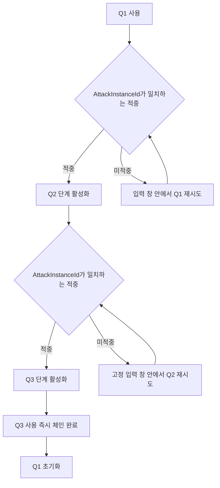
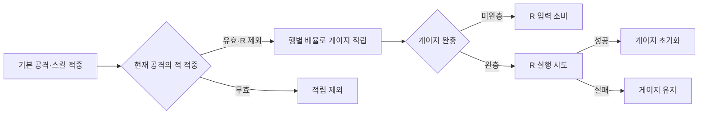

# 플레이어 스킬 구조

## Q 스킬 적중 연계

### 단계 전진

| 단계 | `ChainAdvancePolicy` | 전진 조건 |
|---|---|---|
| Q1 | `OnHitConfirmed` | 현재 공격 실행의 적중 확인 후 Q2 활성화 |
| Q2 | `OnHitConfirmed` | 현재 공격 실행의 적중 확인 후 Q3 활성화 |
| Q3 | `Immediate` | 사용 성공 시 적중 여부와 무관하게 체인 완료·Q1 초기화 |

- 적중 확인 필터: 공격자, 현재 Ability, 활성 상태, `AttackInstanceId`, 현재 Row 정책, 단계별 중복 처리 여부
- `OnHitConfirmed` 재시도: 동일 단계 유지와 다음 단계 전진 지연
- 기본 정책 `Immediate`: 기존 기본 공격·단일 스킬·일반 연계 동작 유지

### 체인 시간 기준

| 상태 | 의미 | 갱신 기준 |
|---|---|---|
| `InputWindowCloseTime` | 현재 단계를 성공시킬 수 있는 전체 마감 | 단계 진입 시 설정, `OnHitConfirmed` 재시도로 연장 금지 |
| `LastStageActivationTime` | 직전 시도 후 `InterStageCooldown` 계산 기준 | 각 Ability 종료 시 갱신 |

- 입력 판정 순서: `InterStageCooldown` 확인 후 입력 창 만료·체인 초기화 확인
- 입력 창 만료가 쿨다운보다 빠른 경우: 남은 쿨다운 종료까지 입력 차단 후 Q1 재시작
- Q1·Q2 재시도: 전체 마감 유지와 시도별 쿨다운 재시작의 동시 적용

### HUD

| 표시 | 기준 |
|---|---|
| 메인 슬롯 단계 | 입력 창 유효 시 현재 단계, 만료 시 Q1 |
| 메인 슬롯 쿨다운 | `bChainActive` 동안 현재 단계의 `InterStageCooldown` |
| 작은 체인 타이머 | 입력 창 유효·현재 단계 인덱스 1 이상 |
| 작은 타이머 아이콘 | 현재 단계의 직전 단계 아이콘 |

- Q2 사용 가능 상태: 작은 타이머에 Q1 아이콘
- Q3 사용 가능 상태: 작은 타이머에 Q2 아이콘
- 입력 창 만료 후 쿨다운 잔존: 작은 타이머 숨김, Q1 메인 아이콘에 남은 쿨다운 표시

### 지연 적중 수명 계약

- `OnHitConfirmed` 체인 전진은 Ability 활성 상태에서 수신한 적중만 허용
- 이동형 Q2 ShockWave: 최대 트레이스 도달 시점까지 Ability NotifyState 활성 구간 유지
- Ability 종료가 트레이스 종료보다 빠른 경우: 대미지는 적용되지만 체인 적중 확인은 거절
- ShockWave 속도·최대 거리·트레이스 수명 변경 시 Ability NotifyState 종료 시점 동반 검토

## R 스킬 적중 충전

기존 쿨다운 중심의 R 실행 조건을 적중 충전형 게이지로 교체
게이지 완충 전 R 입력은 실행 없이 소비하며, 완충 상태에서만 Ability 시작 허용

### 충전 기준

| 구분 | `RSkillGaugeGainMultiplier` | 기준 |
|---|---:|---|
| 일반 적중 | `1.0` | 기본 적립량 적용 |
| 다단 히트 적중 | `0.5` | 기본 공격 대비 절반 적립 |
| R 스킬 적중 | `0.0` | R 자체 재충전 차단 |

- 적립 대상: 현재 Ability와 `AttackInstanceId`가 일치하는 적 캐릭터 적중
- 적립량: 기본 적립량과 공격 데이터 행의 배율 조합
- 최대 게이지 초과분: 최대값으로 제한
- 공격 데이터에 배율이 없던 기존 행: 기본값 `1.0` 적용

### 상태 유지와 초기화

| 상황 | 게이지 처리 |
|---|---|
| R 실행 성공 | 즉시 초기화 |
| R 실행 실패 | 현재 값 유지 |
| 플레이어 사망 시작 | 초기화 |
| 무기 교체 | 현재 값 유지 |
| R 미지원 무기 장착 | 현재 값 유지, R 입력 소비 |

- 게이지 완충 여부를 `TrySkill`에서도 재검사하여 직접 호출 경로의 우회 실행 차단
- R의 데이터 테이블 쿨다운을 `0`으로 두고 게이지를 단일 재사용 조건으로 운용

### HUD

- R 슬롯 오버레이: 남은 쿨다운 대신 미충전 게이지 비율 표시
- 슬롯 투명도: 충전 여부와 분리하고 현재 장비의 R 지원 여부만 반영
- 무기 교체 후 복귀: 유지된 게이지 비율을 동일한 슬롯에 재표시
