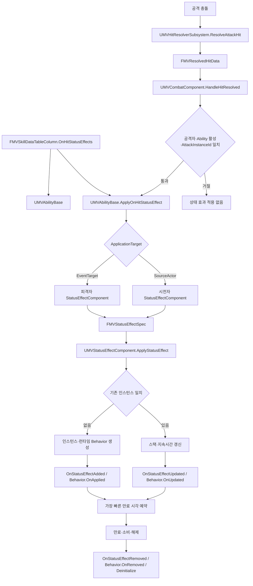
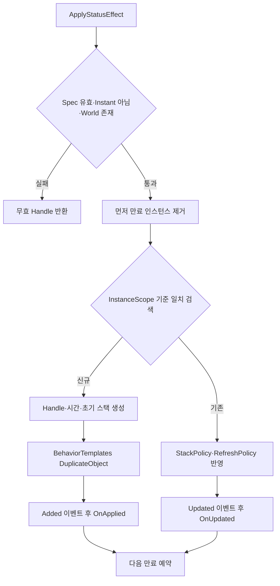
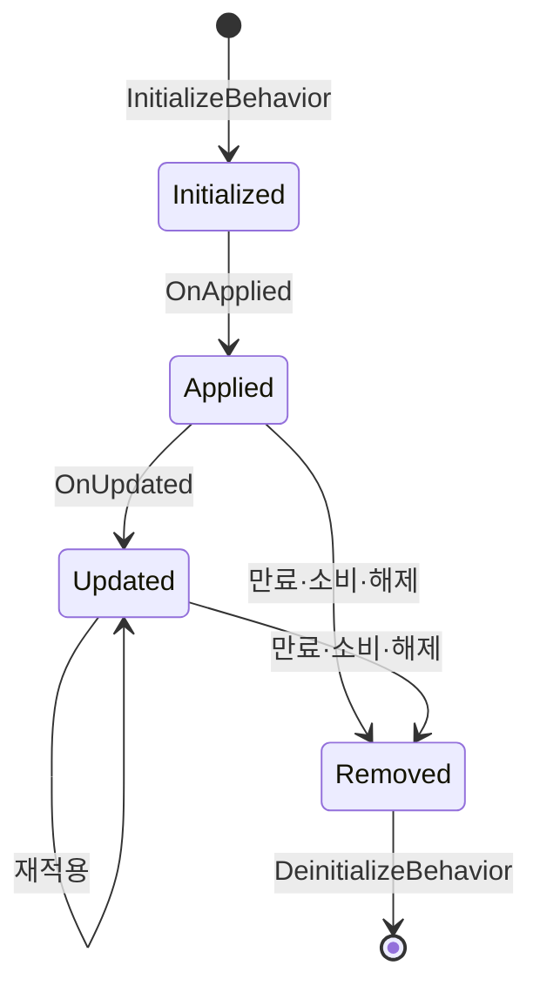
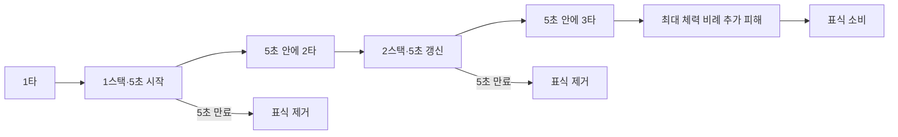

# 상태 효과 시스템

## 목적과 범위

- 캐릭터에게 부여된 버프·디버프·표식의 스택, 시전자, 지속시간과 실행 행동 관리
- 효과별 로직을 공용 인스턴스에 누적하지 않고 `Definition`과 `Behavior` 조합으로 확장
- 현재 적중 연동 예시: 최대 체력 비례 3타 표식과 지속 피해·폭발을 결합한 화상

## 전체 실행 흐름

`HandleHitResolved`의 `AttackInstanceId` 검사는 실제 공격 적중만 상태 효과 적용으로 연결하는 경계. 상태 효과가 만든 직접 피해는 `INDEX_NONE`을 사용하므로 같은 공격의 `OnHitStatusEffects`를 다시 실행하지 않는 구조

## 책임 분리

| 영역 | 주요 타입·파일 | 책임 |
|---|---|---|
| 공용 정책 | `MVStatusEffectEnums.h` | 생성 범위, 지속 방식, 스택, 시간 갱신, 제거 사유, 적용 대상 정의 |
| 공용 데이터 | `MVStatusEffectTypes.h` | 적용 설정, 적용 요청, 런타임 인스턴스, 고유 핸들 정의 |
| 고정 설계 데이터 | `UMVStatusEffectDefinition` | 효과 식별자, 태그, 지속·스택 정책, UI 정보, Behavior 템플릿 보유 |
| 런타임 컨테이너 | `UMVStatusEffectComponent` | 활성 인스턴스 생성·검색·재적용·제거와 만료 타이머 관리 |
| 행동 기반 클래스 | `UMVStatusEffectBehavior` | 적용·갱신·제거 수명주기와 소유 컴포넌트·핸들 접근 제공 |
| 공용 피해 유틸리티 | `MVStatusEffectDamageUtility` | 대상 최대 체력 비례 피해 계산과 직접 피해 요청 생성 |
| 적중 연결 | `UMVCombatComponent`, `UMVAbilityBase` | 적중 검증 후 공격 Row의 상태 효과를 대상 컴포넌트에 전달 |
| 피해 전달 | `UMVHitResolverSubsystem` | 계산 완료 피해를 기존 `FMVResolvedHitData` 피격 경로로 전달 |
| 캐릭터 조립 | `AMVCharacterBase` | 모든 공통 캐릭터에 `StatusEffectComponent` 기본 생성 |

## 데이터 계약

### 적용 데이터

| 타입 | 속성 | 의미 |
|---|---|---|
| `FMVStatusEffectApplication` | `Definition` | 적중 시 적용할 상태 효과 Data Asset |
|  | `StackDelta` | 사건 한 번이 추가할 스택 수 |
|  | `ApplicationTarget` | 피격자 `EventTarget` 또는 시전자 `SourceActor` 선택 |
| `FMVStatusEffectSpec` | `Definition` | 실제 적용 요청이 참조할 고정 설정 |
|  | `SourceActor` | 효과를 부여한 주체이자 시전자별 병합 기준 |
|  | `StackDelta` | 이번 요청에서 반영할 스택 수 |

`FMVStatusEffectSpec`에는 대상 필드 없음. 요청을 받는 `UMVStatusEffectComponent`의 소유자가 항상 실제 적용 대상

### 런타임 인스턴스

| 속성 | 의미 |
|---|---|
| `Handle` | 컴포넌트가 생성한 인스턴스 고유 식별자, `0`은 무효 |
| `Definition` | 변경되지 않는 효과 설정 참조 |
| `SourceActor` | 효과 부여자와 시전자별 인스턴스 구분 기준 |
| `CurrentStacks` | 현재 공용 스택, 최소 1 |
| `AppliedTime` | 최초 적용 또는 `Replace` 시점 |
| `ExpireTime` | 절대 만료 시각, 음수는 자동 만료 없음 |
| `RuntimeBehaviors` | Definition 템플릿에서 복제한 인스턴스 전용 행동 객체 |

효과별 추가 상태는 `FMVStatusEffectInstance`에 필드를 계속 추가하는 방식이 아닌 각 런타임 `Behavior` 내부에 보관

## Definition 정책

### 인스턴스 생성 범위

| `InstanceScope` | 일치 기준 | 사용 의미 |
|---|---|---|
| `OnePerTarget` | 같은 대상 컴포넌트와 같은 Definition | 시전자와 무관하게 대상당 하나의 효과 공유 |
| `OnePerSource` | 같은 Definition과 같은 `SourceActor` | 시전자마다 별도 스택·지속시간 유지 |
| `Independent` | 기존 인스턴스 검색 없음 | 매번 새 인스턴스 생성 |

3타 표식과 화상은 `OnePerSource` 기준. 여러 공격자가 같은 대상을 공격해도 각 공격자의 스택과 폭발 제한을 독립 관리

### 지속 방식

| `DurationPolicy` | 동작 |
|---|---|
| `Instant` | 현재 `ApplyStatusEffect`에서 거절, 즉시 효과 미지원 |
| `Timed` | `CurrentTime + Duration`으로 만료 시각 계산 |
| `Infinite` | `ExpireTime = -1`, 자동 만료 타이머 제외 |

### 스택 처리

| `StackPolicy` | 재적용 동작 |
|---|---|
| `NoStack` | 기존 스택 유지 |
| `AddStack` | `CurrentStacks + StackDelta`, `MaxStacks`까지 제한 |
| `Replace` | 시전자·적용 시각·만료 시각 교체, 스택 1로 초기화 |

### 지속시간 갱신

| `RefreshPolicy` | 재적용 동작 |
|---|---|
| `NoRefresh` | 기존 만료 시각 유지 |
| `RefreshDuration` | 재적용 시각부터 `Duration`을 다시 계산 |
| `ExtendDuration` | 기존 만료 시각 뒤에 `Duration` 추가 |

## 컨테이너 수명주기

### 생성과 재적용

- `PrimaryComponentTick` 비활성화
- 모든 활성 효과를 매 프레임 순회하지 않고 가장 빠른 `ExpireTime` 하나만 단발 타이머로 예약
- 타이머 실행 시 만료 효과 일괄 제거 후 다음으로 빠른 만료 시각 재예약
- 캐릭터 `EndPlay` 시 모든 효과를 `OwnerEnded`로 제거하고 컴포넌트 타이머 정리

### 제거 사유

| `RemovalReason` | 대표 상황 |
|---|---|
| `Manual` | 핸들을 지정한 직접 제거 |
| `Expired` | 지속시간 만료 |
| `Consumed` | 3타 발동처럼 효과 소모 |
| `Dispelled` | 정화·해제 기능용 계약 |
| `Cleared` | 전체 효과 초기화 |
| `Invalidated` | 인스턴스 데이터 무효화 |
| `OwnerEnded` | 소유 캐릭터 수명 종료 |

제거 시 배열에서 인스턴스를 먼저 분리한 뒤 제거 이벤트와 `Behavior.OnRemoved` 호출. 제거 행동이 다른 효과를 검색·갱신할 때 이미 제거된 자신을 다시 찾지 않는 순서

### 이벤트와 수동 스택 변경

| API·이벤트 | 역할 |
|---|---|
| `OnStatusEffectAdded` | 신규 효과와 초기 스택 전달 |
| `OnStatusEffectUpdated` | 갱신 인스턴스와 이전 스택 전달 |
| `OnStatusEffectRemoved` | 제거 인스턴스와 제거 사유 전달 |
| `FindStatusEffectHandle` | Definition과 선택적 SourceActor로 활성 효과 검색 |
| `HasStatusEffect` | 발동 차단 효과 존재 여부 확인 |
| `SetStatusEffectStacks` | `AddStack` 효과의 스택을 1부터 `MaxStacks` 사이로 직접 조정 |

`SetStatusEffectStacks`는 `OnStatusEffectUpdated`만 방송하고 `Behavior.OnUpdated`는 호출하지 않는 계약. 화상 폭발 제한 만료 시 스택을 1로 되돌리면서 폭발 행동을 다시 평가하지 않기 위한 경로

## Behavior 확장 모델

- Definition의 `BehaviorTemplates`: 에디터에서 편집하는 원본 객체
- 인스턴스 생성 시 템플릿마다 `DuplicateObject`, 효과별 독립 런타임 상태 확보
- `GetOwningStatusEffectComponent`: 효과가 적용된 대상의 컨테이너 접근
- `GetEffectHandle`: 행동이 속한 인스턴스 식별과 안전한 자기 제거에 사용
- 하나의 Definition에 여러 Behavior를 조합해 복합 효과 구성

### 현재 제공 Behavior

| Behavior | 발동 조건 | 핵심 동작 |
|---|---|---|
| `UMVStackMaxHealthDamageBehavior` | 이전 스택이 임계값 미만이고 현재 스택이 `RequiredStacks` 이상 | 대상 최대 체력 비례 피해, 차단 효과 확인, 후속 효과 적용, 소유 효과 유지 또는 소비 |
| `UMVPeriodicDamageBehavior` | 효과 최초 적용 후 `TickInterval` 경과 | 대상 최대 체력 비례 주기 피해와 독립 피해 타이머 관리 |
| `UMVResetStatusEffectStackBehavior` | 자신이 `Expired` 사유로 제거 | 같은 컴포넌트·같은 시전자의 연결 효과 스택을 `ResetStacks`로 변경 |

`UMVPeriodicDamageBehavior` 재적용은 다음 틱 시각을 초기화하지 않고 만료 시각만 갱신. 공격을 다시 맞아도 기존 1초 주기 유지. 마지막 틱 시각과 만료 시각이 같으면 타이머 실행 순서와 무관하게 마지막 피해 1회 보장

## 상태 효과 피해 경로

```mermaid
flowchart LR
    Behavior["Damage Behavior"] --> Utility["ApplyTargetMaxHealthDamage"]
    Utility --> MaxHP["Victim MaxHP × Ratio"]
    MaxHP --> Request["FMVDirectDamageRequest"]
    Request --> Direct["ResolveDirectDamage"]
    Direct --> HitData["FMVResolvedHitData"]
    HitData --> Broadcast["OnHitResolved"]
    Broadcast --> Victim["CharacterBase.OnHitResolved"]
    Victim --> Stat["기존 피해·사망 경로"]
```

- 공격력·방어력 공식 재계산 없이 `FinalDamage`를 직접 지정
- 기존 HitResolver의 방송과 피격자 전달 경로 재사용
- `AttackInstanceId = INDEX_NONE`: 공격 적중 연계와 상태 효과 피해의 구분
- `GroggyDamage = 0`, `HitReactionType = None`: 현재 3타 추가 피해와 화상 피해에서 별도 경직 없음
- 공격자·피격자 모두 `AMVCharacterBase`이며 StatComponent가 존재하고 피격자가 생존한 경우만 처리

## 예시 1: 최대 체력 비례 3타 표식

### 구성

| 설정 | 값·의미 |
|---|---|
| Definition | `DA_StatusEffect_ThirdHitMark` |
| 적용 대상 | 공격에 맞은 `EventTarget` |
| 생성 범위 | `OnePerSource`, 공격자마다 독립 표식 |
| 지속 방식 | `Timed`, 5초 |
| 스택 | `AddStack`, 최대 3 |
| 재적용 | `RefreshDuration`, 적중마다 남은 시간 5초로 갱신 |
| 행동 | `UMVStackMaxHealthDamageBehavior` |
| 3타 이후 | 설정된 최대 체력 비례 추가 피해 후 표식 `Consumed` 제거 |

표식 만료 또는 3타 소비 후 다음 적중은 새 인스턴스의 1스택부터 시작. 같은 대상이라도 공격자가 다르면 별도 Handle과 스택 사용

## 예시 2: 화상 지속 피해와 3타 폭발

### 화상 Definition

| 설정 | 값·의미 |
|---|---|
| Definition | `DA_StatusEffect_Burn` |
| 생성 범위 | `OnePerSource` |
| 지속 방식 | `Timed`, 5초 |
| 스택 | `AddStack`, 최대 3 |
| 재적용 | `RefreshDuration` |
| 주기 피해 | 1초마다 대상 최대 체력의 0.1% |
| 3타 폭발 | 3스택 도달 시 대상 최대 체력의 3% |
| 폭발 후 화상 | `bKeepOwningEffectAfterTrigger = true`, 지속 피해와 남은 시간 유지 |

### 폭발 제한 Definition

| 설정 | 값·의미 |
|---|---|
| Definition | `DA_StatusEffect_BurnBurstCooldown` |
| 적용 시점 | 화상 3타 폭발 피해 적용 성공 직후 |
| 지속시간 | 5초 |
| 가시성 | 기본 화상과 분리된 내부 발동 제한 효과 |
| 발동 차단 | 화상의 `TriggerBlockingEffect`가 같은 시전자의 제한 효과 확인 |
| 만료 행동 | 같은 시전자의 `DA_StatusEffect_Burn` 스택을 1로 초기화 |

화상 자체와 폭발 제한을 별도 Definition으로 분리. 공용 인스턴스에 `ProcStacks`, `CooldownEndTime` 같은 화상 전용 필드를 추가하지 않고 기존 컨테이너와 Behavior 조합만 사용

### 시간 예시

| 시각 | 사건 | 화상 상태 | 폭발 제한 |
|---:|---|---|---|
| 0초 | 3스택 도달 | 최대 체력 3% 폭발, 화상 유지 | 5초 제한 시작 |
| 2.5초 | 화상 공격 적중 | 지속시간 5초로 갱신, 지속 피해 유지 | 폭발 차단 |
| 4초 | 화상 공격 적중 | 지속시간 다시 갱신 | 폭발 차단 |
| 5초 | 제한 효과 만료 | 스택 1로 초기화 | 제거 |
| 7초 | 화상 공격 적중 | 2스택, 지속시간 갱신 | 없음 |
| 11초 | 화상 공격 적중 | 3스택, 최대 체력 3% 재폭발 | 새 5초 제한 시작 |

## 두 3타 효과의 차이

| 항목 | 3타 표식 | 화상 3타 폭발 |
|---|---|---|
| 공통 | 같은 시전자의 적중을 대상별로 누적 | 같은 시전자의 적중을 대상별로 누적 |
| 기본 부가 효과 | 없음 | 1초 주기 지속 피해 |
| 임계값 피해 | Definition에 설정한 최대 체력 비례 피해 | 최대 체력 3% |
| 3타 이후 본체 | 표식 소비 | 화상 유지 |
| 재발동 방식 | 다음 적중부터 즉시 새 3타 집계 | 5초 제한 만료 후 스택 1에서 집계 재개 |
| 별도 제한 효과 | 없음 | `DA_StatusEffect_BurnBurstCooldown` |

## 새 상태 효과 추가 절차

### 기존 Behavior 조합으로 표현 가능한 경우

1. `UMVStatusEffectDefinition` 기반 Data Asset 생성
2. `EffectId`, `EffectTags`, 지속·스택·갱신 정책 설정
3. 필요한 기존 Behavior를 `BehaviorTemplates`에 추가하고 수치 설정
4. 적중 연동 효과라면 공격 Row의 `OnHitStatusEffects`에 Definition, `StackDelta`, 적용 대상 설정
5. 비적중 사건이라면 해당 사건 코드에서 `FMVStatusEffectSpec` 생성 후 대상 컴포넌트에 직접 적용
6. 신규 생성·재적용·만료·복수 시전자·복수 대상 동작 검증

### 새로운 실행 로직이 필요한 경우

1. `UMVStatusEffectBehavior` 하위 클래스 생성
2. 최초 적용은 `OnApplied`, 재적용은 `OnUpdated`, 정리는 `OnRemoved`에 배치
3. 타이머·캐시·발동 횟수처럼 효과별 상태는 Behavior 인스턴스 내부에 보관
4. 소유 효과 접근은 `GetEffectHandle`, 대상 컨테이너 접근은 `GetOwningStatusEffectComponent` 사용
5. 공통 인스턴스 필드 추가 전 기존 정책·별도 Definition·Behavior 조합 가능성 우선 검토

## 현재 제약

- `Instant` 지속 정책 미지원, 적용 요청 시 무효 Handle 반환
- 활성 효과 배열과 이벤트의 네트워크 복제 미구현
- `bVisibleInUI`, `DisplayName`, `Icon`과 Added·Updated·Removed 이벤트만 준비, 실제 HUD 연결 미구현
- 태그 기반 일괄 정화·면역·우선순위·충돌 규칙 미구현
- 저장·불러오기를 통한 상태 효과 지속 복원 미구현
- `SetStatusEffectStacks`는 0스택 제거를 지원하지 않으며 최소값 1
- 적중 Row의 자동 적용 대상은 현재 `EventTarget`과 `SourceActor` 두 종류

## 검증 기록

| 항목 | 에디터 확인 결과 |
|---|---|
| 3타 표식 피해 | 기본 공격 49, 3번째 적중 49 + 추가 피해 169 = 218 |
| 3타 표식 만료 | 제한 시간 경과 후 다음 적중에서 1스택부터 재시작 |
| 화상 주기 피해 | 대상 최대 체력 1,500 기준 1초마다 1.5 피해 |
| 화상 폭발 | 대상 최대 체력 1,500 기준 45 피해 |
| 화상 지속시간 | 재적용마다 5초 갱신, 주기 피해 흐름 유지 |
| 폭발 재발동 | 대상별 5초 제한 중 차단, 만료 후 스택 재집계와 재폭발 |
| 대상 분리 | 서로 다른 대상의 화상 스택·폭발 제한 독립 처리 |
