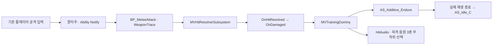
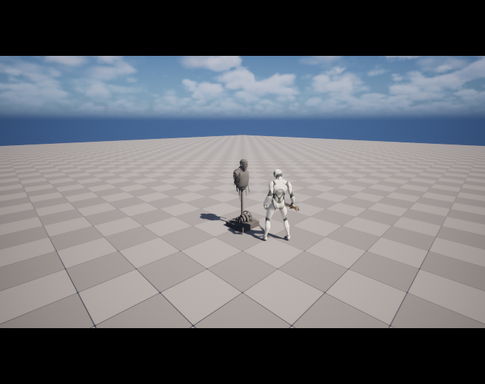
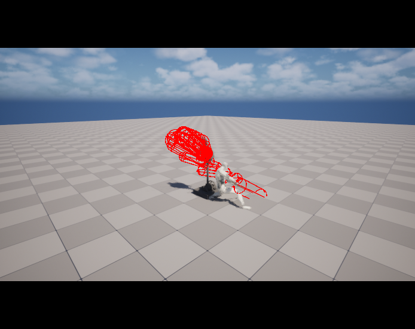

# 훈련용 허수아비

## 배치와 사용

- 레벨: `/Game/Characters/NPC/BaseBoss/Level/BaseBossTestLevel`
- 액터: `TrainingDummy_LiesOfP` 1개, 바닥 중앙 `(0, 0)`·바닥 높이 `-0.5cm`, 캡슐 중심 `Z=99.5cm`
- 플레이어 시작 위치: `(-600, 0, 92)`; 기존 `TutorialBoss_Test`: `(2500, 2500, 87.5)`로 이동하여 겹침 해소
- 콘텐츠 루트: `/Game/Characters/NPC/TrainingDummy`, 배치 클래스: `BP_TrainingDummy`
- 근접 타격 시 피격 동작·금속 효과음 재생, 대기 복귀 후 반복 타격 가능

## 추출 범위

| 항목 | 원본과 결과 |
|---|---|
| 설치본 | Steam Lies of P, AppID `1627720`, build `25227444` |
| 선택 변형 | `SK_CH_MOB_Training_03_Armless_Normal`, 팔 없는 일반형 |
| 메시 | 10,787 정점·15,433 삼각형, 원본 101본·Unreal FBX 루트 포함 102본, 높이 약 195.68cm |
| 재질 | A02의 BC·N·ARM 텍스처로 재구성한 `M_TrainingDummy` |
| 텍스처 | A02 BC·N·ARM·BN·SMH 5개 보존; ARM R/G/B를 AO/거칠기/금속성으로 연결 |
| 애니메이션 | 원본 스켈레톤 기준 10개, 대기·피격·그로기·치명타·공격 동작 포함 |
| 효과음 | 훈련 대상 SoundCue 참조 음원 55개, 공유 Servant02·플레이어 효과음 포함 |
| Unreal 파일 | 메시·스켈레톤·재질·텍스처·애니메이션·SoundWave·Blueprint 총 74개 |

- 원본·중간 변환본: `C:\Users\mindo\Workspace\AssetReviews\LiesOfPTrainingDummy`
- `Raw/`: cooked 패키지 416개, `Properties/`: 패키지 속성, `Converted/`: PSK·PSA·PNG·OGG, `Review/`: FBX·Blender·WAV·확인 이미지
- 추출 도구: 기존 CUE4Parse 환경 재사용, Lies of P 게임 분기와 [1.8.0.0 usmap](https://github.com/TheNaeem/Unreal-Mappings-Archive/tree/main/Lies%20of%20P/1.8.0.0) 적용
- 조회·의존성 추적 대상 197패키지, 추출 실패 0건; 원본 cooked Blueprint·SoundCue의 직접 런타임 사용 제외

## 피격 경로

- `AMVCharacterBase` 상속으로 기존 무기 판정과 HitResolver 연결
- `BindDamageHandlers`에서 허수아비 표현만 구독, 직접 피격에 따른 체력 감소·일반 밀림·사망 처리 제외
- 캡슐: 반지름 40cm·반높이 100cm, `WeaponTrace` 차단; 메시 자체 충돌과 이동 비활성
- 원본 additive 피격을 기준 자세와 합성한 절대 자세 FBX 사용; Unreal에서 additive 재적용 금지
- 피격 정지·연속 피격을 고려한 실제 애니메이션 재생 종료 기준 대기 복귀
- 피격 소리: 원본 `SE_NPC_Training_MT_Dmg_00_Cue`가 참조하는 `SE_NPC_Servant02_MT_Dmg_00/01/02`
- 원본 Cue 기준 피치 `0.8~1.0`, 음량 `0.8 × (0.9~1.0)` 재현, 공간 감쇠 최대 거리 2,820cm

## 검증 결과

2026-10-03, Windows 11·Codex·Unreal Engine `5.8.2-56702186`에서 실제 실행

| 범위 | 결과와 증명 범위 |
|---|---|
| C++ | `MaverickEditor Win64 Development` 빌드 통과 |
| 외형 | Blender 추출본 및 Unreal 레벨의 메시·재질 화면 확인; 원작 전체 셰이더·물리 표현의 동일성 검증 제외 |
| 애니메이션 | 10개 모두 원본 길이와 같은 스켈레톤 확인, 시작·중간·끝 102본 변환의 유한값 검사 통과 |
| 원본 음원 | 55개 PCM16 변환, 유효 길이·유한 신호·비무음 검사 통과 |
| 실제 타격 | `PlayerMeleePIE` 통과; 실제 플레이어 강공격 입력·몽타주·Notify·무기 충돌·HitResolver 경로로 2회 타격 |
| 반응 | 각 타격의 피격 애니메이션 진입·척추 본 변화·대기 복귀·체력 유지 확인 |
| 효과음 출력 | 실제 재생된 허수아비 전용 submix의 48kHz 스테레오 녹음, 비무음 구간 2개·최대 진폭 약 0.1173 확인 |

- 자동 검증 조건: PIE 사본에서 다른 NPC 제거, 각 공격 전 플레이어 위치 재설정, 정면 120cm에서 기존 강공격 입력 제출
- 키보드·마우스의 물리 입력, 실제 스피커 청취, 모든 무기·연타 간격·약공격 각도의 포괄 검증 제외
- 약공격: 별도 진단 실행에서 1회 피격 확인, 첫 베기의 짧은 유효 구간에 따른 반복 재현 불안정; 최종 반복 검사에는 강공격 사용
- 기존 레벨 제한: `ST_BaseAIStateTree`의 Search 상태 바인딩 오류 잔존, 전체 보스 AI 정상 동작의 증명 제외
- 기존 기본 `CHT_Attack_Player` 빈 바인딩 진단 1건은 검사에서 명시적으로 허용; 실제 장착 무기의 공격 경로 별도 검증
- 원작의 날씨·오염·세부 셰이더, 물리 흔들림, 전체 그로기·치명타 상태 전이 재현 제외

[피격 효과음의 엔진 출력 녹음](attachments/training-hit-output.wav) · [검증 수치](attachments/capture-validation.json)

## 재실행

1. `MaverickEditor` Development 빌드 후 `./Scripts/Assets/Test-TrainingDummy.ps1` 실행
2. 필요 시 `-EngineRoot <UE 경로> -Python <python.exe>` 지정
3. `Saved/AssetValidation/TrainingDummy/capture-validation.json`의 `passed: true` 확인

- 검사 실행에만 백그라운드 오디오 허용 옵션 적용; 비활성 Editor의 음소거로 인한 거짓 무음 판정 방지
- 검증기: 기존 보고서·녹음 제거 후 PIE 실행, 자동 검사 결과와 실제 출력 신호 모두 확인
- 새 추출본 가져오기: `Import-TrainingDummy.py`, 레벨 배치: `Place-TrainingDummy.py`; Unreal PythonScriptPlugin·EditorScriptingUtilities 필요
- 가져오기 원본 경로 재정의: `MAVERICK_TRAINING_SOURCE`; 원본 도구·게임 설치본 없이 기존 `.uasset` 사용 가능
- 로컬 환경 복구: 기존 필수 `AsyncLoadingScreen` 누락에 대해 [공식 1.7.0 소스](https://github.com/truong-bui/AsyncLoadingScreen) 설치·Win64 빌드 완료, Engine 플러그인 경로에만 반영
