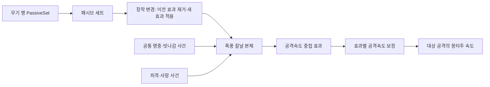
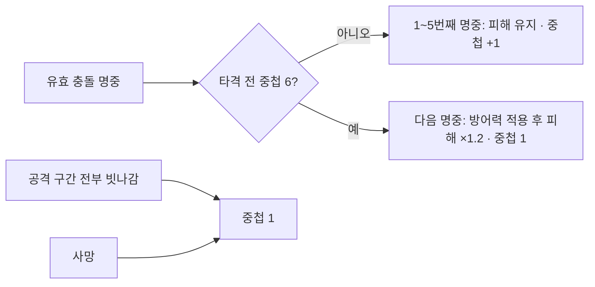
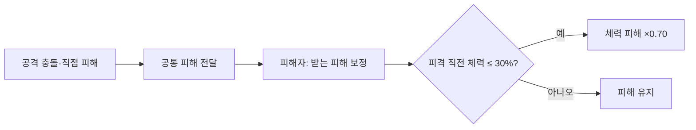
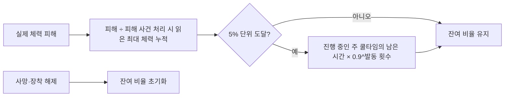
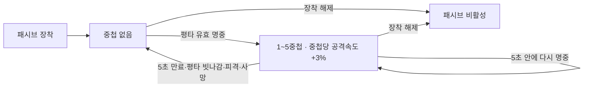
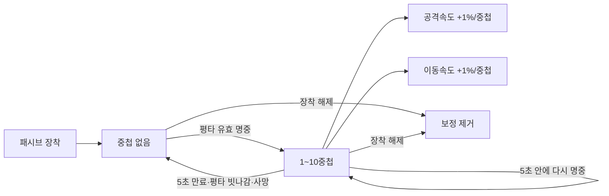
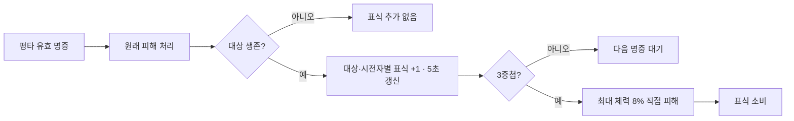

# 무기 패시브

## 핵심

- 무기 행의 `PassiveSet`이 장착 시 활성화할 패시브 묶음을 지정; 최종 목표는 무기당 3종이며 배열 개수는 코드에서 강제하지 않음
- 패시브는 공격 행마다 넣지 않고 장착 중 공통 전투 사건을 받아 동작

## 변경

- `UMVWeaponPassiveComponent`가 장착 변경 시 자신이 적용한 이전 효과를 제거하고 새 세트의 효과를 적용
- 폭풍 칼날 본체가 검증된 공격 충돌 명중·빗나감·피격·사망을 처리하고, 별도 중첩 효과가 공격속도를 보정
- 유효 명중마다 2%, 최대 10중첩, 마지막 명중부터 5초 유지; 빗나감·피격 시 중첩 제거
- 공격 행의 `bUseAttackSpeed`가 켜진 동작만 계산된 공격속도를 몽타주 재생 속도에 반영

## 월광의 응집

- `DA_Passive_MoonlightCondensation`은 `Infinite`·`AddStack`·`OnePerSource`·최대 6중첩으로 설정; 장착 시 내부 중첩 1로 시작
- `UMVMoonlightCondPassiveBehavior`가 현재 공격의 유효 충돌 타격을 공격자 기준으로 집계; 대상 변경·다단 공격의 각 명중은 포함하고 지속 피해·직접 피해는 제외
- 충전 시간 제한 없음; 일반 피격에는 중첩 유지, 사망 중에는 충전 차단, 패시브 해제 시 사건 구독 해제

## 파멸의 무게

- `UMVWeightOfRuinPassiveBehavior`가 장착 중 유효한 평타·스킬 공격 충돌의 방어 계산 후 피해를 15% 증가; 지속 피해와 별도 직접 피해는 제외
- `UMVStatComponent`에 회피 비용 증가율 20%를 고유 핸들로 등록; 효과 제거 시 피해 보정 구독과 자신이 등록한 비용 보정만 해제
- `UMVPlayerDodge`는 `Instant` 회피 비용에 현재 배율을 한 번 적용하고, 같은 값으로 실행 가능 여부를 검사한 뒤 회피 시작에 성공하면 차감; `MinRequiredStamina`는 별도 최소 보유 조건으로 유지
- 현재 시험 무기에서 기본 회피 비용 `12→14.4`, 비용 미달 시 회피 거부, 무기 해제 시 `12`로 복원 확인; 월광의 응집 강화와 함께 적용되면 피해 배율 `1.15×1.20=1.38`

## 불굴의 의지

- `DA_TwoHandedShield_PassiveSet`의 `DA_Passive_IndomitableWill`은 `Infinite`·`NoStack`·`OnePerSource`로 장착 중 유지; 현재 무기로 시험하고 실제 양손 방패 연결은 제작 후 진행
- `UMVHitResolverSubsystem`이 공격자 보정 뒤 피해자의 `UMVStatComponent::OnModifyIncomingDamage`를 호출; 보정된 `FinalDamage`를 체력 차감과 후속 피격 처리에 함께 전달
- `UMVIndomitableWillPassiveBehavior`는 피격 직전 `CurrentHP ≤ MaxHP × 0.30`이면 체력 피해에 `0.70`을 곱함; 이번 피해로 기준 이하가 되면 다음 피격부터 적용
- 체력 조건은 매 피해마다 다시 계산; 체력 소비·직접 설정과 강인도·그로기 피해는 보정하지 않음
- 적용 시 받는 피해 보정 사건을 구독하고 해제 시 자기 구독만 제거; 사망 중에는 보정하지 않음
- 시험 무기에서 체력 `33.40/100`의 피해 `10.20`은 유지되고, 체력 `23.20/100`의 다음 피해는 `10.20→7.14`로 감소 확인; 개발자가 재장착·해제·부활 동작 확인 후 임시 로그 제거
- 공격 충돌은 실행 로그로 확인; 공통 경로에 포함된 직접·지속 피해와 정확히 30%·회복·최대 체력 변경의 개별 실행 검증은 진행하지 않음
- 기획서의 가드 스태미너 요구량 절반은 가드 기능 구현 후 연결

## 피 흘린 만큼..

- `DA_Passive_BloodPrice`의 `UMVBloodPricePassiveBehavior`가 장착 중 `UMVStatComponent::OnDamageApplied`를 구독해 방어·피해 보정 후 실제 체력 감소량을 집계; 체력 비용·직접 설정은 이 사건에 포함되지 않음
- 실제 피해를 피해 사건 처리 시 읽은 최대 체력의 비율로 누적해 5%마다 1회 발동; 한 번에 여러 기준을 넘으면 해당 횟수만큼 발동하고 5% 미만의 잔여 비율은 유지
- `UMVCombatComponent`가 현재 무기의 진행 중인 스킬 주 쿨타임을 발동 1회당 남은 시간의 10%씩 감소; 종료 예정 시각을 실행 판정과 UI 조회가 함께 사용
- 아직 시작하지 않았거나 끝난 주 쿨타임, 실행 중인 스킬, 연계 단계 사이 대기시간, 게이지 방식 R 스킬은 제외; 대상이 없어도 발동 횟수를 다음 스킬을 위해 보관하지 않음
- 시전자 사망·패시브 해제 시 잔여 피해 비율 초기화; 사망을 일으킨 피격에는 환원하지 않고 패시브 제거 자체는 이미 줄인 쿨타임 종료 시각을 복원하지 않음
- 현재 무기 로그에서 최대 체력 100에 실제 피해 6의 1회 발동·잔여 1%, 누적 10%의 2회 발동, W의 `0.485→0.437초`와 E의 `0.376→0.304초` 감소 확인; 임시 추적 로그 제거 후 빌드·실행은 진행하지 않음

## 유연한 흐름

- `DA_Passive_FlexibleFlow`은 장착 중 유지하고, `UMVConsecutiveHitPassiveBehavior`가 평타의 유효 충돌 명중을 구분해 별도 효과를 중첩; `bResetOnOwnerDamaged`로 피격 초기화 여부 설정
- `DA_Effect_FlexibleFlowStacks`는 최대 5중첩·마지막 명중부터 5초 유지; `UMVAttackSpeedPerStackBehavior`가 중첩당 공격속도 3%, 최대 15%를 자기 보정으로 반영
- 피격에는 공통 경로로 전달된 지속 피해 포함; 스킬 명중·빗나감은 중첩에 영향 없음
- 현재 시험 무기에서 중첩·초기화·반복 장착을 개발자가 확인하고 임시 로그 제거; 실제 채찍·에너지소드 연결은 무기 제작 후 재검증

## 아웃사이더 스텝

- `DA_CrossbowBow_PassiveSet`의 `DA_Passive_OutsiderStep`이 장착 중 공통 연속 명중 행동을 활성화; 평타 유효 명중마다 별도 효과 `DA_Effect_OutsiderStepStacks`를 1중첩 적용
- 중첩은 최대 10, 마지막 명중부터 5초 유지; 평타 빗나감·사망·장착 해제에 제거하고 피격에는 유지
- 같은 중첩 효과의 `UMVAttackSpeedPerStackBehavior`와 `UMVMoveSpeedPerStackBehavior`가 중첩당 공격속도·이동속도를 각각 1%, 최대 10% 증가; 해제 시 각자 등록한 보정만 제거
- 이동속도 배율은 방향·걷기·달리기·질주 속도 계산 뒤 적용하며 질주 공격의 속도 기준에도 반영; 공격 몽타주는 해당 행의 `bUseAttackSpeed` 설정을 따름
- 현재 시험 무기에서 두 속도의 동시 증가와 빗나감 초기화를 로그로 확인; 최대 중첩·5초 만료·피격 유지·이동 상태 전환·재장착·사망 후 복원은 개발자가 게임에서 확인하고 임시 로그 제거

## 트리플 볼트

- `DA_CrossbowBow_PassiveSet`의 `DA_Passive_TripleBolt` 본체가 장착 중 `UMVTripleBoltPassiveBehavior`를 활성화; 현재 시험 범위는 기존 무기의 평타
- `UMVHitResolverSubsystem::OnHitDeliveryFinished`는 원래 타격의 피격 처리가 끝난 뒤 발생; `UMVCombatComponent`가 현재 공격의 `AttackCollision` 명중만 `OnValidatedAttackHitAfterDamage`로 전달
- 본체는 살아 있는 대상에 `DA_Effect_TripleBoltMark`를 적용; 대상별·시전자별 최대 3중첩, 마지막 명중부터 5초 갱신, 빗나감·시전자 피격에는 유지
- 세 번째 명중에 `UMVStackMaxHealthDamageBehavior`가 대상 최대 체력의 8%를 직접 피해로 적용하고 표식을 소비; 추가 피해의 `DirectDamage` 출처와 `INDEX_NONE` 공격 번호는 새 평타 명중으로 집계하지 않음
- 대상 사망 시 해당 표식을 즉시 제거; 시전자 사망·장착 해제 시 자신이 만든 남은 표식과 사건 구독을 정리; 만료된 대상의 사망 구독은 다음 유효 평타 또는 해제 시 정리
- 현재 무기 로그에서 3·6번째 명중의 표식 소비와 각각 체력 320 추가 감소 확인; 개발자가 대상 분리·5초 만료·빗나감 유지·장착 해제·사망·스킬 제외를 실행 확인하고 임시 로그 제거

## 기준

- 다음 무기도 같은 세트·상태 효과 연결을 사용하고, 패시브별 규칙은 각 행동에 둠

| 설정 지점 | 재사용 기준 |
|---|---|
| 패시브 세트 | 무기 행의 `PassiveSet`에 연결하고 `PassiveDefinitions`에 해당 무기의 패시브 본체를 배치 |
| 패시브 본체 | `Infinite`·`OnePerSource`와 `NoStack` 또는 `AddStack` 설정 필요; 다른 설정은 장착 컴포넌트에서 건너뜀 |
| 패시브 행동 | 필요한 공통 사건을 구독하고 제거 시 구독과 자신이 만든 파생 효과를 정리 |
| 공격 행 | 같은 패시브를 `OnHitStatusEffects`에 중복 설정하지 않음; 속도 반영 대상만 `bUseAttackSpeed`로 선택 |

## 기획서 기준 무기별 패시브

- 출처: `PROJECT_메버릭_전투_기획_신규무기 대검 추가 및 서순 변경.pdf` 3~10쪽의 무기별 P 스킬 표
- 아래는 기획서 원안의 발동 조건과 수치; 세부 판정과 실제 구현 범위는 해당 패시브 작업 때 확정
- 폭풍 칼날·월광의 응집·파멸의 무게·유연한 흐름·아웃사이더 스텝·트리플 볼트·피 흘린 만큼..의 현재 시험 범위 구현; 불굴의 의지는 저체력 피해 감소 구현·가드 효과 보류; 잔상 이동은 퍼펙트 닷지 구현 전까지 보류; 그 외 9종은 구현 전

| 무기 | 패시브 | 기획서의 조건·효과 |
|---|---|---|
| 카타나·레이피어 | 잔상 이동 | 퍼펙트 닷지 직후 2초간 공격속도 15% 증가 |
| 카타나·레이피어 | 폭풍 칼날 | 평타가 끊기지 않고 명중할 때마다 공격속도 2%씩 중첩, 최대 20%; 피격 판정 시 중첩 초기화 |
| 카타나·레이피어 | 약점 포착 | 적 체력이 30% 이하일 때 치명타 확률 20% 증가 |
| 대검 | 거인의 강인함 | 강인도 30% 증가, 받는 피해량 15% 증가 |
| 대검 | 월광의 응집 | 일반 공격·스킬 명중마다 중첩; 5중첩 시 다음 공격에 20% 추가 피해 |
| 대검 | 파멸의 무게 | 스킬·평타 피해 15% 증가, 회피 시 스태미너 소모 20% 증가 |
| 헬버드·폴암 | 거인의 심장 | 전투 중 최대 체력 상시 15% 증가 |
| 헬버드·폴암 | 파멸의 교차 | 도끼 계열 스킬 명중 후 3초 이내 망치 계열 스킬 피해 15% 증가; 망치 명중 후 도끼 사용에도 동일 |
| 헬버드·폴암 | 외곽 참격 | 도끼날 또는 망치 헤드의 공격 판정 끝부분으로 적중 시 피해 25% 증가 |
| 양손 방패 | 철벽 | 방어력 상시 20% 증가, 최대 체력 20% 증가 |
| 양손 방패 | 불굴의 의지 | 자신의 체력이 30% 이하일 때 받는 모든 피해 30% 감소, 가드 시 스태미너 요구량 절반 |
| 양손 방패 | 피 흘린 만큼.. | 피격으로 최대 체력의 5%를 잃을 때마다 쿨타임 10% 환원 |
| 석궁·활 | 트리플 볼트 | 기본 공격·주력 사격의 3타 적중 시 추가 피해; 추가 피해 수치는 기획서에 없음 |
| 석궁·활 | 아웃사이더 스텝 | 평타가 끊기지 않고 명중할 때마다 공격속도·이동속도 각각 1%씩 중첩, 최대 10% |
| 석궁·활 | 스나이퍼 | 퍼펙트 닷지 성공 시 3초간 피해 15% 증가 |
| 채찍·에너지소드 | 포식자의 순환 | 스킬로 적 타격 시 10% 확률로 소모한 마나와 쿨타임 환원 |
| 채찍·에너지소드 | 유연한 흐름 | 평타가 끊기지 않고 명중할 때마다 공격속도 3%씩 중첩, 최대 15%; 피격 판정 시 중첩 초기화 |
| 채찍·에너지소드 | 혈류 포박 | 채찍 사정거리 끝부분으로 적중 시 공격력 20% 증가 |

## 남은 일

- 완성된 대검의 무기 행에 `DA_GreatSword_PassiveSet` 연결 후 월광의 응집·파멸의 무게를 실제 대검에서 재검증
- 양손 방패 제작 후 무기 행에 `DA_TwoHandedShield_PassiveSet` 연결·불굴의 의지와 피 흘린 만큼.. 재검증; 가드 구현 후 불굴의 의지의 가드 비용 절반 효과 추가
- 피 흘린 만큼..의 쿨타임 감소 후 화면 표시·실제 재사용 시점·환원 저장 없음, 직접·지속 피해와 체력 회복·최대 체력 변경 경계, 임시 로그 제거 후 회귀 동작은 실행 검증 보류
- 채찍·에너지소드 제작 후 무기 행에 `DA_WhipEnergySword_PassiveSet` 연결·재검증
- 석궁·활 제작 후 `DA_CrossbowBow_PassiveSet` 연결·재검증; 트리플 볼트의 주력 사격과 공격 동작 종료 뒤 도착한 투사체의 명중은 현재 시험 범위 밖
- 트리플 볼트의 다른 시전자·다단 타격과 임시 로그 제거 후 회귀 동작은 개별 실행 검증 미보고
- 불굴의 의지의 직접·지속 피해, 정확히 30%·회복·최대 체력 변경 경계는 실행 검증 보류
- 다른 새 무기별 세트 연결과 폭풍 칼날의 대상 공격 목록·방어 판정 연결은 이후 결정
