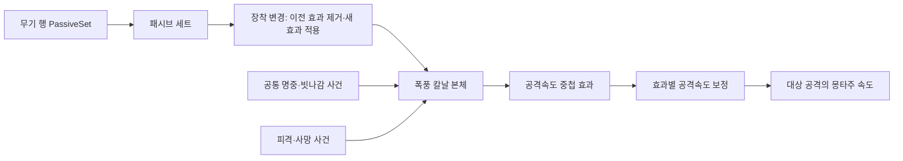

# 무기 패시브

## 핵심

- 무기 행의 `PassiveSet`이 장착 시 활성화할 패시브 묶음을 지정; 최종 목표는 무기당 3종이며 배열 개수는 코드에서 강제하지 않음
- 패시브는 공격 행마다 넣지 않고 장착 중 공통 전투 사건을 받아 동작

## 변경

- `UMVWeaponPassiveComponent`가 장착 변경 시 자신이 적용한 이전 효과를 제거하고 새 세트의 효과를 적용
- 폭풍 칼날 본체가 검증된 공격 충돌 명중·빗나감·피격·사망을 처리하고, 별도 중첩 효과가 공격속도를 보정
- 유효 명중마다 2%, 최대 10중첩, 마지막 명중부터 5초 유지; 빗나감·피격 시 중첩 제거
- 공격 행의 `bUseAttackSpeed`가 켜진 동작만 계산된 공격속도를 몽타주 재생 속도에 반영

## 기준

- 다음 무기도 같은 세트·상태 효과 연결을 사용하고, 패시브별 규칙은 각 행동에 둠

| 설정 지점 | 재사용 기준 |
|---|---|
| 패시브 세트 | 무기 행의 `PassiveSet`에 연결하고 `PassiveDefinitions`에 해당 무기의 패시브 본체를 배치 |
| 패시브 본체 | `Infinite`·`NoStack`·`OnePerSource` 설정 필요; 다른 설정은 장착 컴포넌트에서 건너뜀 |
| 패시브 행동 | 필요한 공통 사건을 구독하고 제거 시 구독과 자신이 만든 파생 효과를 정리 |
| 공격 행 | 같은 패시브를 `OnHitStatusEffects`에 중복 설정하지 않음; 속도 반영 대상만 `bUseAttackSpeed`로 선택 |

## 남은 일

- 새 무기별 세트 연결과 폭풍 칼날의 대상 공격 목록·방어 판정 연결은 이후 결정
