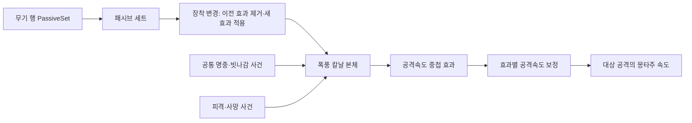
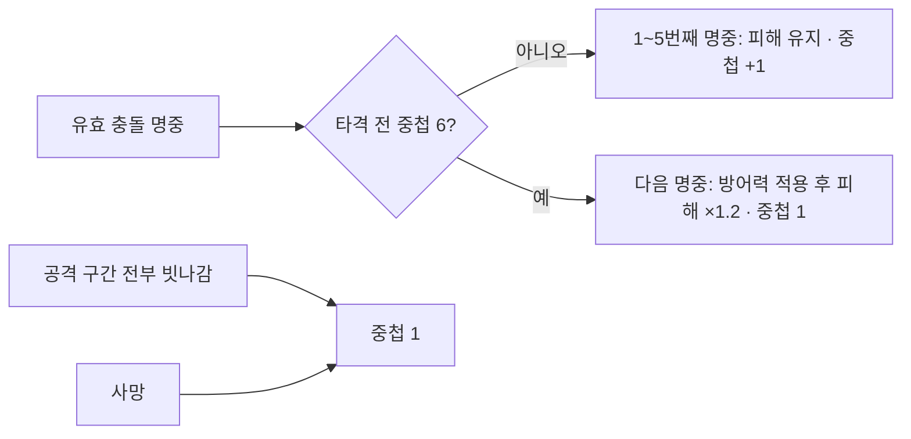

# 무기 패시브

## 핵심

- 무기 행의 `PassiveSet`이 장착 시 활성화할 패시브 묶음을 지정; 최종 목표는 무기당 3종이며 배열 개수는 코드에서 강제하지 않음
- 패시브는 공격 행마다 넣지 않고 장착 중 공통 전투 사건을 받아 동작

## 변경

- `UMVWeaponPassiveComponent`가 장착 변경 시 자신이 적용한 이전 효과를 제거하고 새 세트의 효과를 적용
- 폭풍 칼날 본체가 검증된 공격 충돌 명중·빗나감·피격·사망을 처리하고, 별도 중첩 효과가 공격속도를 보정
- 유효 명중마다 2%, 최대 10중첩, 마지막 명중부터 5초 유지; 빗나감·피격 시 중첩 제거
- 공격 행의 `bUseAttackSpeed`가 켜진 동작만 계산된 공격속도를 몽타주 재생 속도에 반영

## 월광의 응집

- `DA_Passive_MoonlightCondensation`은 `Infinite`·`AddStack`·`OnePerSource`·최대 6중첩으로 설정; 장착 시 내부 중첩 1로 시작
- `UMVMoonlightCondPassiveBehavior`가 현재 공격의 유효 충돌 타격을 공격자 기준으로 집계; 대상 변경·다단 공격의 각 명중은 포함하고 지속 피해·직접 피해는 제외
- 충전 시간 제한 없음; 일반 피격에는 중첩 유지, 사망 중에는 충전 차단, 패시브 해제 시 사건 구독 해제

## 기준

- 다음 무기도 같은 세트·상태 효과 연결을 사용하고, 패시브별 규칙은 각 행동에 둠

| 설정 지점 | 재사용 기준 |
|---|---|
| 패시브 세트 | 무기 행의 `PassiveSet`에 연결하고 `PassiveDefinitions`에 해당 무기의 패시브 본체를 배치 |
| 패시브 본체 | `Infinite`·`OnePerSource`와 `NoStack` 또는 `AddStack` 설정 필요; 다른 설정은 장착 컴포넌트에서 건너뜀 |
| 패시브 행동 | 필요한 공통 사건을 구독하고 제거 시 구독과 자신이 만든 파생 효과를 정리 |
| 공격 행 | 같은 패시브를 `OnHitStatusEffects`에 중복 설정하지 않음; 속도 반영 대상만 `bUseAttackSpeed`로 선택 |

## 기획서 기준 무기별 패시브

- 출처: `PROJECT_메버릭_전투_기획_신규무기 대검 추가 및 서순 변경.pdf` 3~10쪽의 무기별 P 스킬 표
- 아래는 기획서 원안의 발동 조건과 수치; 세부 판정과 실제 구현 범위는 해당 패시브 작업 때 확정
- 폭풍 칼날·월광의 응집 구현 완료, 잔상 이동은 퍼펙트 닷지 구현 전까지 보류; 나머지 15종은 구현 전

| 무기 | 패시브 | 기획서의 조건·효과 |
|---|---|---|
| 카타나·레이피어 | 잔상 이동 | 퍼펙트 닷지 직후 2초간 공격속도 15% 증가 |
| 카타나·레이피어 | 폭풍 칼날 | 평타가 끊기지 않고 명중할 때마다 공격속도 2%씩 중첩, 최대 20%; 피격 판정 시 중첩 초기화 |
| 카타나·레이피어 | 약점 포착 | 적 체력이 30% 이하일 때 치명타 확률 20% 증가 |
| 대검 | 거인의 강인함 | 강인도 30% 증가, 받는 피해량 15% 증가 |
| 대검 | 월광의 응집 | 일반 공격·스킬 명중마다 중첩; 5중첩 시 다음 공격에 20% 추가 피해 |
| 대검 | 파멸의 무게 | 스킬·평타 피해 15% 증가, 회피 시 스태미너 소모 20% 증가 |
| 헬버드·폴암 | 거인의 심장 | 전투 중 최대 체력 상시 15% 증가 |
| 헬버드·폴암 | 파멸의 교차 | 도끼 계열 스킬 명중 후 3초 이내 망치 계열 스킬 피해 15% 증가; 망치 명중 후 도끼 사용에도 동일 |
| 헬버드·폴암 | 외곽 참격 | 도끼날 또는 망치 헤드의 공격 판정 끝부분으로 적중 시 피해 25% 증가 |
| 양손 방패 | 철벽 | 방어력 상시 20% 증가, 최대 체력 20% 증가 |
| 양손 방패 | 불굴의 의지 | 자신의 체력이 30% 이하일 때 받는 모든 피해 30% 감소, 가드 시 스태미너 요구량 절반 |
| 양손 방패 | 피 흘린 만큼.. | 피격으로 최대 체력의 5%를 잃을 때마다 쿨타임 10% 환원 |
| 석궁·활 | 트리플 볼트 | 기본 공격·주력 사격의 3타 적중 시 추가 피해; 추가 피해 수치는 기획서에 없음 |
| 석궁·활 | 아웃사이더 스텝 | 평타가 끊기지 않고 명중할 때마다 공격속도·이동속도 각각 1%씩 중첩, 최대 10% |
| 석궁·활 | 스나이퍼 | 퍼펙트 닷지 성공 시 3초간 피해 15% 증가 |
| 채찍·에너지소드 | 포식자의 순환 | 스킬로 적 타격 시 10% 확률로 소모한 마나와 쿨타임 환원 |
| 채찍·에너지소드 | 유연한 흐름 | 평타가 끊기지 않고 명중할 때마다 공격속도 3%씩 중첩, 최대 15%; 피격 판정 시 중첩 초기화 |
| 채찍·에너지소드 | 혈류 포박 | 채찍 사정거리 끝부분으로 적중 시 공격력 20% 증가 |

## 남은 일

- 완성된 대검에 월광의 응집 세트 연결, 다른 새 무기별 세트 연결과 폭풍 칼날의 대상 공격 목록·방어 판정 연결은 이후 결정
