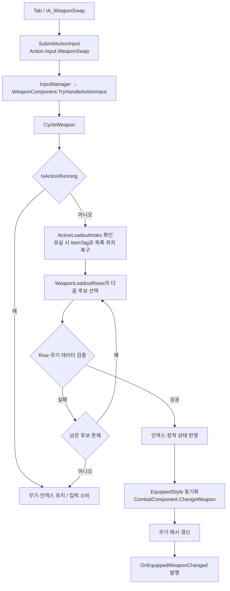

# 플레이어 무기 교체

## 범위와 책임

한손검과 양손에 각각 검을 든 `DualWield` 사이의 교체 구현
보스 애니메이션을 활용한 임시 무기 세트로 장착·애니메이션 선택·공격 판정 연결
구현 기준 커밋: `4122dcfb`

| 계층 | 책임 |
|---|---|
| `UMVInputManagerComponent` | 입력 수집·버퍼·우선순위별 처리기 호출 |
| `UMVWeaponComponent` | 장비 목록·장착 상태·교체 가능 여부·무기 메시 관리 |
| `UMVCombatComponent` | 장착 스타일에 대응하는 전투 데이터·공격 선택 |
| `BP_ThirdPersonCharacter` | 입력 전달·장착 변경 이벤트·애니메이션 레이어·무기 소켓 좌표 제공 |
| `BP_DualWeapon_MeleeAttack` | 손별 트레이스 활성 상태·피격 기록·적중 요청 |
| `ANS_DualWeaponTrace` | 몽타주 구간별 판정 대상 손 지정 |

## TryHandleActionInput 추가 이유

교체 가능 여부와 장착 상태의 소유자인 `WeaponComponent`를 공통 입력 처리 경로에 연결
Blueprint는 입력 태그 전달, InputManager는 처리기 배분, WeaponComponent는 교체 판단 담당

`IMVActionInputHandlerInterface` 구현으로 `BeginPlay`에서 처리기 등록, `EndPlay`에서 해제
등록 우선순위: `MVActionInputHandlerPriorities::Weapon = 50`

`TryHandleActionInput` 반환값은 장착 성공 여부가 아닌 입력 소비 여부
`Action.Input.WeaponSwap`이면 `CycleWeapon` 결과와 무관하게 `true`, 다른 태그이면 `false`
교체 불가 입력의 버퍼 잔류와 액션 종료 후 지연 교체 방지

## Tab 입력과 장착 전환



장착 전 검증: 유효한 ItemTag, 맨손 이외 주 메시 존재·로드 성공, SkeletalMesh 또는 StaticMesh 형식
주 메시와 지정된 보조 메시의 필수 소켓: `Trace_Start`, `Trace_End`, `Trace_Left`, `Trace_Right`
후보 검증 실패 시 다음 Row 탐색, 성공 후보 부재 시 기존 상태 유지

성공 시 `ActiveLoadoutIndex`와 `CurrentWeaponState` 갱신, 공격력·TraceRadius를 0 이상으로 제한
주·보조 메시와 각 부착 소켓·Transform을 장착 데이터에서 적용

## 스타일별 대기·공격 애니메이션

| 대상 | 구성 |
|---|---|
| 듀얼 대기 레이어 | `ABP_PlayerDualWield_Test`에 `RTG_PuppetToManny`로 리타게팅한 NamelessPuppet 대기 애니메이션 연결 |
| 레이어 선택 | `BP_ThirdPersonCharacter.ApplyWeaponAnimationLayer`에서 EquippedStyle별 `Link Anim Class Layers` 호출 |
| 초기·교체 시점 | BeginPlay의 고정 레이어 연결을 선택 함수로 대체, `OnEquippedWeaponChanged`에도 같은 함수 연결 |
| 공격 선택 | `CHT_Attack_Player`에 `Current Weapon Style = DualWield` 분기 추가 |
| 공격 데이터 | 기존 OneHand 설정을 기반으로 `DT_Attack_Player_DualWield_Test`와 대응 Action Row Handle 연결 |
| 시험 공격 | 리타게팅한 공격 시퀀스로 플레이어 공격 몽타주 구성, 시험용 첫 공격 Row에 연결 |

기존 작업 메모의 `DT_Attack_DualWield_Test` 표기와 달리 저장소 자산명은 `DT_Attack_Player_DualWield_Test`
보스 공격 `AS_OA_Skill1` 등의 시퀀스를 활용하되 플레이어 Ability·공격 구간 Notify 계약 유지

## 각 손의 무기별 트레이스

`GetMeleeDualWeaponData`는 `BP_ThirdPersonCharacter`에서 구현한 무기 좌표 제공 인터페이스
구현 전 기본 반환값은 위치 `(0,0,0)`·반지름 `0`; 실제 무기 소켓 조회 연결로 트레이스 미표시 문제 해소

| 반환값 | 조회 대상 |
|---|---|
| `Start R`, `End R` | `WeaponMeshComponent`의 `Trace_Start`, `Trace_End` 월드 좌표 |
| `Start L`, `End L` | `SecondaryWeaponMeshComponent`의 동일 소켓 월드 좌표 |
| `Trace Radius` | 기존 한손검 방식의 소켓 기반 반지름 계산 재사용 |

기존 소켓 기반 반지름 계산: `Trace_Left - Trace_Right`의 축별 절댓값 중 최댓값을 2로 나눈 값
이 Blueprint 반환값과 장착 데이터의 `CurrentWeaponState.TraceRadius`는 구분

`AttackTrace`의 `Sequence`에서 각 손의 활성 Boolean을 확인한 뒤 `Sphere Trace By Channel` 실행
채널은 `WeaponTrace`, 시작·끝 좌표는 해당 손의 반환값 사용

| 구분 | 오른손 | 왼손 |
|---|---|---|
| 활성 상태 | `bRightTraceEnabled` | `bLeftTraceEnabled` |
| 제외·피격 기록 | `HitActors_R` | `HitActors_L` |
| 활성화 | `EnableRightTrace` | `EnableLeftTrace` |
| 비활성화 | `DisableRightTrace` | `DisableLeftTrace` |

검출한 `MVCharacterBase`를 해당 손의 배열에 추가하고 `Actors to Ignore`로 재사용
동일 Ability 실행 중 같은 손의 반복 타격 차단, 다른 손의 동일 대상 타격 허용

`FMVHitResolveRequest`에 공격자·피격자·AttackInstanceId·피해 및 그로기 배율·충돌 위치·법선 등 전달
최종 피해·피격 처리는 `UMVHitResolverSubsystem.ResolveAttackHit`에 위임

## 손별 Notify 구간과 초기화

C++ `EMVWeaponTraceHand`를 `ANS_DualWeaponTrace.TraceHand`의 타입으로 사용, `Instance Editable` 활성화
현재 Ability를 `BP_DualWeapon_MeleeAttack`으로 캐스팅한 뒤 선택한 손의 활성 상태 변경

| TraceHand | Notify Begin | Notify End |
|---|---|---|
| `None` | 상태 변경 없음 | 상태 변경 없음 |
| `Right` | 오른손 활성화 | 오른손 비활성화 |
| `Left` | 왼손 활성화 | 왼손 비활성화 |
| `Both` | 양쪽 활성화 | 양쪽 비활성화 |

선택하지 않은 손의 상태는 유지하여 반대 손 Notify와의 간섭 방지
현재 Boolean 방식에서는 동일 손을 포함한 Notify끼리 중첩 금지; `Both`와 개별 손의 중첩도 동일 제약

`ANS_DualWeaponTrace`를 실제 타격 구간에 배치하고 `ANS_ActiveAbility`보다 늦게 시작·먼저 종료
Ability 시작 시 초기화와 손 활성화의 순서 충돌을 피하도록 경계 분리

`StartAbility`: 양쪽 피격 배열과 활성 Boolean 초기화
`EndAbility`: 양쪽 활성 Boolean을 `false`로 초기화
손별 Notify에서는 피격 배열 유지, 다음 Ability 실행에서 타격 기록 재설정

## 회피·미지원 입력

`DodgeEquippedStyleToRowToken`에 `DualWield → DW` 추가, `DT_Dodge_Player`에 다음 6개 Row 구성
몽타주는 대응하는 기존 한손검 회피 자산 임시 재사용

```text
Dodge_P1_Backstep_DW_01
Dodge_P1_Roll_DW_01
Dodge_P1_Step_DW_B_01
Dodge_P1_Step_DW_F_01
Dodge_P1_Step_DW_L_01
Dodge_P1_Step_DW_R_01
```

듀얼 소드 스킬 입력은 CombatComponent에서 소비 후 실행 차단
피니셔 가능 대상이 있는 듀얼 소드 약공격 입력은 FinisherComponent에서 소비 후 피니셔 차단
피니셔 대상이 없으면 일반 약공격 경로로 전달

## 검증과 제외 범위

Windows Unreal 환경에서 사용자 빌드·플레이 확인 전달: 무기 전환, 스타일별 애니메이션·공격·회피, 양손 개별 트레이스
공격·회피·피격 중 교체 차단, 지연 교체 방지, 반복 교체 및 잘못된 Row 처리도 사용자 통과 전달
문서 작성 시 에이전트 빌드·에디터 재실행 없음; 마지막 손별 Notify 수정 이후 실행 결과는 별도 미확인

리타게팅한 공격의 90도 측면 돌진 문제 잔존
원본 Root 회전값 차이는 사용자 관찰 사항이며 단독 원인으로 확정하지 않은 상태
Root Motion 방향·손 위치·무기 부착 품질 조정은 사용자 결정으로 이번 작업에서 제외
