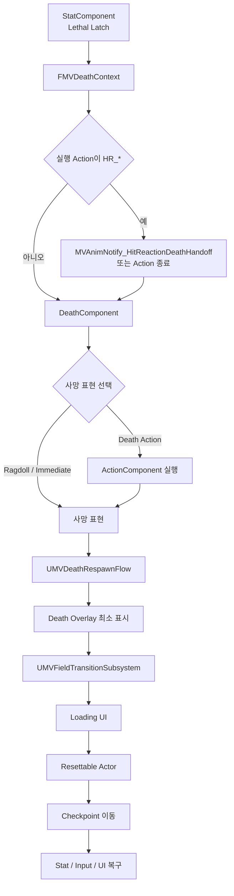

# 사망과 필드 전환

## 실행 흐름

## 책임

- StatComponent: 치명 판정 단일 확정과 `FMVDeathContext` 발행
- DeathComponent: Death Action·Ragdoll·Immediate 선택
- ActionComponent: Death Action 실행
- DeathComponent: Dissolve·Overlay·Presentation 이벤트 관리
- `UMVDeathRespawnFlow`: `UMVFieldTransitionSubsystem` 소유 Transient Coordinator
- World 변경 시 플레이어 DeathComponent 재바인딩
- WorldStateSubsystem: Checkpoint, Consumed Spawn, Flag, Quest, SaveGame 상태 보존
- QuestSubsystem: GameInstance 수명 Facade와 WorldState 의존성 초기화
- Quest 읽기·쓰기와 선택적 저장: WorldState 위임

## 전환 계약

- 필수 Gate: DeathOverlay 최소 표시 완료
- Presentation Finished: Overlay 요청 누락 시 전환 보장 Fallback
- 사망 Montage 종료: 별도 필수 Gate 제외
- 사망 상태: 이동·Action·상호작용 입력 차단
- DeathOverlay: 시점 입력 허용
- LoadingWindow 입력: 도움말 카드 전환 전용
- LoadingWindow 종료와 UI·입력 복구: FieldTransition 소유
- 필드 상태 전용 Subsystem 미도입
- 저장 사실: WorldState 소유
- 숨김·복원·제거: `IMVFieldTransitionResettableInterface` 구현 Actor 소유

## Reset 정책

| 정책 | 계약 |
|---|---|
| `ResetEveryTransition` | `AMVEnemy` 적용 |
| `PersistIfConsumed` | 소비 완료 대상의 비복원 |
| `PersistState` | 저장 상태 기반 복원 |
| `TransientOnly` | 전환마다 제거 |

## 연동 자산

- 사망 데이터: `DT_Death_P1`
- 사망 애니메이션: `AM_Death_*`
- 사망 화면: `WBP_DeathOverlayWindow`
- 로딩 화면: `WBP_LoadingWindow`
