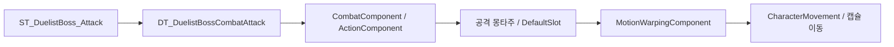

# Duelist 공격 루트 이동

## 원인과 처리 경로

- 대상: `/Game/DuelistComplete/BP_Duelist`의 공격 종료 후 시작 위치 복귀
- 수정 전: 공격 시퀀스의 루트 추출 비활성, 메시만 이동하고 캡슐은 시작 위치 유지
- 재현: 기본 공격의 메시 루트 최대 이동 `506.74 cm`, 캡슐 수평 이동 `0 cm`
- 원본 루트 스케일 `100`; 일반 몽타주 루트 추출 경로에서 이동 거리 100배 확대 관찰
- 기존 `MotionWarpingComponent` 처리 경로 활용 이후 원본 이동 거리 회복, 별도의 이동 거리 축소 배율 적용 제외

## 에셋 설정

모든 시퀀스·몽타주 위치: `/Game/DuelistComplete/Animations`

| 시퀀스 | 몽타주 | 전투 행 |
|---|---|---|
| `AS_Duelist_Attack_HammerSlam_02` | `AM_Duelist_BaseAttack` | `BasicAttack1`, `BasicAttack2`, `BasicAttack3` |
| `AS_Duelist_Attack_HammerThrow_02` | `AM_Duelist_Q` | `SkillQ` |
| `AS_Duelist_W` | `AM_Duelist_SkillW` | `SkillW` |
| `AS_Duelist_PazeChange` | `AM_Duelist_PazeChange` | `Resonance` |

- 위 시퀀스 4개: `Enable Root Motion` 활성, `Root Motion Root Lock = Anim First Frame`
- `ABP_Duelist`: 기존 `RootMotionFromMontagesOnly`와 `DefaultSlot` 유지
- 몽타주 전체 구간: `RootMotionNormalize` 트랙의 `Motion Warping` NotifyState와 `RootMotionModifier_Scale`, Scale `(1, 1, 1)`
- 기존 `MVCharacterBase`의 `MotionWarpingComponent` 사용, C++ 변경이나 새 컴포넌트 추가 없음
- 기존 `AM_Duelist_W`에도 동일 구간 설정 유지; 전투 행은 새 경로 `AM_Duelist_SkillW` 사용
- 이전 W 경로 지정 시 엔진의 실제 문자열 참조가 `AS_Duelist_W`로 복귀하는 현상 확인, 새 고유 몽타주 경로로 확정
- `DT_DuelistBossCombatAttack`: `SkillW.Montage` 한 항목 교체, 다른 전투 행·열 보존
- 로코모션 걷기·달리기 시퀀스 5개의 루트 고정 유지

새 공격 몽타주 추가 시 위 루트 설정과 전체 길이의 `RootMotionNormalize` 구간 동반 구성 필요
구간 길이와 시퀀스 길이 일치 여부 확인, 전투 행에는 AnimSequence 대신 AnimMontage 지정

## 검증

Windows / Unreal Engine 5.8.3 / SimulateInEditor 실행
AI 선택을 제외한 제어된 전투 행 입력, 실제 `CombatComponent`·`ActionComponent`·바닥 충돌·걷기 모드 유지

| 경로 | 캡슐 이동 거리 | 종료 후 위치 변화 | 실행 결과 |
|---|---:|---:|---|
| 기본 공격 | 487.73 cm | 0 cm | 통과 |
| 망치 투척 | 1,506.86 cm | 0 cm | 통과 |
| W | 248.40 cm | 0 cm | 통과 |
| 단계 전환 | 18.69 cm | 0 cm | 통과 |
| 기본 공격 중도 취소 | 491.01 cm | 0 cm | 통과 |

- 총 91개 위치 표본, 오류 0; 종료 후 표본 간 캡슐 변화 `0.1 cm` 미만 검사 통과
- 모든 표본의 걷기 모드와 메시 루트 오프셋 `2 cm` 미만 검사 통과
- `ST_DuelistBoss_Attack`의 전투 테이블·행 연결 확인, 전체 자동 AI 전투·피해 균형·네트워크 검증은 해당 위치 복귀 수정 범위 밖으로 현재 Windows에서 미실행
- C++ 빌드·패키징: C++ 변경 없는 에셋 수정으로 현재 Windows에서 미실행, 패키징 성공 여부 보장 제외
- 임시 맵 삭제와 기존 `AITestLevel`·카메라 복구, 추적 콜백 종료
- 원본 에셋 백업과 원시 재현 자료: `Saved/DuelistRootMotion`, Git 제외

검증 요약: [root-motion-validation.json](attachments/root-motion-validation.json)
