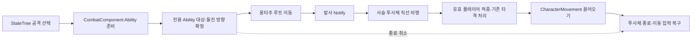

# Duelist 돌진 사슬 스킬

## 소스 배치

`Source/Maverick/Combat/Duelist/`: Duelist 전용 스킬 코드 통합

| 파일 `.h`·`.cpp` | 책임 |
|---|---|
| `MVDuelistChainPullAbility` | 대상·발사 1회·투사체 수명 |
| `MVDuelistChainProjectile` | 사슬 비행·적중·끌어오기·종료 정리 |
| `MVAnimNotify_DuelistFireChain` | 몽타주 발사 시점과 전용 Ability 연결 |

- 공용 `MVAbilityBase`·`MVHitResolverSubsystem`: 기존 `Combat/` 위치 유지
- 전용 발사 Notify는 스킬 폴더에 동반 배치, 공용 Notify는 기존 `Animation/` 위치 유지
- 이후 Duelist 스킬도 같은 폴더에 추가, 현재 기능 규모에서는 역할별 추가 하위 폴더 제외
- `Maverick` 모듈·native 클래스 식별자 보존, Blueprint·몽타주 연결의 경로 변경·재지정 불필요

## 에셋 연결

| 위치 | 역할 |
|---|---|
| `DT_DuelistBossCombatAttack.SkillW` | 현재 사슬 몽타주·전용 Ability 연결 |
| `/Game/DuelistComplete/Skills/BP_Ability_Duelist_ChainPull` | 공격 수치 편집, `UMVDuelistChainPullAbility` 상속 |
| `/Game/DuelistComplete/Animations/AM_Duelist_ChainPull` | 현재 `AS_Duelist_W` 동작 사용, 사용자 몽타주 편집 유지 |
| `ST_DuelistBoss_Attack.SkillW` | 현재 실행 가능 거리 `300 cm`, 기존 선택 분기 유지 |
| `/Game/DuelistComplete/Skills/SM_DuelistChainLink`·`M_DuelistChain` | 교차 배치 사슬 고리·금속 재질 |

- 현재 몽타주 길이 `4.8667 s`, `MV Duelist Fire Chain` 발사 Notify 시점 약 `2.5191 s`
- `MV Activate Ability`: 시작부터 몽타주 끝까지 활성 구간, `AbilityClass=MVDuelistChainPullAbility`·`AbilityIndex=0`
- 공격 행의 `AbilityReference`와 활성 Notify의 클래스 일치 필수, 발사 Notify는 `CurrentAbilityInstance`의 사슬 Ability 형변환 성공 시 `FireChain` 호출
- 몽타주 연결만 변경 시 기존 공격 행의 Ability와 불일치 가능, `AbilityClass does not match` 로그 확인 위치: `MVAnimNotifyState_Ability`
- `FMVBossExecuteAttackTask`: 전투 행 직접 연결도 `CombatComponent.TryStartCombatActionFromRowHandle` 경유

## 실행과 소유권

- 대상: AI 현재 대상 플레이어 1명, AI 대상 부재 시 기본 플레이어 사용
- 돌진 방향: Ability 시작 시 확정, 발사 방향: Notify 시점의 대상 위치 기준
- 발사 1회 제한, 유도·주변 다중 대상·새 공용 이동 컴포넌트 제외
- 투사체 Actor: 비행·적중·끌어오기·사슬 표현·정리 통합 소유
- 사슬 메시 충돌 비활성, 비행 구간 구체 Sweep으로 실제 판정
- 무적·사망 플레이어 적중 거절, 벽 적중·사거리 초과·수명 종료 시 제거
- 끌어오기 목적지: 적중 시 보스와 플레이어 방향·정지 거리로 확정, 플레이어 현재 높이 유지
- 목적지까지 캡슐 Sweep으로 벽 앞 위치 제한, 실제 이동은 `FRootMotionSource_MoveToForce`와 CharacterMovement 충돌 처리
- 종료: 목적지 도달·시간 만료·이동 정체·공격 종료·보스 또는 플레이어 사망
- `EndPlay`: 자신의 루트 이동 소스 제거, 추가한 이동 입력 잠금 1회만 해제

## 조절 위치

`BP_Ability_Duelist_ChainPull`의 Class Defaults

| 값 | 기본값 |
|---|---:|
| `LaunchSocket` | `BN_Weapon_RSocket` |
| `ProjectileSpeed` | `2,400 cm/s` |
| `MaxRange` | `2,500 cm` |
| `PullDuration` | `0.65 s` |
| `StopDistance` | `90 cm` |

- 사거리 확대·속도 감소·끌어오기 시간 확대 시 `ChainAbility` 구간과 몽타주 길이 동반 검토
- 이동 도중 보스 추적 대신 적중 시 고정 목적지 사용, 종료 거리와 최종 보스 간 거리 차이 가능
- Class Defaults 조절 후 Blueprint Compile·Save 필수, 편집 기본값 조회만으로 새 런타임 인스턴스 적용 보장 불가
- 현재 `SkillW` 선택 시 사슬 발사, `AM_Duelist_Q`에는 사슬 발사 Notify 미배치
- 적중 시 보스까지 거리가 정지 거리 이하인 경우 추가 끌어오기 제외, 벽 앞에서는 이동 거리 축소 가능
- 피해 계산: 기존 장착 무기 공격력·전투 행 배율·대상 방어력 사용
- 현재 `BP_Duelist` 장비 공격력 `0`, 전투 피해 수치 설정은 별도 장비 데이터 책임

## 소스 이동 검증

2026-10-07 / Windows / Unreal Engine 5.8.3 실제 실행

- 파일 6개 이동, 원본 대비 include 경로 변경만 확인·헤더 바이트 동일·이전 include 참조 0개
- Visual Studio 프로젝트 재생성 후 새 경로 반영, 일반 `MaverickEditor Win64 Development` 전체 빌드 통과·컴파일과 링크 확인
- 첫 빌드의 실행 중 Editor DLL 잠금 실패, 관련 레벨·에셋 미저장 변경 없음 확인 후 정상 종료·재시도에서 복구
- 새 Editor 프로세스에서 native 클래스 3개·Ability Blueprint 상속·정지 거리 `90 cm`·SkillQ Ability·몽타주·발사 Notify·StateTree 로딩 확인
- 기존 Ability Blueprint·몽타주·DataTable·StateTree 파일 4개 바이트 동일, 기존 `BaseBossTestLevel` 재열기 확인
- 이번 변경은 소스 배치만 대상, 게임플레이·네트워크·패키징 재시험은 현재 Windows에서 미실행·이 검증의 보장 범위 제외

검증 요약: [source-layout-validation.json](attachments/source-layout-validation.json)
원본 소스 백업·빌드 기록: `Saved/DuelistSourceLayout`, Git 제외

## 초기 구현·이전 조절 검증

Windows / Unreal Engine 5.8.3 실제 PIE 실행, 아래 결과는 초기 `SkillQ` 연결 당시 기준
`BaseBossTestLevel`의 배치된 `BP_Duelist`·기존 AI·공격 선택 경로 검증, 별도 임시 바닥·벽·보스에서 9개 경로 검사

- 기존 AI는 대상 가까이 접근 후 공격 선택, 이전 정지 거리 `180 cm`에서 실제 사슬 적중 후 플레이어 이동 약 `67 cm` 재현
- 정지 거리 `90 cm` 조절·Blueprint 재컴파일 후 같은 AI 경로에서 이동 약 `157 cm`, 입력 복구·남은 사슬 `0` 확인
- 적중·빗나감·무적·비행 벽 충돌·끌어오기 벽 충돌·비행 취소·끌어오기 취소·기존 이동 입력 잠금·보스 사망의 9개 경로, 조절 후 144개 표본 확인
- 별도 정상 적중의 플레이어 수평 이동 약 `508.7 cm`, 끌어오기 벽 충돌 시 약 `195.9 cm`
- 각 경로 종료 후 추가한 이동 입력 잠금 복구·남은 사슬 투사체 `0` 확인, 기존 입력 잠금 1회 보유 경로에서는 그 잠금 유지
- 시험 보스 인스턴스의 맨손 공격력 `10`·대상 방어력 `0` 설정으로 피해 검사, 유효 적중 시 HP `100 → 90` 1회 적용, 빗나감·무적·비행 벽·비행 취소 시 HP `100` 유지
- 공격력 변경은 PIE 시험 인스턴스에만 적용, 실제 `BP_Duelist` 장비 데이터는 기존 값 `0` 유지
- 초기 구현의 Windows Live Coding·일반 Development Editor 빌드 실제 실행 통과, 새 C++ 타입 컴파일·링크 확인
- 초기 일반 빌드의 기존 `LockOnTargetDev` 메모리 부족 `C1060`, 동시 컴파일 수 1 재시도에서 일반 Editor 빌드 통과
- 초기 구현의 에디터 재시작 후 native 클래스 3개·Ability Blueprint·저장된 SkillQ 연결·몽타주 Notify 3개 로딩 확인, Live Coding 패치 없이 로딩 성공
- 재시작 후 StateTree SkillQ의 실행 Task·전투 행·거리 `2,500 cm` 재조회 확인, 기존 에디터 세션 캐시에만 의존하는 연결 제외
- 조절 작업의 임시 추적 로그 제거 후 Windows Live Coding 실제 실행 통과, 최종 코드는 전용 스킬 초기 구현 유지·Blueprint 정지 거리만 조절
- 시험 Actor 3개 제거 후 기존 배치 Actor 11개 복구, 기존 사용자 `BaseBossTestLevel` 미저장 편집 상태 유지·레벨 저장 미실행
- 초기 에디터 재시작 전 사용자 편집 백업·저장 기록: 검증 첨부의 `initial_editor_cleanup`, `Saved/DuelistChainPull/BeforeEditorSave`
- AI의 SkillQ 선택부터 사슬 적중·끌어오기까지 실제 실행 확인, 전체 공격 선택 균형·네트워크 전파·패키징은 현재 Windows에서 범위 밖으로 미실행·성공 보장 불가

검증 요약: [chain-pull-validation.json](attachments/chain-pull-validation.json)
원본 시험 기록·수정 전 에셋 백업: `Saved/DuelistChainPull`, Git 제외

## 현재 몽타주 연결 복구 검증

2026-10-07 / Codex / Windows / Unreal Engine 5.8.3 실제 PIE 실행

- 수정 전 `SkillW`의 사슬 몽타주·일반 공격 Ability 불일치 재현, 활성 Notify 클래스 불일치와 발사 Notify의 사슬 형변환 실패 확인
- `DT_DuelistBossCombatAttack.SkillW.AbilityReference`만 `BP_Ability_Duelist_ChainPull`로 변경·저장, 다른 행·수치·몽타주 설정의 변경 없음 확인
- 배치된 `BP_Duelist`의 전투 행 실행 경로에서 반복 발사 3회 성공, 각 회차 투사체 최대 1개·종료 후 0개·플레이어 이동 입력 잠금 해제 확인
- 임시 추적 코드 제거·C++ 파일 3개 원본 바이트 복원·Live Coding 재반영 후 사슬 발사 1회와 종료 정리 재확인
- 현재 Windows의 로컬 Editor 공격 행·Notify·발사·정리 검증, AI의 전체 선택 분기·네트워크·패키징은 연결 수정 범위 밖으로 미실행·성공 보장 제외

검증 요약: [chain-fire-connection-validation.json](attachments/chain-fire-connection-validation.json)
진단 로그·변경 전 테이블 백업: `Saved/DuelistChainFire`, Git 제외
