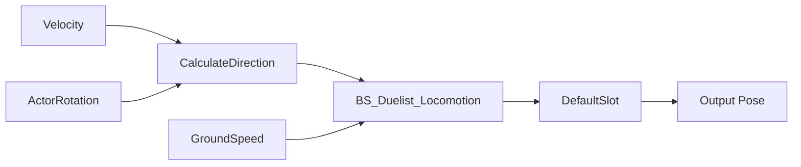

# Duelist 기본 로코모션

## 에셋과 책임

| Unreal 경로 | 책임 |
|---|---|
| `/Game/DuelistComplete/BP_Duelist` | `MVEnemy` 기반 캐릭터, 메시의 `AnimClass`에 `ABP_Duelist_C` 지정 |
| `/Game/DuelistComplete/Animations/ABP_Duelist` | `MVAnimInstanceBase`의 이동 자료로 자세 계산, `DefaultSlot`을 통한 몽타주 연결 지점 |
| `/Game/DuelistComplete/Animations/BS_Duelist_Locomotion` | 대기·전후좌우 걷기·전방 달리기의 2차원 혼합 |

- 방향 계산: 실제 속도와 액터 회전 기준, `WantsToStrafe`에 따라 0으로 고정되는 기존 `MovingDirection`의 영향 제외
- `BP_Duelist` 메시 회전: Yaw `-90°`, 원본 메시의 전방 `+Y`를 캐릭터 전방 `+X`에 정렬
- 메시 크기·AI·공격·능력치 변경 제외

## 동작 배치

모든 시퀀스 위치: `/Game/DuelistComplete/Animations`

| 속도 | 방향 | 시퀀스 |
|---:|---|---|
| 0 cm/s | 전체 | `AS_Duelist_UpIdle` |
| 200 cm/s | 전방 0° | `AS_Duelist_Move_Walk_Fwd` |
| 200 cm/s | 후방 ±180° | `AS_Duelist_Move_Walk_Back` |
| 200 cm/s | 좌측 -90° | `AS_Duelist_Move_Walk_Left` |
| 200 cm/s | 우측 +90° | `AS_Duelist_Move_Walk_Right` |
| 500 cm/s | 전방 0° | `AS_Duelist_Move_Run_Fwd` |
| 500 cm/s | 좌측·우측·후방 | 해당 방향 걷기 시퀀스의 재생 속도 보정 |

- 혼합 축: Direction `-180~180°`, GroundSpeed `0~500 cm/s`
- 방향 경계 순환, 방향 보간 `0.10초`, 속도 보간 `0.12초`, 순환 재생과 동작 위상 동기화
- 대기·걷기·달리기 속도별 5개 방향, 총 15개 표본
- 원본 루트 이동량과 시퀀스 길이 기준 재생 속도 보정, 속도 축에 따른 추가 재생 속도 조절
- 좌우·후방 달리기 전용 시퀀스 미보유에 따른 빠른 걷기 대체, 해당 방향의 달리기 표현에는 전용 자료 추가 필요

## 루트 이동과 확장 경계

- 이동 시퀀스 5개: `Force Root Lock` 활성, `Root Motion Root Lock = Anim First Frame`, `Enable Root Motion` 비활성
- 캐릭터 이동 책임: `CharacterMovement`, 시퀀스 루트 이동 중첩과 반복 경계 위치 튐 방지
- `ABP_Duelist`: `RootMotionFromMontagesOnly`, 공격 몽타주용 `DefaultSlot` 확보
- 공격·피격·사망·단계 전환 연결과 몽타주 제작: 이번 기본 로코모션 범위 밖

## 검증 범위

| 대상 | Windows / Unreal Engine 5.8.3 실행 결과 | 근거와 한계 |
|---|---|---|
| `ABP_Duelist`, `BP_Duelist` | 경고를 오류로 처리한 컴파일 실행·통과 | 그래프와 클래스 연결 유효성 확인, 전체 전투 동작 검증 제외 |
| 실제 `BP_Duelist`의 애니메이션 갱신 | 임시 맵의 SimulateInEditor 실행·통과, 7개 상태·14개 표본·오류 0 | 대기·네 방향 걷기·전방 달리기·정지의 속도 입력과 뼈 자세 변화 확인 |
| 이동 루트 고정 | 위 재생 검증에서 실행·통과, 이동 표본의 최대 루트 이동 `0.002259 cm` 미만 | 이동 시퀀스 위치 누적 방지 확인, 대기 시퀀스의 작은 원본 흔들림 유지 |
| 저장과 정리 | 변경 에셋 8개 저장 확인, 임시 맵 삭제와 기존 `AITestLevel` 복구 확인 | 사용자 기존 맵의 미저장 변경 없음 확인 후 검증, 테스트 자료는 `Saved/DuelistLocomotion` 보관 |
| 실제 AI 추적·공격·전체 게임 | 현재 Windows 에디터에서 미실행, 기본 로코모션 요청 범위 밖 | 제어된 속도 입력 검증만 수행, 경로 탐색·이동 충돌·공격 연결 보장 제외 |
| C++ 빌드·패키징 | 현재 Windows에서 미실행, C++ 변경 없는 에셋 연결 작업 | 에디터 컴파일·재생 결과만 확보, 패키징 성공 여부 확인 제외 |

검증 요약: [validation.json](attachments/validation.json)
