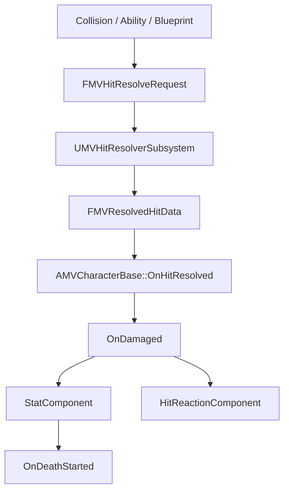

# Hit, Stat, HitReaction

## 실행 흐름

## 책임

| 계층 | 책임 |
|---|---|
| Collision·Ability·Blueprint | 필터링된 `FMVHitResolveRequest` 생성 |
| `UMVHitResolverSubsystem` | 공격자·피격자 Stat, 공격 배율, 무기 Snapshot 기반 `FMVResolvedHitData` 계산 |
| `AMVCharacterBase::OnHitResolved` | CharacterIndex 확인과 `OnDamaged` 방송 |
| StatComponent | 수치 피해, Groggy, Lethal Latch, `OnDeathStarted` 소유 |
| HitReactionComponent | Row·Section, Interrupt, 무적, KD·AB Recovery 표현 |

## 무적 적용 범위

- 무적 검사: HitReaction 경로
- Resolver·Stat 피해 적용: 무적 검사와 분리
