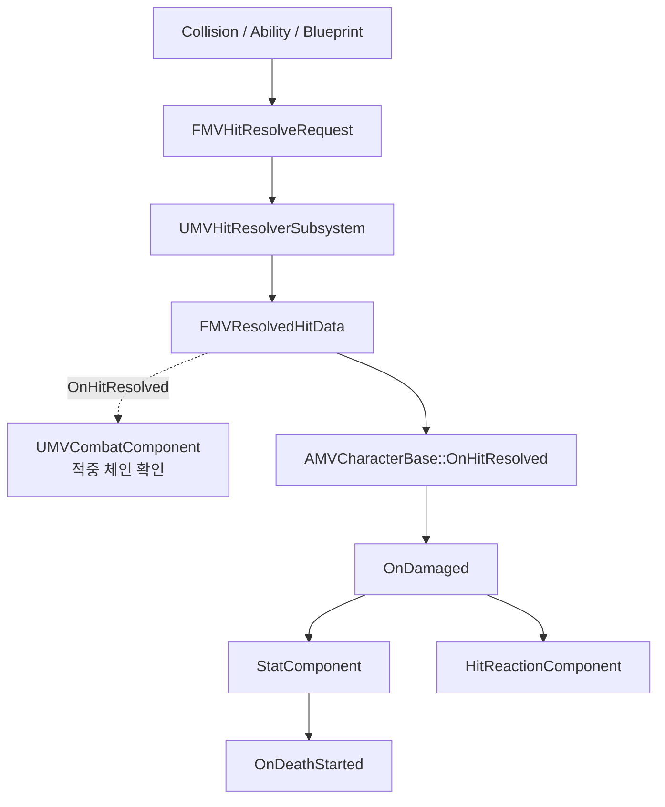
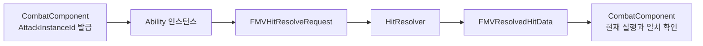

# Hit, Stat, HitReaction

## 실행 흐름

## 책임

| 계층 | 책임 |
|---|---|
| Collision·Ability·Blueprint | 필터링된 `FMVHitResolveRequest` 생성 |
| `UMVHitResolverSubsystem` | 공격자·피격자 Stat, 공격 배율, 무기 Snapshot 기반 `FMVResolvedHitData` 계산 |
| `UMVCombatComponent` | 현재 공격 실행과 일치하는 `OnHitConfirmed` 스킬의 체인 단계 전진 |
| `AMVCharacterBase::OnHitResolved` | CharacterIndex 확인과 `OnDamaged` 방송 |
| StatComponent | 수치 피해, Groggy, Lethal Latch, `OnDeathStarted` 소유 |
| HitReactionComponent | Row·Section, Interrupt, 무적, KD·AB Recovery 표현 |

## 무적 적용 범위

- 무적 검사: HitReaction 경로
- Resolver·Stat 피해 적용: 무적 검사와 분리

## 공격 실행 식별자

- `AttackInstanceId`: Ability 실행마다 증가하는 일회성 식별자
- Blueprint Ability: 적중 요청 생성 시 현재 Ability의 식별자를 `FMVHitResolveRequest`에 복사
- HitResolver: 요청의 식별자를 `FMVResolvedHitData`로 전달하며 피해 계산에는 미사용
- CombatComponent: 공격자·현재 Ability·활성 상태·식별자 일치 후 `OnHitConfirmed` 단계 전진
- `SkillMap`의 적중 확인 정책만 소비, 기본 공격과 `Immediate` 스킬의 체인 진행에 영향 없음
