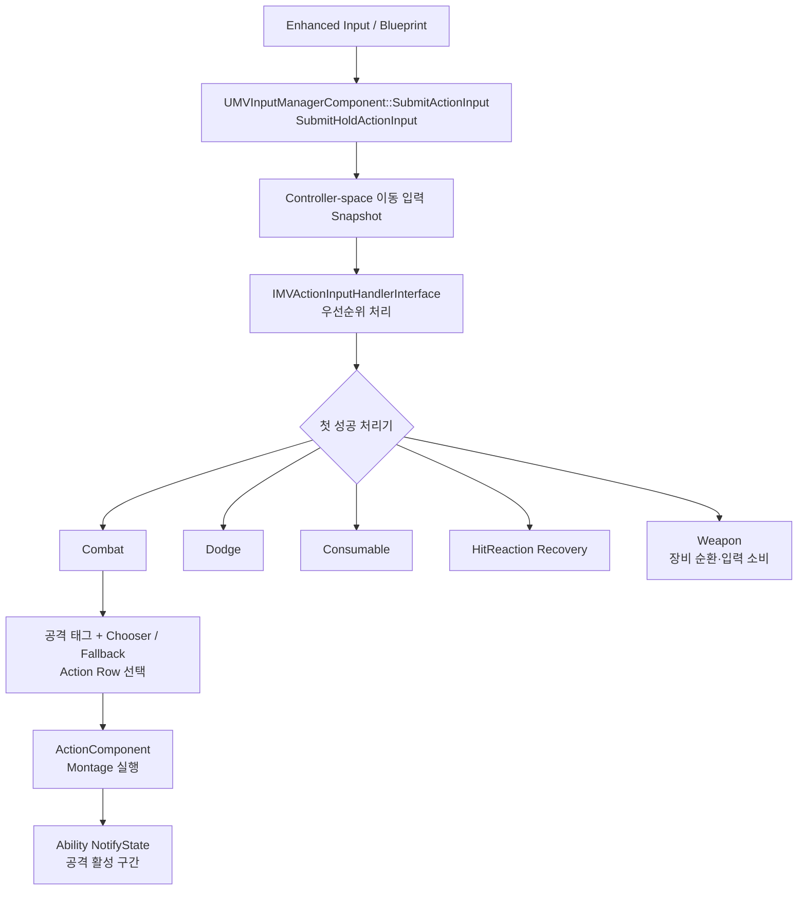

# 입력에서 Action 실행까지

## 실행 흐름

## 책임

| 계층 | 책임 |
|---|---|
| Blueprint·Enhanced Input | 입력 이벤트와 Submit API 연결 |
| InputManager | 이동 입력 Snapshot, 짧은 Buffer, 처리기 우선순위 배분 |
| 도메인 처리기 | Combat·Dodge·Consumable·Recovery·Weapon 규칙과 입력 소비 |
| CombatComponent | 공격 태그, Chooser·Fallback, Chain·Ability 상태와 Action Row 선택 |
| ActionComponent | Montage, Active Action, Interruptibility, 종료 이벤트 소유 |
| Ability NotifyState | Montage의 실제 Ability 시작·종료 구간 소유 |

## 경계 원칙

무기 교체의 `true` 반환은 장착 성공이 아닌 입력 소비 의미
교체 불가 상태에서도 소비하여 액션 종료 후 지연 실행 방지: [[Features/Combat/Weapon-Swap/document|플레이어 무기 교체]]

- CombatComponent: 선택기
- ActionComponent: 실행기
- 입력 Buffer: 개별 도메인 규칙 배치 금지
