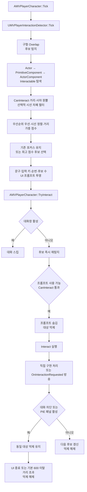

# 상호작용 흐름

## 실행 흐름

## Interactable 계약

| 계약 | 역할 |
|---|---|
| `CanInteract` | 현재 상호작용 가능 여부 |
| `Interact` | 선택 대상의 상호작용 실행 |
| `GetInteractionPromptText` | UI 프롬프트 문구 제공 |
| `GetInteractionPriority` | 후보 정렬 우선순위 제공 |

- 네 함수 모두 C++·Blueprint 구현 지원
- 탐색 순서: Actor 직접 구현 → Overlap Component 구현 → Actor 보유 Component 구현
- `UMVInteractableComponent`: 가능 상태·문구·우선순위 보관과 `OnInteractionRequested` 방송
- 실제 결과·네트워크 권한·소비 상태: 구현체 또는 델리게이트 구독자 소유

## InteractionDetector 책임

| 구분 | 현재 계약 |
|---|---|
| 감지 | 반경 300·주기 0.1초·`WorldDynamic`·`Pawn`·`PhysicsBody` |
| 필터 | `CanInteract`·반각 75도·선택적 시선 차폐 |
| 선택 | 우선순위 우선·시선 정렬과 거리의 가중 점수 |
| 포커스 | 기존 대상이 후보에 남으면 유지 |
| 복수 후보 | 다음·이전 순환 선택 |
| 프롬프트 | 문구·입력 키·후보 순번·후보 수 투영 |

## 실행과 해제

- `TryInteract`: 입력 해제 잠금·대화 상태 처리 후 후보 즉시 재탐지
- 실행 직전 UI 사용 가능 여부와 `CanInteract` 재검사
- 실행 직전 프롬프트 숨김·대상 억제·입력 해제 잠금
- 일반 실행: 다음 후보 갱신에서 억제 해제
- 대화 차단·PIE 패널 활성: 동일 대상 억제 유지
- UI 종료 또는 기본 600 이탈 거리 초과: 억제 해제
- 감지 비활성·소유자 사망·`EndPlay` 시 후보·포커스·프롬프트 정리
- 별도 종료·취소 통지 없는 단방향 `Interact` 계약
