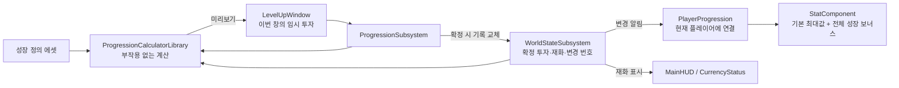

# 레벨업 프로토타입

## 핵심

- 참고용 레벨업 화면에 HP·Stamina·MP 투자, 비용 차감, 실제 최대 스탯 반영 연결

구현 근거: `8001a813` / UI 복구·원설계 기록: `fc07fdeb`

**테스트 성장 설정**

| 투자 항목 | 투자 식별자 | 실제 스탯 식별자 | 기본 증가량 |
|---|---|---|---|
| HP | `Progression.Attribute.HP` | `Stat.MaxHP` | 1점당 +20 |
| Stamina | `Progression.Attribute.Stamina` | `Stat.MaxStamina` | 1점당 +10 |
| MP | `Progression.Attribute.MP` | `Stat.MaxMP` | 1점당 +10 |

| 항목 | 기준 |
|---|---|
| 성장 정의 | `UMVProgressionDefinition` / `/Game/Miscellaneous/DataAsset/Progression/DA_PlayerProgression` |
| 정의 연결 | `UMVProgressionSettings.DefinitionAsset`, `Config/DefaultGame.ini` |
| 시작·최대 레벨 | 기본값 1·100 |
| 투자 상한 | 항목별 기본값 99, 전체 레벨 상한도 동시 적용 |
| 현재 레벨 | 저장된 `BaseLevel + Σ InvestedRanks` |
| 다음 1점 비용 | `BaseLevelCost + CostPerLevel × (현재 레벨 - BaseLevel)` |
| 비용 기본값 | `100 + 50 × (현재 레벨 - 1)`, 여러 점은 단계별 비용 합산 |
| 누적 보너스 | `Σ [BonusByRank(투자 수) - BonusByRank(0)]` |

수치는 정의 클래스의 기본 생성값이며 데이터 에셋에서 조정 가능
투자 항목과 실제 스탯의 GameplayTag를 분리하고, 항목당 여러 효과와 동일 스탯의 효과 합산 지원

## 변경

**데이터 흐름**



| 소유자 | 책임과 수명 |
|---|---|
| `UMVWorldStateSubsystem` | GameInstance 수명의 영구 기록, 저장·불러오기와 변경 알림 |
| `UMVProgressionSubsystem` | GameInstance 수명의 정의 조회·계산·확정, 별도 가변 성장 원본 비소유 |
| `UMVProgressionCalculatorLibrary` | 원본을 바꾸지 않는 투자·레벨·비용·보너스 계산 |
| `UMVPlayerProgression` | 플레이어 소유 연결 객체, 초기화 시 성장·기본 스탯 알림 구독, 종료 시 해제 |
| `UMVStatComponent` | 기본 최대값·전체 성장 보너스·실제 최대값·계산 변경 번호 관리 |
| `UMVLevelUpWindow` | 활성 창의 임시 투자·선택·미리보기·확정·취소·입력 등록 |

- 성장 정의 순서에 따라 투자·비교 행 생성, C++은 동작·데이터 전달, Blueprint는 배치·스타일 담당
- 창 종료 후 `UMVGameplayInputWidget`이 게임 입력 상태 제공, 이동·시점·마우스 잡기 복구

**화면 연결**

| 위젯 | C++ 부모 | 주요 연결 |
|---|---|---|
| `W_LevelUp` | `UMVLevelUpWindow` | `LevelAndCurrencyBlock`, `AttributeBlock`, `ComparisonBlock`, `ConfirmButton` |
| `W_StatEntry_LevelUp` | `UMVLevelUpAttributeEntryWidget` | 투자 수와 증감 버튼 |
| `W_StatEntry` | `UMVLevelUpStatComparisonWidget` | `StatValueOld`, `StatValueNew`, `StatNameWidget` |
| `W_StatBlock_LevelUp` | `UMVLevelUpStatBlockWidget` | 행 생성 대상 `StatBox` |
| `W_LevelCurrencyBlock_LevelUp` | `UMVLevelUpSummaryWidget` | 레벨·보유 재화·총 비용·예상 잔여 재화 |
| 스탯 이름 하위 위젯 | `UMVLevelUpStatNameWidget` | 하위 위젯 함수로 글자 갱신 |
| `WBP_CurrencyStatus` | `UMVCurrencyStatusWidget` | `CurrencyText`, 메인 HUD의 `CurrencyStatus` |

화면: `/Game/UI/LevelUp/RestMenu/LevelUpMenu/W_LevelUp`
등록: `UMVUISettings.LevelUpWindowClass` / 열기·닫기: `UMVUISubsystem.ShowLevelUpWindow`·`HideLevelUpWindow`

## 기준

- 미리보기는 실제 재화·스탯 유지, 확정 시 비용·상한·변경 번호 재검사 후 투자와 재화 함께 교체
- 성장 보너스 전체 교체로 반복 로드 중복 누적 방지, 최대값 증가 시 현재량 유지와 감소 시 상한 제한, 레벨업 자동 회복 없음
- 저장은 기준 레벨·확정 투자·재화·버전·변경 번호 대상, Confirm의 실행 중 기록 변경과 디스크 저장 분리
- 실제 연결 스탯은 세 최대값, 새 실제 스탯은 `FMVProgressionStatBinding`의 읽기·적용·표시 연결 확장 필요
- HP·Stamina·MP 프로토타입 범위에서 종료, 미검증 상황과 정식 게임 기능은 완료 판정에서 제외

변경 번호 `Revision`은 미리보기 이후 성장 기록이 바뀌었는지 판별하는 값
현재량의 자연 회복과 스탯 계산 변경 번호를 분리해 회복 틱으로 확정이 무효화되는 상황 방지
이미 확정한 투자는 감소·취소로 환불하지 않으며 창 종료 시 `PendingRanks`만 폐기

| 확정·진입 조건 | 처리 |
|---|---|
| 추가 투자 없음·재화 부족·투자/레벨 제한 초과 | 확정 거부 |
| 현재 성장 변경 번호 불일치 | `RevisionMismatch`, 추가 차감·투자 없음 |
| 창의 스탯 계산 변경 번호 불일치 | 확정 차단 |
| 처리 중 재진입 | `bCommitInProgress`로 차단 |
| 로컬 플레이어·기본 스탯 미준비, 사망·전투·필드 전환 | 진입·조작 조건 실패, 활성 창 정리 경로 구성 |
| 지원하지 않는 스탯·잘못된 보너스 값 | 스탯 보너스 교체 전체 거부 |

기존 스탯 대상의 새 투자 항목은 데이터 정의로 추가 가능
성장 정의 자체가 잘못되어 현재 성장 평가가 실패하면 연결 객체는 성장 보너스를 비우고 오류 기록
실행 중 스탯 보너스 교체의 거부와 영구 저장 기록의 교체를 구분하며 전 계층 롤백을 보장하는 계약은 아님

**입력과 HUD**

| 입력·표시 | 현재 연결 |
|---|---|
| ↑·↓ / ←·→ | 투자 항목 선택 / 임시 투자 증감 |
| 마우스 | 행 선택·증감·Confirm |
| Enter | `GenericForward`를 기본 확인 동작으로 등록 |
| Esc | `GenericBack` 취소, PIE 실행 종료와 충돌하여 테스트 생략 |
| 키 안내 | `CommonActionWidget`은 안내 표시, 실제 동작은 창에서 등록 |
| 재화 HUD | 영구 성장 변경 알림으로 갱신, 미리보기 중 실제 재화 유지 |

창이 없을 때의 게임 입력 상태와 마우스·초점 복구 책임: [[Features/UI-and-CommonUI/document|UI와 CommonUI]]

**저장과 개발용 명령**

월드 저장 버전 2, 이전 버전의 성장 기본값 이관 코드 포함
테스트 슬롯 `Maverick_LevelUpTest`, 사용자 번호 0, 반복 저장 시 같은 슬롯 덮어쓰기
테스트 슬롯은 PIE 재시작 후 수동 불러오기, 자동 저장·자동 불러오기 미구현

```text
MV.Progression.Status
MV.Progression.Currency.Add 10000
MV.Progression.LevelUp HP 1
MV.Progression.LevelUp Stamina 1
MV.Progression.LevelUp MP 1
MV.UI.LevelUp.Show
MV.UI.LevelUp.Hide
MV.Progression.SaveTest
MV.Progression.LoadTest
```

명령은 게임 실행 월드에서 사용하며 Shipping 빌드 제외
레벨 1·각 최대값 100·재화 10000에서 세 항목 각 1점 확정 → 레벨 4·재화 9550·최대 HP 120·Stamina 110·MP 110

**검증 근거와 한계**

| 대상·결과 | 실제 실행·근거 | 증명 범위·한계 |
|---|---|---|
| 사용자 C++ 빌드·PIE 확인 | 사용자 Windows PC / UE 5.8.1, 사용자 실행·완료 전달 | 표시·미리보기·확정·실제 최대값·재화 HUD·방향키·Enter·반복 열기·게임 입력 복구, 모든 게임 상황의 검증 아님 |
| 성장 계산 자동 검사 4개 통과 | 같은 Windows UE 에디터의 사용자 결과 화면 | `DefaultAllocation`, `Validation`, `AllocationOrder`, `SaveDefaults`, 실제 UI·디스크 실패·이전 저장 이관 검증 아님 |
| 스탯 연결 자동 검사 3개 통과 | 같은 Windows UE 에디터의 사용자 결과 화면 | `StatBinding.Registry`, `BonusReplacement`, `AtomicRejection`, 현재 세 최대값 연결·교체·거부 조건 범위 |
| 테스트 저장·반복 불러오기 확인 | 사용자 Windows PIE 확인 및 2026-09-28 `Maverick.log`의 저장·불러오기·상태 기록 | 같은 투자·레벨·재화·최대값 유지, 전체 상태 및 모든 실패 경로 증명 아님 |
| 문서 대조 | 이번 Windows Codex 작업에서 현재 커밋의 C++·설정·기존 로그 읽기 | 구조·수치·링크 확인만 수행, 새 빌드·PIE·자동 검사 미실행 |

자동 검사 이름의 공통 접두사: `Maverick.Progression.`

| 구분 | 이번 범위 |
|---|---|
| 미검증 | 실제 게임패드, PIE Esc 취소, 사망·부활·플레이어 교체·맵 이동, 이전 저장 파일 이관·디스크 실패, 모든 재화 부족·상한·연속 확정 UI 상황 |
| 제외 | 적 처치 재화 지급·사망 회수·확정 투자 환불·정식 휴식 메뉴·최종 밸런스·멀티플레이 |
