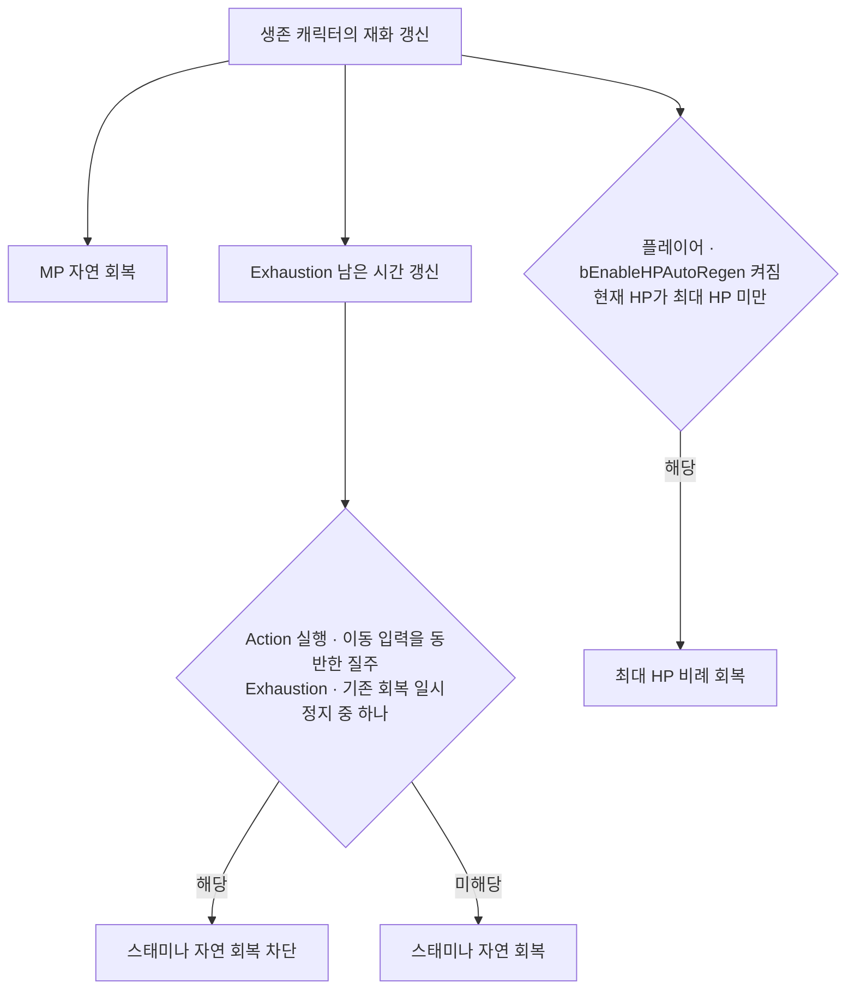

# 기본 재화 회복과 소비

## 기준

| 항목 | 현재 계약 | 설정 위치 |
|---|---|---|
| HP 자동재생 | 기본 꺼짐, 켜면 생존 플레이어가 전투·행동 상태와 무관하게 초당 최대 HP의 2% 회복, 적에게 미적용 | `AMVPlayerCharacter::bEnableHPAutoRegen`, `MVPlayerHPRecoveryRatioPerSecond` |
| MP 자연 회복 | 생존 캐릭터가 전투·행동 상태와 무관하게 초당 5 회복 | `CharacterStat.csv`의 `MPRecoveryPerSecond` |
| 스태미나 자연 회복 | 회복 차단 조건 해제 시 초당 25 | `CharacterStat.csv`의 `StaminaRecoveryPerSecond` |
| 고갈 회복 차단 | 양수 스태미나 소비로 0 도달 시 1.5초 | `CharacterStat.csv`의 `StaminaRecoveryDelay` |
| 적중 MP 수급 | 유효 적중당 기본 2, 스킬별 행 값 적용 | `FMVSkillDataTableColumn::MpRecoveryPerHit` |
| HP 비용 | 기본 0, 소비 후 HP 1 이상일 때만 실행 허용 | `FMVSkillDataTableColumn::HpCost` |

- HP 비용 부족: 행동 선택·Ability 소비 경로 모두 차단, HP 비용으로 자살 불가
- 비용 판정: HP·MP·스태미나 사전 검사 후 소비, 스태미나는 양수 잔량이 있으면 부분 소비 허용
- 적중 MP 수급: 플레이어 제어 공격자, 활성 Ability·현재 `AttackInstanceId` 일치, 적 캐릭터·양수 피해 조건

## 회복 차단과 책임

| 소유자 | 책임 |
|---|---|
| `UMVStatComponent` | 수치 증감·상한, 비치명 HP 소비, Exhaustion 타이머 |
| `AMVCharacterBase` | 이동 처리의 조기 반환과 독립된 회복 갱신, 행동·질주 회복 허용 판정 |
| `AMVPlayerCharacter` | 플레이어 HP 자동재생 설정·회복, 질주 비용·허용 판정 |
| `UMVCombatComponent`·`UMVAbilityBase` | 실행 전 비용 검사·소비, 현재 공격의 적중 MP 수급 |
| `UMVPlayerDodge` | Exhaustion 중 회피 비용 진입 차단 |

- 행동 종료 기준: `IsActionRunning()` 해제, 이동·Idle 애니메이션 이름의 직접 검사 없음
- 행동 중 질주 진입 차단, 이동 활성·질주·이동 입력·소모 허용 조건에서만 질주 비용 소비
- Exhaustion 중 질주·회피·스태미나 회복 차단, 강제 양수 설정 시 고갈 해제

## HP 자동재생 설정

- 기획 기본값은 HP 자동재생 없음, 테스트 편의를 위해 플레이어 변수 `bEnableHPAutoRegen` 제공
- 에디터의 플레이어 클래스 기본값·배치 인스턴스에서 `PlayerCharacter|Health` 항목으로 설정, Blueprint에서도 읽기·쓰기 가능
- 별도 전투 상태 판정과 전투 이탈 대기 없음, 자동재생을 켜도 사망 시 회복 차단
- 설정은 매 프레임의 자동재생만 제어, 회복약 등에서 사용하는 `UMVStatComponent::RecoverHP()` 호출은 독립

## 근거와 검증

- 기본 재화 구현 근거: `5815b5de`, Windows Unreal 빌드·동작은 이전 사용자 확인 기준이며 이후 변경의 실행 검증을 대신하지 않음
- 2026-09-29 Windows Codex: 현재 작업 트리의 C++과 문서 대조로 자동재생 기본값·회복 조건·전투 상태 판정 제거 확인, 이번 작업에서 빌드·PIE 미실행으로 변경 후 실제 동작은 미검증
