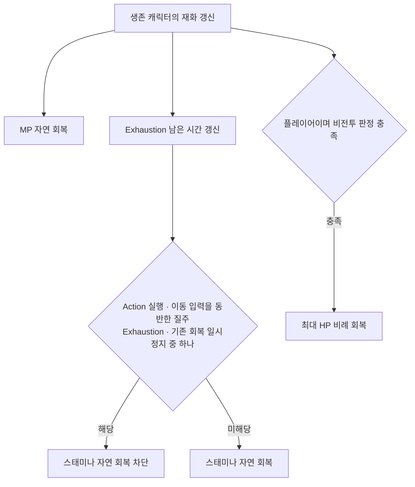

# 기본 재화 회복과 소비

## 기준

| 항목 | 현재 계약 | 설정 위치 |
|---|---|---|
| HP 자연 회복 | 생존 플레이어의 비전투 상태에서 초당 최대 HP의 2%, 적에게 미적용 | `MVPlayerOutOfCombatHPRecoveryRatioPerSecond` |
| MP 자연 회복 | 생존 캐릭터의 전투·비전투·행동 중 초당 5 | `CharacterStat.csv`의 `MPRecoveryPerSecond` |
| 스태미나 자연 회복 | 회복 차단 조건 해제 시 초당 25 | `CharacterStat.csv`의 `StaminaRecoveryPerSecond` |
| 고갈 회복 차단 | 양수 스태미나 소비로 0 도달 시 1.5초 | `CharacterStat.csv`의 `StaminaRecoveryDelay` |
| 적중 MP 수급 | 유효 적중당 기본 2, 스킬별 행 값 적용 | `FMVSkillDataTableColumn::MpRecoveryPerHit` |
| HP 비용 | 기본 0, 소비 후 HP 1 이상일 때만 실행 허용 | `FMVSkillDataTableColumn::HpCost` |

- HP 비용 부족: 행동 선택·Ability 소비 경로 모두 차단, HP 비용으로 자살 불가
- 비용 판정: HP·MP·스태미나 사전 검사 후 소비, 스태미나는 양수 잔량이 있으면 부분 소비 허용
- 적중 MP 수급: 플레이어 제어 공격자, 활성 Ability·현재 `AttackInstanceId` 일치, 적 캐릭터·양수 피해 조건

## 회복 차단과 책임

| 소유자 | 책임 |
|---|---|
| `UMVStatComponent` | 수치 증감·상한, 비치명 HP 소비, Exhaustion 타이머 |
| `AMVCharacterBase` | 이동 처리의 조기 반환과 독립된 회복 갱신, 행동·질주 회복 허용 판정 |
| `AMVPlayerCharacter` | 플레이어 HP 회복, 질주 비용·허용 판정 |
| `UMVCombatComponent`·`UMVAbilityBase` | 실행 전 비용 검사·소비, 현재 공격의 적중 MP 수급 |
| `UMVPlayerDodge` | Exhaustion 중 회피 비용 진입 차단 |
| `UMVCombatStateComponent` | 전투 활동 시각·추적 위협·전투 이탈 차단 조건 |

- 행동 종료 기준: `IsActionRunning()` 해제, 이동·Idle 애니메이션 이름의 직접 검사 없음
- 행동 중 질주 진입 차단, 이동 활성·질주·이동 입력·소모 허용 조건에서만 질주 비용 소비
- Exhaustion 중 질주·회피·스태미나 회복 차단, 강제 양수 설정 시 고갈 해제

## 비전투 판정의 현재 범위

| 구분 | 현재 구현 |
|---|---|
| 전투 활동 갱신 | 자신·등록된 위협의 전투 행동 시작, 자신이 공격자·피격자인 적중 처리 |
| 비전투 전환 | 마지막 전투 활동 후 3초 경과와 이탈 차단 조건 해제 |
| 이탈 차단 | 유효 추적 위협, 누운 상태, Groggy, Exhaustion, 활성 Debuff 태그 |
| 외부 연결 | `NotifyCombatActivity()`·`SetAggroThreatActive()`, 기존 `MVGlobalSensingTask` 연결 |

- 보스 클래스 재작성 후 비전투·어그로 해제·거리 이탈 연동 재검증 예정, 요구사항 전체 완료 판정에서 제외

## 근거와 검증

- 구현 근거: `5815b5de` · Windows Unreal 빌드·동작은 이전 사용자 확인 기준, 이번 위키 작업은 코드·수치·링크 대조만 수행하며 보스 재작성 후 동작 검증을 대체하지 않는 범위
