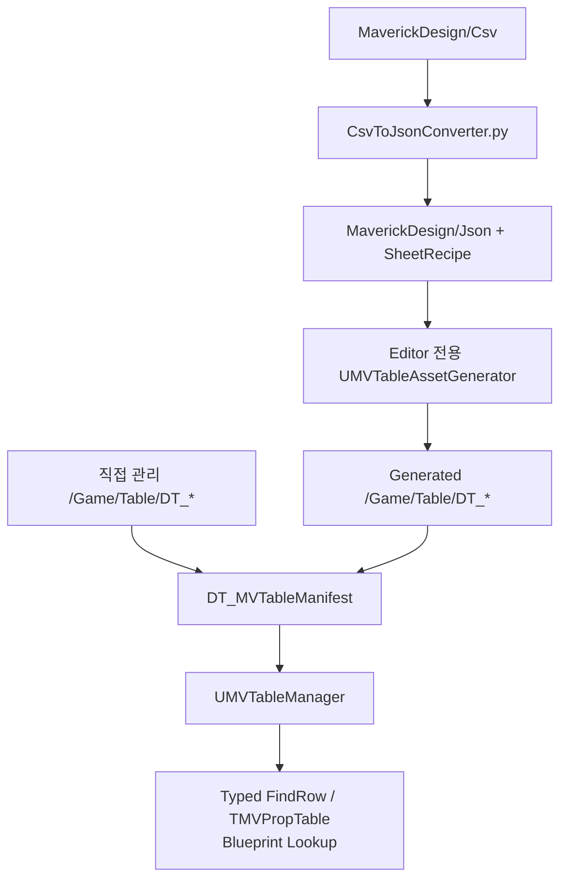

# 테이블 데이터

## 데이터 흐름

## 런타임 계약

- JSON: Editor 중간 산출물
- 런타임 기준: CSV 생성 테이블, 직접 관리 `UDataTable`, Manifest
- `UMVTableManager`: `UEngineSubsystem`
- 조회 방식: Typed Row와 Blueprint Reflection

## 직접 관리 Root

- `Attack`
- `Death`
- `Dodge`
- `Groggy`
- `HitReaction`
- `Props`
- `Sprint`
- `Weapons`
- `MaverickDesign/README.md` 목록과 현재 Root 사이 Drift 존재

## GameGuide 경계

- `GameGuide`: 도움말·팁 노출 문구 소유
- 아이템 설명·Lore 복제 금지
- 아이템 도움말 추가 시: 별도 큐레이션 데이터에서 `Item` Row 참조
