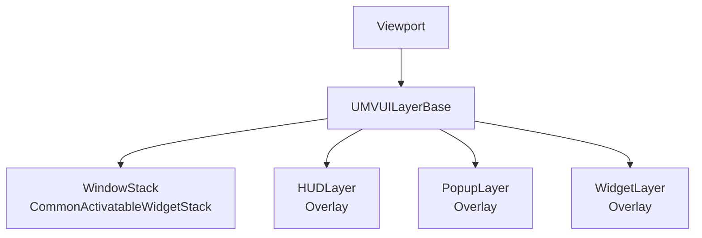

# UI와 CommonUI

`UMVUISubsystem`: GameInstance 수명의 UI 진입점

## 계층

## 책임

| 계층 | 책임 |
|---|---|
| Window | CommonUI Activatable Stack, Modal, Back, Focus, Input 수명주기 |
| Popup·HUD | 단일 Overlay, Stack Activation 비소유 |
| WBP Blueprint | Widget Tree, Animation, 화면 Binding |

## 사망과 필드 전환

- DeathRespawnFlow: Death Overlay 표시
- FieldTransition: Loading Window와 화면 전환 오케스트레이션
- 전환 전후 `ClearAllUI`, `ResetToDefaultUI` 사용
