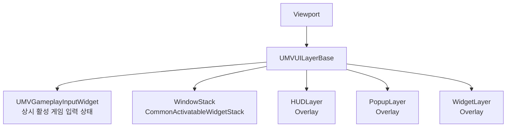

# UI와 CommonUI

`UMVUISubsystem`: GameInstance 수명의 UI 진입점

## 계층

```mermaid
flowchart TD
    Viewport["Viewport"] --> Layer["UMVUILayerBase"]
    Layer --> GameplayInput["UMVGameplayInputWidget<br/>상시 활성 게임 입력 상태"]
    Layer --> Window["WindowStack<br/>CommonActivatableWidgetStack"]
    Layer --> HUD["HUDLayer<br/>Overlay"]
    Layer --> Popup["PopupLayer<br/>Overlay"]
    Layer --> Widget["WidgetLayer<br/>Overlay"]
```

## 책임

| 계층 | 책임 |
|---|---|
| GameplayInput | WindowStack 밖에서 기본 게임 입력 상태와 게임 화면 초점 복귀 제공 |
| Window | CommonUI Activatable Stack, Modal, Back, Focus, Input 수명주기 |
| Popup·HUD | 단일 Overlay, Stack Activation 비소유 |
| WBP Blueprint | Widget Tree, Animation, 화면 Binding |

## 사망과 필드 전환

- DeathRespawnFlow: Death Overlay 표시
- FieldTransition: Loading Window와 화면 전환 오케스트레이션
- 전환 전후 `ClearAllUI`, `ResetToDefaultUI` 사용

## 창 종료 후 게임 입력 복구

- `UMVGameplayInputWidget`은 `RootOverlay`에 창 목록과 별도로 배치, 마지막 창 종료 후에도 활성 유지
- 기본 입력: `Game`, `CapturePermanently_IncludingInitialMouseDown`, `LockOnCapture`, 이동·시점 차단 해제
- CommonUI가 활성 창의 메뉴 입력에서 기본 게임 입력으로 전환해 커서·마우스 잡기·게임 화면 초점 복구
- Windows UE 5.8.1 사용자 PIE 확인과 기존 로그에서 `Hide` 후 입력 전환·카메라 회전·반복 열기 확인, 이번 문서 작업은 새 실행 없음

## 레벨업 창과 재화 HUD

| 구성 | 연결 |
|---|---|
| 창 등록 | `UMVUISettings.LevelUpWindowClass` → `W_LevelUp` / `UMVLevelUpWindow` |
| 창 열기·닫기 | `UMVUISubsystem.ShowLevelUpWindow`·`HideLevelUpWindow`, 중복 창 검사와 임시 투자 폐기 |
| 확인 | `GenericForward` 기본 확인 동작, 창에서 등록한 Enter 처리 |
| 취소 | `GenericBack`, PIE Esc는 실행 종료와 충돌하여 미검증 |
| 키 안내 | `CommonActionWidget`은 표시 담당, 동작 실행은 활성 창 책임 |
| 재화 HUD | `UMVMainHUDWidget`이 영구 성장 변경 구독 → `UMVCurrencyStatusWidget.SetCurrency(int64)` |

성장·미리보기·위젯 부모·저장·검증 범위: [[Features/Progression/Level-Up/document|레벨업 프로토타입]]
