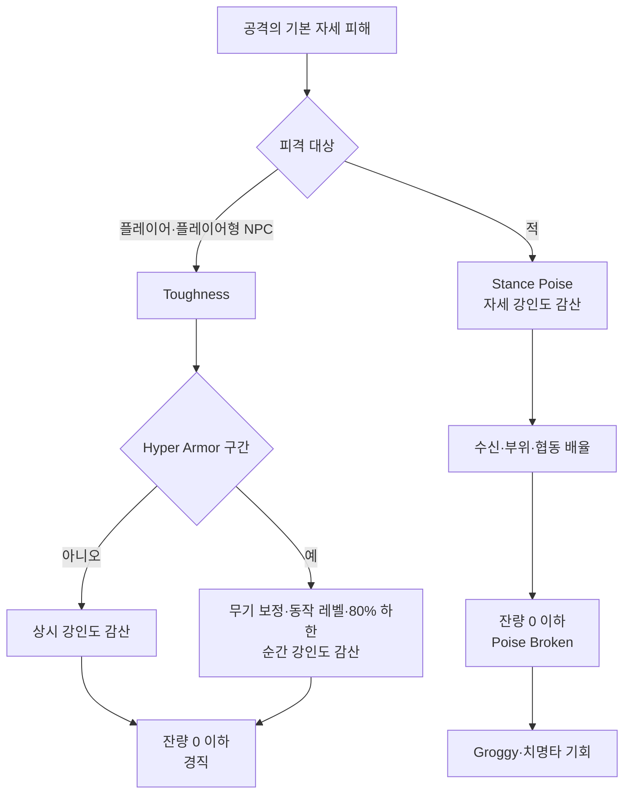
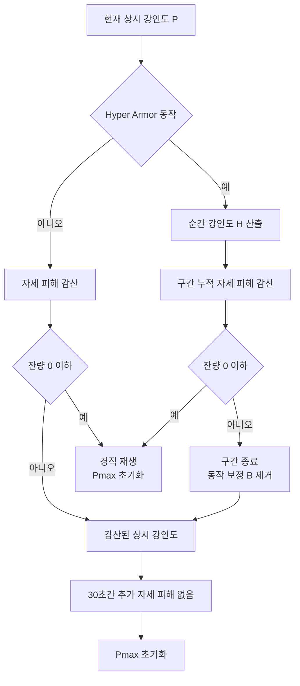
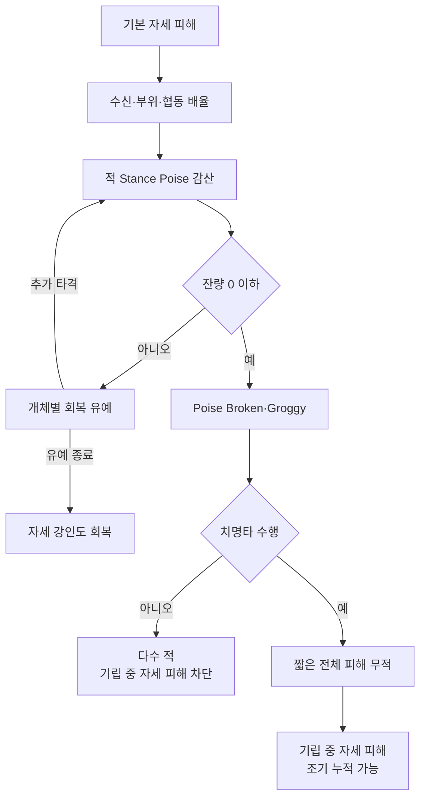

# 자세 시스템 연구

<iframe title="Elden Ring Dissected #6 - Poise Explained" src="https://www.youtube.com/embed/qeRVJOYQURM?feature=oembed" height="113" width="200" allowfullscreen="" allow="fullscreen" style="aspect-ratio: 1.76991 / 1; width: 100%; height: 100%;"></iframe>
> 이 영상 꼭 보세요 전부 설명돼있음 ㅇㅇ
## 범위

- 연구 대상: *Elden Ring* 1.12 기준 `Poise`·`Toughness`·`Hyper Armor`·`Groggy`
- 문서 성격: 공개 분석 자료의 외부 사례 연구
- Maverick 현재 구현·확정 계약: [[Features/Hit-Stat-HitReaction/document|Hit, Stat, HitReaction]] 기준
- 버전 경계: 수치·배율의 변경 가능성, 공통 골자 중심 정리

## 전체 구조



## 공통 자세 피해

```text
기본 자세 피해 = 무기 기본값 × 동작 Poise Damage MV / 100
개념적 적용값 = 기본 자세 피해 × 수신 배율 × 부위 배율 × 협동 배율
```

| 데이터 경로 | 핵심 규칙 |
|---|---|
| 일반 공격·근접 전회 | 무기 기본값과 동작 MV의 곱 |
| 투사체 전회 | 일부 공격의 `AtkSuperArmor` 고정값 |
| 주문 | 공격 데이터의 PvE·PvP 별도 자세 피해 |
| 약점 부위 | 개체별 부위 배율과 적용 대상 플래그 |

### 단위

| 구분 | 자료의 스케일 |
|---|---|
| 플레이어 표시·원시 `Poise` | 전투 계산값의 10배 계열 |
| 적 자세·PvE 자세 피해 | 1배 계열 |
| 일반 무기·전회 PvP 감쇄값 | PvE 값의 10배 계열 |
| 주문 PvP 감쇄값 | 제공 자료 기준 PvE 값의 13.5배 |

- 수치 비교 전 동일 스케일로 환산
- 공격의 기본 자세 피해 계열 공유, 대상·상황별 배율과 붕괴 결과 분기
- 적의 일반 피격 경직·밀림: Stance Poise가 아닌 `Damage Level` 계통

## 플레이어 Toughness

### Hyper Armor 산식

| 기호 | 의미 |
|---|---|
| `Pmax` | 상시 강인도 최대치 |
| `P` | 현재 상시 강인도 |
| `W` | 무기별 강인도 보정값 |
| `L` | 동작 강인도 레벨 |
| `B` | 동작 보정 `W × L` |
| `D` | Hyper Armor 구간의 누적 자세 피해 |

```text
B = W × L
Hraw = P + B
Hfloor = 0.8 × (Pmax + B)
H = max(Hraw, Hfloor)
Ptrigger = Hfloor - B = 0.8 × Pmax - 0.2 × B
```

- `Hfloor`: 상시 강인도 자체가 아닌 Hyper Armor 진입값의 하한
- `P < Ptrigger`: 80% 하한 보정 적용
- 적용 순간 강인도 `H` 대비 누적 자세 피해, 잔량 0 이하에서 통상 경직

```text
R = H - D
Pnext = clamp(R - B, 0, Pmax)
```

- `Pnext`: 경직 없이 Hyper Armor 구간 종료 시의 상시 강인도
- 구간 종료로 `Pnext` 0 도달 시 사후 경직 없음
- 직전 자세 피해 후 30초간 추가 자세 피해 없거나 경직 재생 시 `Pmax` 초기화

### 실행 흐름



### 산식 예시

| `P` | `W` | `L` | 순간 강인도 |
|---:|---:|---:|---:|
| 88 | 90 | 0.75 | 155.5 |
| 42 | 59 | 1 | 101 |
| 10 | 77 | 2 | 164 |

| 조건 | 결과 |
|---|---|
| `Pmax=90`, `P=40`, `W=90`, `L=1` | 단순값 130, 하한 144, 무피격 종료 후 `Pnext=54` |
| `P=80`, `W=52`, `L=1`, `D=20` | `H=132`, 잔량 112, 종료 후 `Pnext=60` |
| `P=80`, `W=52`, `L=1`, `D=100` | 잔량 32, 종료 후 `Pnext=0`, 종료 시점 경직 없음 |
| `Pmax=36`, `W=90`, `L=1` | 하한 적용 시 자세 피해 100의 단일 타격 후 잔량 최소 0.8 |

#### 동작 레벨과 하한 잔존값

`Pmax=86`, `W=90`, 하한 발동 후 추가 피격 없음 기준

| 동작 | `L` | Hyper Armor 종료 후 상시 강인도 |
|---|---:|---:|
| 구르기 공격 | 0.75 | 55.3 |
| 일반 약공격 | 1 | 50.8 |
| 풀 차지 강공격 | 2 | 32.8 |

- 높은 동작 레벨: 높은 순간 강인도, 낮은 하한 종료 잔존값
- 하한 발동과 구간 중 추가 피격 없음을 전제로 상시 강인도의 조건부 회복

## 적 Stance와 Groggy



| 규칙 | 예시·효과 |
|---|---|
| 개체별 자세 강인도 | 고유 최대치와 회복 유예 |
| 수신 배율 | 무너지는 파름 아즈라 일반 고룡 120과 0.2배 조합의 등가 요구량 600 |
| 약점 부위 | 해당 고룡 머리 2배 기준 등가 요구량 300 |
| 회복 유예 | Elden Beast 자세 150, 11.54초 |
| 협동 보정 | 보스 한정, 추가 아군 1명 0.60배, 2명 0.366배 수신 |
| 붕괴 후 자세치 | 분석 자료상 최대치 재설정, 이후 누적 창은 치명타·개체 규칙에 따라 분기 |

### 예외

- 치명타 미수행: 다수 적의 기립 중 자세 피해 차단
- 치명타 수행: 짧은 전체 피해 무적 후 기립 중 자세 피해 누적 재개
- Abductor Virgin: 일반 자세 피해 대신 타격당 5, 번개 타격 추가 15, 음수 잔량 후 추가 타격에서 붕괴
- Malenia: 특정 Hyper Armor 중 음수 잔량에서도 붕괴 거부, 회복 유예 없이 즉시 회복 개시

## 설계 관찰

- 플레이어 경직과 적 Groggy: 공통 자세 피해 개념, 서로 다른 재설정·면역·결과 상태
- 80% 하한: 누적 소모 후에도 대형 무기의 Hyper Armor 성능을 일정 수준 유지하는 안전장치
- 하한의 적용 대상: 상시 강인도가 아닌 공격 동작 중 순간 강인도
- 적 자세 운영: 연속 압박·약점 부위·협동 보정으로 Groggy 속도 제어

## 출처

- [엘든링의 강인도 시스템에 대해 알아보자\(ver1.12\)-PVE편](https://gall.dcinside.com/mgallery/board/view/?id=fromsoftware&no=5107524)
- [엘든링의 PVE에서의 그로기 시스템에 대해 알아보자](https://gall.dcinside.com/mgallery/board/view/?id=fromsoftware&no=3627469)
- [*Elden Ring Dissected #6 - Poise Explained*](https://www.youtube.com/watch?v=qeRVJOYQURM)
- [*Elden Ring Dissected #7 - Answering 20 Questions About Poise*](https://www.youtube.com/watch?v=sMe35LdlD4Q)
- [Poise Damage 데이터 시트](https://docs.google.com/spreadsheets/d/1j4bpTbsnp5Xsgw9TP2xv6d8R4qk0ErpE9r_5LGIDraU/edit)
- [Hyper Armor Poise 계산기](https://docs.google.com/spreadsheets/d/15gBgj4_QgHSbTfd7pc046PS4BzpA6NMCy3BGSs2Jd68/copy)
